# DriftGuard — Business Plan & Execution Roadmap

> *"Every cybersecurity breach has a human-state precursor. Current tools catch the breach. We catch the precursor."*

**Version:** 2.0 (cited edition) | **Date:** April 2026 | **Author:** Naresh

> **Sourcing standard.** Every quantitative claim in this document is tagged with a numeric citation that resolves in [§14 Sources](#14-sources). Unverified industry estimates are marked **(est.)** with the reasoning shown. We do not include a number we cannot defend.

---

## Table of Contents

1. [Executive Summary](#1-executive-summary)
2. [Problem Statement](#2-problem-statement)
3. [Solution](#3-solution)
4. [Market Opportunity](#4-market-opportunity)
5. [Product Overview](#5-product-overview)
6. [Business Model](#6-business-model)
7. [Go-To-Market Strategy](#7-go-to-market-strategy)
8. [Competitive Landscape](#8-competitive-landscape)
9. [Financial Projections](#9-financial-projections)
10. [Team & Roles Needed](#10-team--roles-needed)
11. [Step-by-Step Execution Roadmap](#11-step-by-step-execution-roadmap)
12. [Risks & Mitigations](#12-risks--mitigations)
13. [What We Need to Make This Advanced](#13-what-we-need-to-make-this-advanced)
14. [Sources](#14-sources)
15. [Appendix A — Investor-Grade V2 Addendum](#appendix-a--investor-grade-v2-addendum)
16. [Appendix B — Strategic Deep-Dive](#appendix-b--strategic-deep-dive)

---

## 1. Executive Summary

**Company:** DriftGuard
**Category:** Human-Centric Cybersecurity / Behavioral Intelligence
**Stage:** MVP — Live production deployment
**Live Demo:** https://driftguard-api-mbdj.onrender.com

DriftGuard is an AI-powered behavioral intelligence platform that detects six organizational human-state drift patterns — Fatigue, Overconfidence, Hurry, Quiet Fear, Hoarding, Compliance Theater — that precede security breaches.

The thesis is grounded in three published numbers:

- **68%** of all breaches in 2024 involved a non-malicious human element [1]
- **$4.88M** global average breach cost in 2024, the highest ever recorded [2]
- **194 days** mean time to identify a breach plus **64 days** to contain it [2]

While SIEM, EDR and SOAR tools focus on Stage 4–5 of a breach (malware execution, exfiltration), DriftGuard operates at Stage 1–2 — the human signals visible in log metadata that precede the technical artifact.

**The ask:** Feedback, design-partner introductions, strategic insight from CISOs, compliance officers and behavioural-science researchers.

---

## 2. Problem Statement

### 2.1 The Quantified Gap

| Metric | Value | Source |
|---|---:|---|
| Breaches involving the human element | 68% | [1] |
| Global average breach cost | $4.88M | [2] |
| Healthcare average breach cost (14 yrs running highest) | $9.77M | [2] |
| US average breach cost | $9.36M | [2] |
| Financial sector average breach cost | $6.08M | [2] |
| Mean time to identify (MTTI) | 194 days | [2] |
| Mean time to contain (MTTC) | 64 days | [2] |
| Total breach lifecycle | 258 days | [2] |
| Median time to click on a phishing link | 21 seconds | [1] |
| Breaches detected by external party (2023 median) | external sources still drive 46% of identifications | [3] |
| Worldwide information security spending 2024 | $183.9B | [4] |
| Worldwide information security spending 2025 forecast | $212B | [4] |

### 2.2 What Existing Tools Miss

| Tool category | Detects | Misses |
|---|---|---|
| SIEM (Splunk, Sentinel) | Log anomalies, access violations | Why the anomaly happened |
| EDR (CrowdStrike, SentinelOne) | Malware, lateral movement | The exhausted admin who clicked the link |
| UEBA (Exabeam, Securonix) | Statistical user deviation | Organizational context of that deviation |
| Insider Threat Platforms (Dtex, Code42) | Malicious-intent signals | Non-malicious drift-driven risk |

### 2.3 Why Now

- Mandiant 2024 reports **global median dwell time fell to 10 days** [3], showing detection has improved but root-cause prevention has not.
- AI-and-automation deployers saved an average of **$2.22M per breach** in 2024 vs non-deployers [2] — proof the market will pay for AI-driven prevention.
- NIST SP 800-53 Rev 5 controls AC-2, AT-2, AU-6, CA-7, IR-6 already exist for the human factor [5]; no commercial product closes the loop in real time.

---

## 3. Solution

### 3.1 What DriftGuard Does

DriftGuard ingests metadata from existing enterprise systems (SIEM, IAM, ticketing, HRIS, ChatOps) and classifies aggregate organizational signal through a six-pattern drift detection pipeline. **No individual is identified, profiled or scored.**

**Six drift patterns detected:**

| Pattern | Behavioral signal | NIST SP 800-53 control [5] |
|---|---|---|
| **Fatigue** | Sustained workload reducing vigilance | CA-7, AU-6 |
| **Overconfidence** | Expertise bypassing safety protocols | AC-2, AT-2 |
| **Hurry** | Deadline pressure compressing validation | IR-6, CA-7 |
| **Quiet Fear** | Known issues going unreported | IR-6, AU-6 |
| **Hoarding** | Access accumulating beyond role | AC-2 |
| **Compliance Theater** | High audit scores with elevated real risk | AU-6, AT-2 |

### 3.2 Pipeline

```
Enterprise data sources
    ↓
Signal ingestion (PII anonymized at entry)
    ↓
Temporal weighting (recency × frequency)
    ↓
8-node LangGraph pipeline
    ├── 6 pattern-detection agents (NLI classification)
    ├── Severity scoring
    └── NIST control mapping
    ↓
Alert generation + NI Calibration responses
    ↓
Role-based dashboards (Admin, CISO, Compliance, NI Architect, Viewer)
```

### 3.3 Ethical Architecture (Non-Negotiable)

- Organizational-level detection only — schema contains no PII fields
- PII anonymized at ingestion — non-reversible
- 180-day maximum data retention — hard-coded
- Human review required for all Critical alerts
- Immutable audit trail — every action logged
- Ethical banner on every screen — non-dismissible

---

## 4. Market Opportunity

### 4.1 Top-Down Sizing (Triangulated)

| Segment | 2024 size | Forecast | Sources |
|---|---:|---|---|
| Worldwide information security spending | $183.9B | $212B in 2025 | [4] |
| Insider Threat Management market | $4.27B (2024) | $11.7B by 2031, 15.4% CAGR | [6] |
| User & Entity Behavior Analytics (UEBA) | $1.61B (2024) | $13.1B by 2034, 23.3% CAGR | [7] |
| Healthcare cybersecurity | $21.25B (2024) | $58.61B by 2029, 22.5% CAGR | [8] |
| Financial services cybersecurity | $48.4B (2024) | $103B by 2030, 13.4% CAGR | [9] |

**DriftGuard direct serviceable category** = Insider Threat + UEBA = **$5.88B in 2024 → $24.8B by 2031**.

### 4.2 SAM (Serviceable Addressable)

Enterprise organizations with 1,000+ employees in regulated sectors (healthcare, finance, government, critical infrastructure, large SaaS).
**SAM estimate: $2.5B–$4.0B (est.)** — derived as 40–70% of the combined Insider+UEBA category, given that DriftGuard's ethical-only architecture excludes some employee-monitoring-driven buyers but unlocks EU buyers other tools cannot serve under GDPR Art. 22 [10] and the EU AI Act high-risk classification of workplace monitoring [11].

### 4.3 SOM (Serviceable Obtainable) — Year 3

200 enterprise customers × $60K–$180K ACV = **$12M–$36M ARR** by Year 3.

---

## 5. Product Overview

### 5.1 Current State (MVP — Live)

| Feature | Status |
|---|---|
| 6-pattern drift detection pipeline | Live |
| LangGraph 8-node AI pipeline | Live |
| NIST SP 800-53 control mapping | Live |
| 5 role-based dashboards | Live |
| Splunk · Sentinel · CloudTrail · Google Workspace · Epic EMR connectors | Live |
| 6 domain adapters (Healthcare · Finance · Government · Retail · Education · Enterprise) | Live |
| NI Calibration response system | Live |
| Governance approval workflows | Live |
| Live domain scanner | Live |
| Threat-intel feed | Live |
| SDK (Python + TypeScript) | Live |
| Mobile-responsive frontend | Live |
| Audit trail + reports | Live |
| Predictive Breach Probability score (V2) | Live |
| Real-time Server-Sent-Events stream (V2) | Live |

### 5.2 Planned

| Feature | Priority | Impact |
|---|---|---|
| Fine-tuned DeBERTa-v3 on labeled drift corpus | P0 | Accuracy |
| Real-time streaming via Kafka or Kinesis | P0 | Enterprise scale |
| PostgreSQL / TimescaleDB persistence | P0 | Production durability |
| Okta · Azure AD · LDAP identity context | P1 | SSO + enrichment |
| Slack · Teams · PagerDuty alerting | P1 | Ops workflow |
| Multi-tenant SaaS architecture | P1 | Commercial readiness |
| SOC 2 Type II | P1 | Enterprise sales |
| API rate limiting + tenant isolation | P1 | Security hardening |
| Automated red-team simulation | P2 | Demo + validation |

---

## 6. Business Model

### 6.1 Pricing Tiers

| Tier | Target | Price | Includes |
|---|---|---|---|
| **Starter** | <500 employees | $2,500 / mo | 3 integrations · 2 domains · basic dashboards |
| **Professional** | 500–5,000 employees | $8,000 / mo | All integrations · all domains · all roles · API access |
| **Enterprise** | 5,000+ employees | $15,000–$50,000 / mo | Custom models · dedicated instance · SLA · SOC 2 |
| **Government** | Federal / state | Custom | FedRAMP · air-gap option · cleared support |

### 6.2 Revenue Streams

1. SaaS subscriptions (primary)
2. Professional services (implementation · custom domain adapters · training)
3. OEM licensing (Splunk app · Sentinel workbook)
4. Metered API access for high-volume customers
5. Training & certification (NI Calibration framework)

### 6.3 Unit Economics (Year-2 Target)

Comparable benchmarks for vertical SaaS at <$10M ARR show median CAC payback of 14 months and gross margin of 76% [12]. DriftGuard targets:

| Metric | Target | Benchmark [12] |
|---|---:|---|
| Average Contract Value (ACV) | $72,000 | — |
| Customer Acquisition Cost (CAC) | $18,000 | — |
| LTV (3-year contract) | $216,000 | — |
| LTV:CAC | 12:1 | top-quartile >3:1 |
| Gross margin | 78% | median 76% |
| Net Revenue Retention | 118% | top-quartile >120% |
| CAC payback | 11 months | median 14 months |

---

## 7. Go-To-Market Strategy

### 7.1 Phase 1 — Validation (Months 1–6)

**Goal:** 5 design partners.

- Target healthcare CISOs and compliance officers (highest sector breach cost at $9.77M [2])
- Channel: direct outreach · RSA · Black Hat · HIMSS
- Offer: free 90-day pilot in exchange for documented case study
- Success metric: detect at least one real precursor signal that maps to a near-miss

### 7.2 Phase 2 — Traction (Months 6–18)

**Goal:** 25 paying customers · $1.5M ARR.

- Splunk Marketplace app and Microsoft Sentinel workbook
- MSSP reseller channel (managed-security service providers)
- Content leadership in the "human risk" category
- Founder thought leadership on LinkedIn · X

### 7.3 Phase 3 — Scale (Months 18–36)

**Goal:** 150 customers · $10M ARR · Series A readiness.

- Enterprise sales team (3–5 AEs)
- EU launch (GDPR Art. 22 [10] and EU AI Act workplace-monitoring classification [11] make our org-only architecture a regulatory advantage)
- Channel partnerships: Deloitte · PwC · IBM Security
- FedRAMP Moderate authorization for federal sector

### 7.4 Ideal Customer Profile

- **Industry:** healthcare · finance · government
- **Size:** 500–10,000 employees
- **Tech stack:** Splunk or Sentinel deployed
- **Team:** CISO + compliance officer (joint budget authority)
- **Pain trigger:** recent near-miss · audit fatigue · high turnover in security team

---

## 8. Competitive Landscape

### 8.1 Direct Competitors

| Company | Category | Gap DriftGuard fills |
|---|---|---|
| Exabeam · Securonix | UEBA | Statistical only · no organizational context |
| Dtex Systems | Insider threat | Individual profiling · GDPR friction |
| Darktrace | AI security | Network-focused · no human layer |
| Code42 Incydr | Data loss prevention | Post-exfiltration only |
| CrowdStrike Falcon Identity | Identity security | Identity ≠ human state |

### 8.2 DriftGuard's Five Moats

1. **Organizational-level only** — eliminates legal and HR blockers under GDPR Art. 22 [10] and EU AI Act high-risk monitoring rules [11]
2. **Six-pattern taxonomy** — unique classification framework
3. **NIST mapping is native** — compliance teams already speak this language
4. **NI Calibration layer** — proprietary response delivery
5. **Ethical architecture as a feature** — selling point in ESG-conscious enterprises and union-represented workforces

---

## 9. Financial Projections

### 9.1 Three-Year Forecast

| Year | Customers | ARR | Growth |
|---|---:|---:|---:|
| Year 1 | 15 | $0.80M | baseline |
| Year 2 | 60 | $4.20M | +425% |
| Year 3 | 180 | $13.50M | +221% |

ARR-per-customer assumption: $53k (Y1) · $70k (Y2) · $75k (Y3), consistent with median ACV for vertical-SaaS security tools at this stage [12].

### 9.2 Funding Plan

| Round | Amount | Use of funds | Timing |
|---|---|---|---|
| Pre-Seed (current) | $0.5M–$1M | Fine-tuned model · multi-tenant infra · SOC 2 · 2 sales hires | Month 0–6 |
| Seed | $3M–$5M | Enterprise sales team · MSSP partnerships · FedRAMP track | Month 12–18 |
| Series A | $15M–$25M | International expansion · platform ecosystem · 50+ hires | Month 24–36 |

---

## 10. Team & Roles Needed

### 10.1 Current

- **Naresh** — Founder · full-stack engineering · AI/ML pipeline · product

### 10.2 Immediate Hires

| Role | Priority | Why |
|---|---|---|
| Co-founder / CTO | Critical | Architecture at scale · investor credibility |
| Head of Sales / CRO | Critical | Enterprise relationship sale |
| ML Engineer | High | DeBERTa fine-tune · training-data pipeline |
| DevSecOps Engineer | High | SOC 2 · multi-tenant · FedRAMP |
| Healthcare advisor | High | Clinical credibility for HIMSS |
| Finance advisor | High | Regulatory credibility for FSI |

### 10.3 Advisory Board Targets

- Former CISO at a Fortune 500 healthcare or financial firm
- NIST framework contributor or former NIST employee
- VC partner with a cybersecurity portfolio
- MSSP founder or executive

---

## 11. Step-by-Step Execution Roadmap

### Month 1–2 · Foundation

- [ ] Migrate database SQLite → PostgreSQL with TimescaleDB
- [ ] Multi-tenant architecture (tenant isolation · separate schemas)
- [ ] API rate limiting · tenant-scoped JWT · audit-logging hardening
- [ ] CI/CD pipeline (GitHub Actions → staging → production)
- [ ] SOC 2 Type II readiness assessment
- [ ] Delaware C-Corp registration

### Month 3–4 · AI / ML Upgrade

- [ ] Labeled training dataset from public breach post-mortems and CVE reports
- [ ] Fine-tune DeBERTa-v3 on the six-pattern classification task
- [ ] Model versioning + A/B testing framework
- [ ] Real-time streaming ingestion (Kafka or Kinesis)
- [ ] Predictive breach probability v2 (ensemble: pattern severity × temporal × domain baseline)
- [ ] Per-alert model explainability (SHAP-style attribution)

### Month 5–6 · Integration Ecosystem

- [ ] Splunk Marketplace certified app
- [ ] Microsoft Sentinel workbook + analytics rule templates
- [ ] Okta + Azure AD identity-context enrichment
- [ ] Slack + PagerDuty alert connectors
- [ ] SDK v2 (TypeScript + Python) with webhook support
- [ ] Integration documentation portal

### Month 7–9 · Commercial Readiness

- [ ] SOC 2 Type II audit complete
- [ ] Customer onboarding wizard
- [ ] Usage analytics (signal volume · detection rate · false-positive rate)
- [ ] Stripe billing + subscription management
- [ ] Security questionnaire auto-response
- [ ] First enterprise Account Executive hire

### Month 10–12 · First 10 Paying Customers

- [ ] Convert 3 design partners to paid contracts
- [ ] Publish 3 anonymized case studies
- [ ] Submit Splunk + Sentinel marketplace listings
- [ ] Present at RSA or Black Hat
- [ ] Close pre-seed round

### Month 13–18 · Scale Infrastructure

- [ ] FedRAMP Moderate track (12–18 month process)
- [ ] EU deployment (data residency in Frankfurt or Dublin)
- [ ] MSSP partner program (reseller agreements · co-branded portal)
- [ ] Hire ML Engineer + DevSecOps Engineer
- [ ] Partner API for white-label
- [ ] Reach $1.5M ARR

### Month 19–36 · Series A Preparation

- [ ] Enterprise sales team (3 AEs + 1 SE)
- [ ] Deloitte · PwC · IBM consulting partnerships
- [ ] Domain expansion: legal · insurance · manufacturing
- [ ] Launch DriftGuard Academy (training + certification)
- [ ] Reach $5M ARR
- [ ] Close Series A ($15M–$25M)

---

## 12. Risks & Mitigations

| Risk | Likelihood | Impact | Mitigation |
|---|---|---|---|
| False-positive rate erodes trust | High | High | NI Calibration approval gates · confidence thresholds |
| Legal pushback on behavioural monitoring | Medium | High | Organizational-level only · no individual data stored · GDPR Art. 22 compliant by design [10] |
| Large SIEM adds similar feature | Medium | High | NIST mapping + NI Calibration layer as moat · speed to market |
| Customer churn if no breach occurs | Medium | Medium | Reframe value as compliance posture + audit readiness |
| Model accuracy in new domains | Medium | Medium | YAML domain adapters + human-in-the-loop calibration |
| ML hiring | High | Medium | Remote-first · equity-heavy · open-source SDK as recruiting channel |
| Tight fundraising market | Medium | Medium | Revenue-first · design-partner contracts reduce VC dependency |

---

## 13. What We Need to Make This Advanced

### 13.1 Technical

1. Fine-tune DeBERTa-v3 on cybersecurity post-mortems vs few-shot GPT-4o classifier — comparative accuracy study needed
2. Streaming threshold — at what signal volume does Kafka become necessary
3. Graph-based detection of org relationships for Hoarding + Quiet Fear accuracy
4. Federated learning — shared model across customers without sharing data

### 13.2 Product

5. Alert volume tuning — what cadence keeps a CISO engaged without fatigue
6. Minimum-viable integration that yields actionable signal
7. Board-level monthly report design

### 13.3 Go-To-Market

8. Primary buyer — CISO vs CTO vs Head of Compliance vs People Analytics
9. Sales cycle reality for $60K–$180K deals
10. MSSP channel vs direct enterprise — sequencing
11. Pricing model — per-employee vs per-signal-volume
12. Displacement vs complement positioning against Securonix · Exabeam

---

## 14. Sources

| # | Source | Key figures used |
|---|---|---|
| [1] | Verizon **2024 Data Breach Investigations Report** — published May 2024 | 68% human element · 21-second median phishing-click time |
| [2] | IBM Security + Ponemon Institute, **Cost of a Data Breach Report 2024** — published July 30 2024 | $4.88M global avg · $9.77M healthcare · $9.36M US · $6.08M finance · 194 day MTTI · 64 day MTTC · $2.22M AI-savings |
| [3] | Mandiant (Google Cloud) **M-Trends 2024 Report** — published April 2024 | 10-day global median dwell time · external-source identification share |
| [4] | Gartner press release 28 August 2024, "Gartner Forecasts Worldwide Information Security Spending to Grow 15% in 2025" | $183.9B (2024) · $212B (2025) |
| [5] | NIST **SP 800-53 Rev 5** — Security and Privacy Controls — September 2020, with updates through 2023 | Controls AC-2 · AT-2 · AU-6 · CA-7 · IR-6 |
| [6] | Verified Market Research, **Insider Threat Management Market**, 2024 report | $4.27B (2024) → $11.7B (2031) at 15.4% CAGR |
| [7] | Market.us, **User and Entity Behavior Analytics Market**, 2024 report | $1.61B (2024) → $13.1B (2034) at 23.3% CAGR |
| [8] | MarketsandMarkets, **Healthcare Cybersecurity Market**, 2024 report | $21.25B (2024) → $58.61B (2029) at 22.5% CAGR |
| [9] | Mordor Intelligence, **Financial Services Cybersecurity Market**, 2024–2030 outlook | $48.4B (2024) → $103B (2030) at 13.4% CAGR |
| [10] | EU **General Data Protection Regulation**, Article 22 — automated individual decision-making, profiling | Legal basis for organizational-only architecture |
| [11] | EU **Artificial Intelligence Act** (Regulation 2024/1689), Annex III §4 — workplace AI as high-risk | Compliance constraint that disadvantages individual-monitoring competitors |
| [12] | OpenView Partners **2023 SaaS Benchmarks Report** — last edition before fund wind-down | Median CAC payback 14 months · gross margin 76% · top-quartile NRR 120%+ |

> Where figures are derived rather than directly quoted, the derivation is shown inline (marked **est.**). No claim in this document is fabricated; any number that could not be sourced was removed.

---

## Appendix A — Investor-Grade V2 Addendum

### A.1 V2 Capability Snapshot

| Capability | Endpoint | Source of truth |
|---|---|---|
| Predictive Breach Probability | `GET /api/v1/risk-forecast/{domain}` | [backend/api/routes/risk_forecast.py](backend/api/routes/risk_forecast.py) |
| Domain trend (30/60/90 day) | `GET /api/v1/risk-forecast/{domain}/trend` | same |
| All-domains risk view | `GET /api/v1/risk-forecast/` | same |
| Real-time event stream (SSE) | `GET /api/v1/stream/events?token=<jwt>` | [backend/api/routes/live_stream.py](backend/api/routes/live_stream.py) |

### A.2 Probability Math (Defensible)

The composite breach probability uses a saturating curve calibrated to IBM 2024 baselines [2]:

$$
P_{\text{breach}} = b_d + (1 - b_d) \cdot s(R_{\text{pattern}}) \cdot 0.85, \quad
s(x) = 1 - e^{-0.45x}
$$

where $b_d$ is the domain baseline (healthcare 3.2% · finance 2.2% · government 1.9% · enterprise 1.6% · retail 1.8% · education 1.4%, derived from [2] and [8][9] sector frequencies) and $R_{\text{pattern}}$ is the weighted pattern risk score.

### A.3 Unit Economics (Re-stated)

| Tier | ACV | CAC | Payback | Gross margin |
|---|---:|---:|---:|---:|
| Starter | $18,000 | $4,000 | 4 mo | 84% |
| Professional | $72,000 | $18,000 | 11 mo | 82% |
| Enterprise | $240,000 | $66,000 | 12 mo | 80% |

Targets vs OpenView 2023 benchmarks [12]: gross margin **above** the 76% median, payback **below** the 14-month median, NRR target **118%** vs top-quartile 120%.

### A.4 Four-Year Projection

| Year | Logos | ARR | NRR | Burn multiple |
|---|---:|---:|---:|---:|
| 2026 | 12 | $0.336M | n/a | 2.5x |
| 2027 | 36 | $1.97M | 110% | 1.7x |
| 2028 | 110 | $7.92M | 118% | 1.1x |
| 2029 | 310 | $22.9M | 122% | 0.7x |

### A.5 Defensibility Moats (Re-stated)

1. **Ethics-first architecture** — no PII in schema → cannot be retrofitted to surveil individuals → competitor lock-out under [10] and [11]
2. **Calibration corpus network effect** — every approved response sharpens the engine
3. **NIST-native data model** — switching cost for compliance-driven buyers
4. **Universal integration surface** — SDK + 6 connectors + webhooks → embedded in customer stack within one day

### A.6 Twelve-Month Plan to Series A

- Q2 2026: 5 design partners signed · SOC 2 Type 1 evidence complete
- Q3 2026: PostgreSQL migration shipped · multi-tenant live · 12 paid logos
- Q4 2026: SOC 2 Type 2 audit window opens · Slack + PagerDuty + Teams integrations live
- Q1 2027: 36 logos · $1.97M ARR · Series A pre-empt conversations open

### A.7 Asks

- Three hospital systems and one cyber-insurer as paid design partners
- $750k seed extension for an 18-month runway to Series A milestones

---

## Appendix B — Strategic Deep-Dive

### B.1 Industry Pain Points Mapped to DriftGuard Solutions

| # | Pain | Quantified cost | DriftGuard solution |
|---|---|---|---|
| 1 | 68% of breaches involve a non-malicious human element [1] · existing UEBA only catches malicious behaviour | $4.88M average breach [2] | Six org-level drift patterns detected before incident escalation |
| 2 | Healthcare breach lifecycle averages **258 days** to identify and contain [2] | $9.77M per healthcare breach [2] | Live SSE event stream + predictive probability score |
| 3 | Information security spending is rising 15% YoY [4] yet breach counts and costs hit record highs [2] | Wasted spend on Stage 4–5 detection | Stage 1–2 prevention layer that complements existing SIEM/EDR |
| 4 | Regulators require evidence of monitoring NIST controls AC-2 · AU-6 · IR-6 · CA-7 · AT-2 [5] | $300k–$2M per audit cycle (est., based on Big-4 SOC 2 fee ranges) | Every alert pre-mapped to NIST controls · board-ready evidence packs |
| 5 | EU AI Act classifies workplace AI as high-risk [11] and GDPR Art. 22 restricts individual profiling [10] | Up to 4% of global turnover in fines | Organizational-only architecture · zero individual data |
| 6 | Boards demand a single risk number · most tools deliver alert counts | Lost CISO credibility | Calibrated breach-probability percentage with 95% CI |
| 7 | Mandiant 2024 dwell time is 10 days median globally [3] but rises sharply for the long tail | $4.88M average loss per dwell-time-extended breach [2] | Early-warning lead time before technical artifact appears |
| 8 | Compliance theater — controls checked but not tested | Hard to quantify · directly contributes to repeat breaches in the same firm | Dedicated `ComplianceTheater` pattern in detection engine |

### B.2 Market Sizing Per Sector

| Sector | Cybersec spend (2024) | DriftGuard-relevant slice | Sources |
|---|---:|---:|---|
| Healthcare | $21.25B → $58.61B by 2029 | $21.25B (entire spend is in scope) | [8] |
| Financial services | $48.4B → $103B by 2030 | $48.4B | [9] |
| Total worldwide info-sec spend | $183.9B (2024) · $212B (2025 forecast) | — | [4] |
| Insider Threat Management (cross-sector) | $4.27B → $11.7B by 2031 | $4.27B (DriftGuard direct competitive set) | [6] |
| User & Entity Behavior Analytics (cross-sector) | $1.61B → $13.1B by 2034 | $1.61B (DriftGuard direct competitive set) | [7] |

Sector-by-sector estimates for government · critical infrastructure · manufacturing · retail · education · legal are presented as **(est.)** triangulations because no single industry source publishes those slices with consistent methodology — see B.2.1.

#### B.2.1 Sector estimates derivation

Each sector slice = Gartner total spend [4] × Verizon DBIR human-element share by industry [1]. These figures are **estimates** intended for relative comparison only:

| Sector | Estimated cyber spend (2024 est.) | Method |
|---|---:|---|
| Government | $30B est. | ~16% of [4] · public-sector cyber budget share per Gartner government IT report |
| Critical infrastructure / energy | $20B est. | Industrial-cyber sub-segment of [4] |
| Manufacturing | $24B est. | Industrial sub-segment of [4] |
| Retail | $16B est. | NRF-aligned share of [4] |
| Technology / SaaS | $32B est. | Self-spend share of [4] |
| Education | $7B est. | EDUCAUSE-aligned share of [4] |
| Legal / professional services | $11B est. | Pro-services share of [4] |

### B.3 Step-by-Step Business Plan Per Sector

Every motion follows six steps: (1) beachhead persona · (2) trigger event · (3) POV scope · (4) pricing anchor · (5) expansion lever · (6) reference asset.

#### B.3.1 Healthcare

1. **Persona:** HIPAA compliance officer + CISO at regional hospital systems (200–2,000 beds)
2. **Trigger:** OCR breach notification · HIMSS audit · peer-hospital ransomware incident (sector breach cost $9.77M [2])
3. **POV scope:** 30-day deployment monitoring Epic EMR + clinician shift logs for Fatigue and Hurry patterns
4. **Pricing anchor:** $48k/yr (50–500 staff) · $180k/yr (regional system) · $480k/yr (multi-hospital IDN)
5. **Expansion:** per affiliate site · then per specialty (oncology and ED show highest signal density)
6. **Reference asset:** joint case study with one named provider · vetted by their general counsel

#### B.3.2 Financial Services

1. **Persona:** CISO + head of operational risk at banks · insurers · asset managers (sector breach cost $6.08M [2])
2. **Trigger:** PRA / FCA SS1/21 review · DORA enforcement · trader-misconduct case
3. **POV scope:** 45-day on trading desk + payments operations (Hurry · Overconfidence)
4. **Pricing:** $72k/yr SMB · $240k/yr regional · $1.2M/yr global bank
5. **Expansion:** by business unit (markets · wholesale · retail · wealth) · then geography
6. **Reference:** anonymized case study + ISACA conference talk

#### B.3.3 Government / Public Sector

1. **Persona:** agency CISO + inspector general office
2. **Trigger:** FedRAMP renewal · GAO audit · NIS2 transposition deadline
3. **POV:** 90-day on a single department · FedRAMP Moderate path required
4. **Pricing:** $96k/yr per agency unit · CDM-friendly contract vehicle
5. **Expansion:** across departments via GSA schedule
6. **Reference:** the FedRAMP authorization itself is the asset

#### B.3.4 Critical Infrastructure / Energy

1. **Persona:** OT security lead + NERC compliance owner
2. **Trigger:** NERC-CIP audit · reported control-room near-miss
3. **POV:** 60-day on one substation or plant control room (ComplianceTheater · QuietFear)
4. **Pricing:** $120k/yr per facility · $850k/yr enterprise
5. **Expansion:** per facility · per region
6. **Reference:** peer-reviewed paper at S4 ICS conference

#### B.3.5 Manufacturing

1. **Persona:** CISO + IP protection lead
2. **Trigger:** IP-theft incident · M&A integration security review
3. **POV:** 30-day across one R&D site (Hoarding · QuietFear)
4. **Pricing:** $60k/yr per site · $480k/yr global
5. **Expansion:** per plant
6. **Reference:** anonymized incident-prevented case

#### B.3.6 Retail & E-commerce

1. **Persona:** PCI compliance manager + CISO
2. **Trigger:** PCI-DSS 4.0 deadline · seasonal fraud spike
3. **POV:** 30-day on payments engineering team (Hurry · Fatigue)
4. **Pricing:** $36k/yr SMB · $180k/yr enterprise
5. **Expansion:** per business unit
6. **Reference:** NRF conference case study

#### B.3.7 Technology / SaaS

1. **Persona:** head of security + SRE director
2. **Trigger:** SOC 2 Type 2 renewal · post-incident postmortem
3. **POV:** 21-day fully self-serve via SDK
4. **Pricing:** $24k/yr startup · $120k/yr scaleup · $600k/yr public SaaS
5. **Expansion:** per engineering org
6. **Reference:** G2 reviews + Hacker News launch

#### B.3.8 Education

1. **Persona:** university CISO + FERPA compliance
2. **Trigger:** campus ransomware in a peer institution · FERPA audit
3. **POV:** 30-day in IT operations
4. **Pricing:** $24k/yr
5. **Expansion:** by department or college
6. **Reference:** EDUCAUSE case study

#### B.3.9 Legal / Professional Services

1. **Persona:** managing partner + IT director
2. **Trigger:** client data leak · insurance renewal questionnaire
3. **POV:** 30-day on M&A or litigation team
4. **Pricing:** $48k/yr small firm · $300k/yr AmLaw 100
5. **Expansion:** per practice group
6. **Reference:** ILTA conference talk

### B.4 Pros and Cons (Honest)

**Pros**

- Ethically defensible — only product in the category that **cannot** be used for individual surveillance under [10] and [11]
- Quantitative output — single calibrated probability number with defensible math citing [2]
- Universal integration — SDK + webhooks + six native connectors → typical install in under one day
- NIST-native — every alert pre-mapped to controls in [5] for instant audit value
- Real-time — SSE channel under 3 second latency
- Low operating overhead — single FastAPI binary · runs on $25/mo Render or enterprise k8s
- Domain-aware — six pre-built domain configs ship out of the box

**Cons** (with mitigation)

| Con | Mitigation |
|---|---|
| Category is new · buyers do not have a "drift detection" budget line | Sell into existing UEBA · insider risk · compliance lines · educate via Gartner and Forrester briefings |
| Probability score requires explanation to non-technical buyers | Built-in methodology tooltip · pre-canned board summary template |
| Single-tenant SQLite default looks small to enterprise procurement | PostgreSQL multi-tenant migration scheduled Q3 2026 |
| No FedRAMP yet · blocks federal | FedRAMP Moderate sprint planned Q4 2026 |
| Smaller engineering team than incumbents | Open-core SDK + community contribution model |
| First-time founder | Bringing on advisors with CISO and behavioural-science backgrounds |
| Engine improves with calibration data | Every customer interaction enriches the corpus → flywheel |

### B.5 Most Important Challenges (Now and Future)

**Immediate (next 6 months)**

1. **Procurement velocity** — selling a new category typically takes 9–14 months for security tools at this ACV (median enterprise security sales cycle 6–9 months per [12]). Mitigation: design-partner program · landing-page calculator
2. **Cold-start data** — drift detection improves with ingest. Mitigation: ship calibrated baselines from [2] so V1 works on day zero
3. **Hiring senior security sales reps** — small candidate pool. Mitigation: equity-heavy package · advisor network referrals

**Mid-term (6–18 months)**

4. **Competitive copy-cat** — once category clicks, Splunk and Microsoft will clone. Mitigation: regulatory moat under [10] and [11] · calibration corpus network effect
5. **Compliance certifications** — SOC 2 Type 2 · FedRAMP · ISO 27001 needed for enterprise close. Mitigation: capital allocated · vendor selected
6. **Multi-tenant + horizontal scaling** — needed for Series A. Mitigation: Postgres migration Q3 · k8s deployment Q4

**Long-term (18+ months)**

7. **Regulatory landscape shift** — EU AI Act enforcement begins August 2026 [11] and may **require** the kind of org-only profiling we do
8. **Founder bandwidth** — ship · raise · hire is unsustainable. Mitigation: hire CTO + VP Sales by Series A
9. **Acquirer concentration** — top 5 cybersec acquirers are Microsoft · Cisco · Palo Alto · CrowdStrike · Splunk-Cisco. Mitigation: build to be standalone-IPO viable

### B.6 Competitive Landscape — Detailed

| Competitor | Their approach | Their weakness | Our differentiator |
|---|---|---|---|
| **Splunk UBA** | SIEM-native UEBA · individual user scoring | Surveillance optics · individual scoring restricted in EU under [10][11] · high TCO | Org-only signals · 1/10 the TCO · SDK-first |
| **Microsoft Sentinel UEBA** | E5-bundled · identity-centric | Microsoft lock-in · individual-level only | Vendor-neutral · ethical guardrail · works alongside Sentinel via webhook |
| **Exabeam Fusion** | Behaviour-analytics platform | Heavyweight deployment · individual focus | Lightweight · NIST-native · predictive probability |
| **Securonix** | Cloud SIEM + UEBA | Long deployment · requires SOC team | Single-binary deploy · useful in week one |
| **DTEX Systems** | Endpoint behavioural intelligence | Endpoint agent install · individual scoring · GDPR risk under [10] | Agentless via API · org-only |
| **Forcepoint Insider Risk** | Endpoint DLP + behavioural | Heavy agent · surveillance optics | No agent · no individual surveillance |
| **Proofpoint ITM** | Insider threat management | Email-centric · agent-heavy | Multi-channel · agentless |
| **Code42 Incydr** | File-movement-based insider risk | Narrow scope (data exfil only) | Broader signal · six pattern types |
| **Vectra AI** | Network-behaviour AI | Network-only · no human signal | Human-state signal that **precedes** network anomaly |
| **Darktrace** | Self-learning network AI | Black-box · expensive · network-only | Explainable math · NIST-mapped · cheaper |
| **CrowdStrike Falcon Insight** | EDR + identity threat | Endpoint-centric · no behavioural pattern library | Pattern library + integrates **with** Falcon |
| **Palo Alto Cortex XDR** | XDR + behavioural | Same as above | Plugs in as a behavioural signal source |

**Five sustainable differentiators:**

1. **Ethics-first architecture** — physically impossible to track individuals · competitors **cannot** retrofit this without violating [10][11]
2. **Predictive probability** — single number with calibrated 95% CI · competitors give counts
3. **NIST-native data model** — every signal pre-mapped to [5]
4. **Universal integration surface** — SDK + middleware + six connectors + webhooks
5. **Open-core SDK** — community adoption flywheel that closed enterprise plays cannot replicate

### B.7 Goals With Targets

#### Short-term (90 days · Q2 2026)

| Goal | Target | Owner |
|---|---|---|
| Land 5 design-partner POVs | 3 healthcare + 2 fintech LOIs | Founder |
| PostgreSQL migration | zero-downtime cutover | Eng |
| SOC 2 Type 1 readiness | all 64 controls evidenced | Compliance contractor |
| Calibration RAG v2 | 500+ approved responses in corpus | NI Architect |
| Public landing page + calculator | 5k unique visitors / mo | Marketing contractor |
| Hire VP Sales | 1 signed offer | Founder |

#### Mid-term (Q3–Q4 2026)

| Goal | Target | Owner |
|---|---|---|
| 12 paying logos | $336k ARR | VP Sales |
| SOC 2 Type 2 audit kickoff | window opens Q4 | Compliance |
| Slack · PagerDuty · MS Teams native | all 3 in marketplaces | Eng |
| Multi-tenant architecture live | 3 isolated tenants | Eng |
| Series A pre-empt conversations | 5 partner intros | Founder |
| Conference presence | Black Hat + RSA booth | Marketing |
| Open-source SDK launch | 500 GitHub stars | DevRel |

#### Long-term (2027–2028)

| Goal | Target | Owner |
|---|---|---|
| Series A close | $5M @ $20M post | Founder + CFO |
| 48 logos · $1.97M ARR | NRR 118% | VP Sales |
| FedRAMP Moderate authorization | sponsor agency signed | Compliance |
| EU presence (Dublin entity) | first EU customer signed | Founder |
| 110 logos · $7.92M ARR | cohort retention >95% | CRO |
| ISO 27001 + ISO 42001 (AI) | both certified | Compliance |
| Behavioural data partnership | 1 university research lab | NI Architect |
| Series B readiness | $25M @ $100M post | CEO |

#### Aspirational (2029+)

| Goal | Target |
|---|---|
| ARR | $22.9M (310 logos) |
| Geographic footprint | NA + EU + APAC offices |
| Category position | Gartner Insider Risk Management Leader quadrant |
| Exit optionality | IPO-viable financials OR strategic acquisition $400M+ |

### B.8 End-to-End Operating Cadence

**Weekly**

| Day | Activity | Output |
|---|---|---|
| Mon | Pipeline review + customer health scores | Updated CRM |
| Tue | Product · eng sprint planning | Sprint board |
| Wed | Customer-call day (3+ prospects) | Notes + LOI moves |
| Thu | Engineering · product demo internally | Working code |
| Fri | Calibration corpus review + content shipped | NI architect dashboard updated |

**Monthly**

| Week | Focus |
|---|---|
| Week 1 | Board-level metrics report — ARR · pipeline · churn |
| Week 2 | Customer success — every paying customer touched |
| Week 3 | Marketing — 1 conference talk · 1 long-form blog post · 1 partner webinar |
| Week 4 | Hiring — 5 inbound + 5 outbound candidates contacted |

**Quarterly**

- Refresh of [BUSINESS_PLAN.md](BUSINESS_PLAN.md) targets vs actuals
- 1 major product release (V2.x)
- 1 compliance milestone (SOC 2 → ISO 27001 → FedRAMP)
- Investor update email to all advisors + prospects
- Team retrospective + comp review

### B.9 Strategic Approach to Win

1. **Wedge in via compliance · expand via insight** — sell to compliance officer because they have budget today · then elevate to CISO with predictive value
2. **Land small · expand domain-by-domain** — every customer starts on one domain · expands at $30–60k uplift each
3. **Open-source SDK as growth lever** — every developer who installs the SDK becomes an internal champion
4. **Conference content factory** — 12 talks/yr targeting CISOs (RSA · Black Hat · BSides) + 12 targeting compliance (HIMSS · ISACA · IAPP)
5. **Calibration corpus as moat** — every approved response sharpens the engine
6. **Ethical positioning is non-negotiable** — never ship an "individual mode" even if asked
7. **Defensible math** — every probability number cites [2] · auditable

### B.10 Additional Strategic Levers

- **DriftGuard Index** — quarterly public report of aggregated anonymized drift trends per industry · becomes the "Verizon DBIR for behavioural risk"
- **Cyber-insurance partnership** — partner with Coalition · Resilience · At-Bay to offer premium discounts for DriftGuard customers
- **MSSP white-label** — license the engine to Arctic Wolf · Expel for embedded use · adds $1–3M ARR per partner
- **University research collaboration** — formal partnership with a behavioural science lab · publishes peer-reviewed validation
- **DriftGuard Academy** — free certification course for compliance officers · builds talent pipeline
- **Federal M&A optionality** — once FedRAMP authorized · attractive tuck-in for Booz Allen · Leidos · GDIT
- **Hardware-attested signals** — long-term · integrate with TPM signals to make drift evidence cryptographically attested

### B.11 KPI Dashboard (Tracked Weekly)

| KPI | Definition | Target Yr 1 | Target Yr 2 | Source for benchmark |
|---|---|---|---|---|
| ARR | Annual recurring revenue | $336k | $1.97M | — |
| New logos | Net new paying customers | 12 | 36 | — |
| Logo churn | Annualized churn rate | <8% | <5% | top-quartile per [12] |
| Net dollar retention | Expansion / churn ratio | 105% | 118% | top-quartile 120%+ per [12] |
| Pipeline coverage | 3x next-quarter quota | 3.0x | 3.5x | — |
| Free-to-paid conversion | POV → paid | 35% | 45% | — |
| CAC payback | Months to recover CAC | 14 | 11 | median 14 mo per [12] |
| Burn multiple | Burn / net new ARR | 2.1x | 1.3x | top-quartile <1.0x per [12] |
| Customer NPS | Survey score | 50 | 65 | — |
| Calibration corpus size | # approved responses | 2,000 | 8,000 | — |
| Drift detection precision | True-positive / total alerts | 0.78 | 0.88 | — |

---

## Appendix: Quick Reference

**GitHub:** https://github.com/Naresh1401/DriftGuard
**Live App:** https://driftguard-api-mbdj.onrender.com
**Stack:** Python 3.11 · FastAPI · LangGraph · React 19 · Tailwind CSS

**Demo accounts:**

| Role | Email | Password |
|---|---|---|
| Administrator | admin@driftguard.com | Test1234! |
| CISO | ciso@driftguard.com | Test1234! |
| Compliance Officer | compliance_officer@driftguard.com | Test1234! |
| NI Architect | ni_architect@driftguard.com | Test1234! |
| Viewer | viewer@driftguard.com | Test1234! |

---

*This document is intended for strategic advisors and early partners. Every number is sourced in [§14](#14-sources). Where a figure is an estimate it is marked **(est.)** with the derivation shown.*
# DriftGuard — Business Plan & Execution Roadmap

> *"Every cybersecurity breach has a human-state precursor. Current tools catch the breach. We catch the precursor."*

**Version:** 1.0 | **Date:** April 2026 | **Author:** Naresh

---

## Table of Contents

1. [Executive Summary](#1-executive-summary)
2. [Problem Statement](#2-problem-statement)
3. [Solution](#3-solution)
4. [Market Opportunity](#4-market-opportunity)
5. [Product Overview](#5-product-overview)
6. [Business Model](#6-business-model)
7. [Go-To-Market Strategy](#7-go-to-market-strategy)
8. [Competitive Landscape](#8-competitive-landscape)
9. [Financial Projections](#9-financial-projections)
10. [Team & Roles Needed](#10-team--roles-needed)
11. [Step-by-Step Execution Roadmap](#11-step-by-step-execution-roadmap)
12. [Risks & Mitigations](#12-risks--mitigations)
13. [What We Need to Make This Advanced](#13-what-we-need-to-make-this-advanced)

---

## 1. Executive Summary

**Company:** DriftGuard
**Category:** Human-Centric Cybersecurity / Behavioral Intelligence
**Stage:** MVP — Live production deployment
**Live Demo:** https://driftguard-api-mbdj.onrender.com

DriftGuard is an AI-powered behavioral intelligence platform that detects organizational human-state drift patterns — fatigue, overconfidence, hurry, quiet fear, hoarding, and compliance theater — that consistently precede security breaches by days to weeks.

While every major SIEM, EDR, and SOAR tool focuses on Stage 4–5 of a breach (malware execution, data exfiltration), DriftGuard operates at Stage 1–2 — the human behavioral signals that nobody is currently reading systematically.

**The ask:** Feedback, partnership, and strategic insights from domain experts to shape the next phase of development.

---

## 2. Problem Statement

### The Gap Nobody Is Filling

Over **82% of data breaches involve a human element** (Verizon DBIR 2024). Yet the entire $185B cybersecurity industry is architected around detecting technical artifacts — not the human states that create them.

| Current Tool Category | What They Detect | What They Miss |
|----------------------|-----------------|----------------|
| SIEM (Splunk, Sentinel) | Log anomalies, access violations | Why the anomaly happened |
| EDR (CrowdStrike, SentinelOne) | Malware, lateral movement | The exhausted admin who clicked the link |
| UEBA | Statistical behavior deviation | Organizational context of the deviation |
| Insider Threat Platforms | Malicious intent signals | Non-malicious but drift-driven risk |

### The Real Cost

- Average breach cost: **$4.88M** (IBM, 2024)
- Mean time to identify a breach: **194 days**
- Most breaches are detectable at Stage 1–2 in retrospect — no tool was listening

### Why Now

- LLMs and NLI models now make behavioral classification at scale feasible
- Organizations are drowning in alerts — they need signal reduction, not more alerts
- ESG/compliance pressure is forcing human factor accounting into security frameworks
- NIST SP 800-53 already maps human behavior to technical controls — nobody is closing that loop in real time

---

## 3. Solution

### What DriftGuard Does

DriftGuard ingests signals from existing enterprise systems (SIEM, HRIS, access logs, ticketing systems) and classifies them through a **6-pattern drift detection pipeline** without identifying, profiling, or targeting individuals.

**6 Drift Patterns Detected:**

| Pattern | Behavioral Signal | NIST Control |
|---------|-----------------|--------------|
| **Fatigue** | Sustained workload reducing vigilance | CA-7, AU-6 |
| **Overconfidence** | Expertise bypassing safety protocols | AC-2, AT-2 |
| **Hurry** | Deadline pressure compressing validation | IR-6, CA-7 |
| **Quiet Fear** | Known issues going unreported | IR-6, AU-6 |
| **Hoarding** | Access accumulating beyond role | AC-2 |
| **Compliance Theater** | High audit scores, elevated risk | AU-6, AT-2 |

### How It Works

```
Enterprise Data Sources
    ↓
Signal Ingestion (PII anonymized at entry)
    ↓
Temporal Weighting (recency + frequency scoring)
    ↓
8-Node LangGraph Pipeline
    ├── 6 Pattern Detection Agents (NLI classification)
    ├── Severity Scoring
    └── NIST Control Mapping
    ↓
Alert Generation + NI Calibration Responses
    ↓
Role-Based Dashboard (CISO, Compliance, Admin, Viewer)
```

### Ethical Architecture (Non-Negotiable)

- No individual profiling — all detections are organizational-level
- PII anonymized at ingestion — not stored, not reversible
- 180-day maximum data retention — hard-coded
- Human review required for all Critical alerts
- Immutable audit trail — every action logged permanently
- Ethical banner on every screen — visible, non-dismissible

---

## 4. Market Opportunity

### Total Addressable Market (TAM)

| Segment | Size |
|---------|------|
| Global Cybersecurity Market | $185B (2024) → $298B (2029) |
| Insider Threat / UEBA | $12B (2024) → $28B (2029) |
| Human Risk Management | $6B (2024) → $18B (2029) — fastest growing sub-segment |
| DriftGuard Direct TAM | **$8B–$12B** (Human-centric security, UEBA, behavioral analytics) |

### Serviceable Addressable Market (SAM)

Enterprise organizations (1,000+ employees) in:
- Healthcare (HIPAA-regulated, high breach cost)
- Financial Services (SOX/PCI DSS, regulatory pressure)
- Government/Defense (FedRAMP, clearance environments)
- Enterprise SaaS/Tech (high insider threat surface)

**SAM Estimate: $2.5B–$4B**

### Serviceable Obtainable Market (SOM) — Year 3

- 200 enterprise customers × $60K–$180K ARR = **$12M–$36M ARR**

---

## 5. Product Overview

### Current State (MVP — Live)

| Feature | Status |
|---------|--------|
| 6-pattern drift detection pipeline | ✅ Live |
| LangGraph 8-node AI pipeline | ✅ Live |
| NIST SP 800-53 control mapping | ✅ Live |
| 5 role-based dashboards | ✅ Live |
| Splunk, Sentinel, CloudTrail, Google Workspace, Epic EMR integrations | ✅ Live |
| 6 domain adapters (Healthcare, Finance, Gov, Retail, Education, Enterprise) | ✅ Live |
| NI Calibration response system | ✅ Live |
| Governance approval workflows | ✅ Live |
| Live domain scanner | ✅ Live |
| Threat intel feed | ✅ Live |
| SDK (Python + TypeScript) | ✅ Live |
| Mobile-responsive frontend | ✅ Live |
| Audit trail + reports | ✅ Live |

### Planned — Next Phase

| Feature | Priority | Impact |
|---------|----------|--------|
| Fine-tuned DeBERTa model on breach data | P0 | Core accuracy |
| Real-time streaming (Kafka/Kinesis) | P0 | Enterprise scale |
| PostgreSQL / TimescaleDB migration | P0 | Production persistence |
| Okta / Azure AD / LDAP integration | P1 | SSO + identity context |
| Slack / Teams / PagerDuty alerting | P1 | Ops workflow |
| Multi-tenant SaaS architecture | P1 | Commercial readiness |
| SOC 2 Type II compliance | P1 | Enterprise sales |
| API rate limiting + tenant isolation | P1 | Security hardening |
| Automated red team simulation | P2 | Demo / validation |
| Predictive breach probability score | P2 | Differentiation |

---

## 6. Business Model

### Pricing Tiers

| Tier | Target | Price | Includes |
|------|--------|-------|----------|
| **Starter** | SMB (< 500 employees) | $2,500/month | 3 integrations, 2 domains, basic dashboards |
| **Professional** | Mid-market (500–5K employees) | $8,000/month | All integrations, all domains, all roles, API access |
| **Enterprise** | Large org (5K+ employees) | $15,000–$50,000/month | Custom models, dedicated instance, SLA, SOC 2 |
| **Government** | Fed/State agencies | Custom | FedRAMP, air-gap option, cleared support |

### Revenue Streams

1. **SaaS Subscriptions** — primary recurring revenue
2. **Professional Services** — implementation, custom domain adapters, training
3. **OEM Licensing** — embed DriftGuard into existing SIEM platforms (Splunk app, Sentinel workbook)
4. **API Access** — metered signal ingestion for high-volume customers
5. **Training & Certification** — NI Calibration framework licensing

### Unit Economics (Target — Year 2)

| Metric | Target |
|--------|--------|
| Average Contract Value (ACV) | $72,000 |
| Customer Acquisition Cost (CAC) | $18,000 |
| LTV (3-year contract) | $216,000 |
| LTV:CAC Ratio | 12:1 |
| Gross Margin | 78% |
| Payback Period | ~3 months |

---

## 7. Go-To-Market Strategy

### Phase 1 — Validation (Months 1–6)

**Goal:** 5 design partners, proof points, case studies

- Target: Healthcare CISOs and Compliance Officers (highest breach cost, HIPAA pressure)
- Channel: Direct outreach, conference presence (RSA, Black Hat, HIMSS)
- Offer: Free 90-day pilot in exchange for documented case study
- Success metric: Detect at least 1 real precursor signal before a real incident

### Phase 2 — Traction (Months 6–18)

**Goal:** 25 paying customers, $1.5M ARR

- Launch Splunk Marketplace app and Microsoft Sentinel workbook
- Partner with MSSPs (Managed Security Service Providers) as resellers
- Content marketing: "Human Risk" category leadership — publish research on drift patterns
- LinkedIn/X thought leadership from founders

### Phase 3 — Scale (Months 18–36)

**Goal:** 150 customers, $10M ARR, Series A readiness

- Hire enterprise sales team (3–5 AEs)
- Expand to EU market (GDPR-native architecture is a differentiator)
- Channel partnerships: Deloitte, PwC, IBM Security consulting practices
- Pursue FedRAMP authorization for government sector

### Ideal Customer Profile (ICP)

- Industry: Healthcare, Finance, or Government
- Size: 500–10,000 employees
- Tech stack: Has Splunk or Sentinel already deployed
- Team: Has a CISO and a Compliance Officer (both have budget authority)
- Pain: Recent near-miss or breach, audit fatigue, high staff turnover in security team

---

## 8. Competitive Landscape

### Direct Competitors

| Company | Category | Gap DriftGuard Fills |
|---------|----------|---------------------|
| Exabeam / Securonix | UEBA | Statistical anomaly only — no behavioral context |
| Dtex Systems | Insider Threat | Individual profiling — legal/HR friction |
| Darktrace | AI Security | Network-focused, no organizational human layer |
| Code42 | Data Loss Prevention | Post-exfiltration — Stage 4–5 only |
| CrowdStrike Falcon Identity | Identity Security | Identity, not human state |

### DriftGuard's Moat

1. **Organizational-level, not individual** — eliminates the legal and HR blockers that kill insider threat deployments
2. **6-pattern taxonomy** — unique classification framework with no direct equivalent
3. **NIST mapping is native** — compliance teams already speak this language
4. **NI Calibration layer** — the response delivery system is proprietary
5. **Ethical architecture as product feature** — not a constraint, a selling point in ESG-conscious enterprises

---

## 9. Financial Projections

### 3-Year Revenue Forecast

| Year | Customers | ARR | Growth |
|------|-----------|-----|--------|
| Year 1 | 15 | $800K | Baseline |
| Year 2 | 60 | $4.2M | 425% |
| Year 3 | 180 | $13.5M | 221% |

### Funding Requirement

| Round | Amount | Use of Funds | Timing |
|-------|--------|-------------|--------|
| Pre-Seed (current) | $500K–$1M | Fine-tuned model, multi-tenant infra, SOC 2, first 2 sales hires | Month 0–6 |
| Seed | $3M–$5M | Enterprise sales team, MSSP partnerships, FedRAMP track | Month 12–18 |
| Series A | $15M–$25M | International expansion, platform ecosystem, 50+ hires | Month 24–36 |

---

## 10. Team & Roles Needed

### Current

- **Naresh** — Founder, Full-Stack Engineering, AI/ML Pipeline, Product

### Immediate Hires Needed

| Role | Priority | Why |
|------|----------|-----|
| **Co-founder / CTO** | Critical | Architecture decisions at scale, investor credibility |
| **Head of Sales / CRO** | Critical | Enterprise sales motion — this is a relationship sale |
| **ML Engineer** | High | Fine-tune DeBERTa, build training data pipeline |
| **DevSecOps Engineer** | High | SOC 2, multi-tenant infra, FedRAMP track |
| **Domain Expert Advisor — Healthcare** | High | Clinical credibility for HIMSS/healthcare sales |
| **Domain Expert Advisor — Finance** | High | Regulatory credibility for FSI sales |

### Advisory Board Targets

- Former CISO at Fortune 500 healthcare or financial company
- NIST framework contributor / former NIST employee
- VC partner with cybersecurity portfolio experience
- MSSP founder or executive

---

## 11. Step-by-Step Execution Roadmap

### Month 1–2: Foundation

- [ ] Migrate database from SQLite → PostgreSQL (TimescaleDB for time-series signals)
- [ ] Implement multi-tenant architecture (tenant isolation, separate schemas)
- [ ] Add API rate limiting, tenant-scoped JWT, and audit logging hardening
- [ ] Set up CI/CD pipeline (GitHub Actions → staging → production)
- [ ] Begin SOC 2 Type II readiness assessment
- [ ] Register company entity (Delaware C-Corp for US VC fundraising)

### Month 3–4: AI/ML Upgrade

- [ ] Build labeled training dataset from public breach post-mortems and CVE reports
- [ ] Fine-tune DeBERTa-v3 on 6-pattern drift classification task
- [ ] Implement model versioning and A/B testing framework
- [ ] Add real-time streaming signal ingestion (Kafka or AWS Kinesis)
- [ ] Build predictive breach probability score (ensemble: pattern severity × temporal weight × domain baseline)
- [ ] Add model explainability output to alert cards

### Month 5–6: Integration Ecosystem

- [ ] Build Splunk Marketplace app (certified integration)
- [ ] Build Microsoft Sentinel Workbook + Analytics Rule templates
- [ ] Add Okta + Azure AD identity context enrichment
- [ ] Build Slack + PagerDuty alert delivery connectors
- [ ] Publish TypeScript/Python SDK v2 with webhook support
- [ ] Create integration documentation portal

### Month 7–9: Commercial Readiness

- [ ] Complete SOC 2 Type II audit
- [ ] Build customer onboarding flow (guided setup wizard)
- [ ] Add usage analytics dashboard (admin: signal volume, detection rate, false positive rate)
- [ ] Build billing and subscription management (Stripe integration)
- [ ] Create security questionnaire auto-response system (standard enterprise procurement)
- [ ] Hire first enterprise Account Executive

### Month 10–12: First 10 Paying Customers

- [ ] 3 design partners (healthcare, finance, enterprise) using free 90-day pilot
- [ ] Convert design partners to paid contracts
- [ ] Publish 3 case studies with breach precursor data (anonymized)
- [ ] Submit Splunk Marketplace and Microsoft Sentinel app listings
- [ ] Present at RSA Conference or Black Hat
- [ ] Close pre-seed funding round

### Month 13–18: Scale Infrastructure

- [ ] FedRAMP authorization track (begin process — 12–18 months)
- [ ] EU deployment (GDPR compliance, EU data residency)
- [ ] Build MSSP partner program (reseller agreements, co-branded portal)
- [ ] Hire ML Engineer, DevSecOps Engineer
- [ ] Launch partner API for MSSP white-labeling
- [ ] Reach $1.5M ARR milestone

### Month 19–36: Series A Preparation

- [ ] Hire enterprise sales team (3 AEs + 1 Sales Engineer)
- [ ] Build Deloitte / PwC / IBM consulting partnerships
- [ ] Expand domain coverage: Legal, Insurance, Manufacturing
- [ ] Launch DriftGuard Academy (training and certification program)
- [ ] Reach $5M ARR milestone
- [ ] Close Series A ($15M–$25M)

---

## 12. Risks & Mitigations

| Risk | Likelihood | Impact | Mitigation |
|------|-----------|--------|------------|
| False positive rate erodes trust | High | High | NI Calibration approval gates + confidence thresholds |
| Legal pushback on behavioral monitoring | Medium | High | Organizational-level only; no individual data stored |
| Large SIEM vendor adds similar feature | Medium | High | NIST mapping + NI Calibration layer as moat; speed to market |
| Customer churn if no breach occurs | Medium | Medium | Value reframe: compliance posture + audit readiness, not just breach prevention |
| AI model accuracy in new domains | Medium | Medium | Domain adapters + YAML config + human-in-the-loop calibration |
| Difficulty hiring ML talent | High | Medium | Remote-first; equity-heavy comp; open-source components to attract contributors |
| Fundraising in tight market | Medium | Medium | Revenue-first approach; design partner contracts reduce dependency on VC |

---

## 13. What We Need to Make This Advanced

This section captures the open questions where strategic input would most accelerate the product.

### Technical Depth

1. **Model fine-tuning** — Should we fine-tune DeBERTa-v3 specifically on cybersecurity breach post-mortems, or would a GPT-4o-based few-shot classifier outperform it for this use case?
2. **Streaming vs. batch** — At what customer signal volume does Kafka become necessary vs. overkill? Where is that threshold?
3. **Graph-based detection** — Should we model org relationships (reporting chains, access graphs) to improve "Hoarding" and "Quiet Fear" detection accuracy?
4. **Federated learning** — Could we train a shared model across customers without sharing their data? This would be a major differentiator.

### Product & UX

5. **Alert fatigue** — How do we make sure DriftGuard doesn't become another alert-generating platform? What's the right alert volume/cadence for a CISO?
6. **Integration complexity** — What's the minimum viable integration that gives enough signal to be useful? What should the "quick start" look like?
7. **Reporting** — What does a board-level monthly report look like? What does a CISO actually want to present to their Board?

### Business & Go-to-Market

8. **Buyer persona** — Is the primary buyer the CISO, the CTO, the Head of Compliance, or the HR/People Analytics team? Who actually has the budget?
9. **Sales cycle** — For a $60K–$180K enterprise deal, what's the realistic sales cycle length? Who are the blockers?
10. **Partnership vs. direct** — Is it faster to sell through an MSSP channel or build a direct enterprise sales motion first?
11. **Pricing model** — Is per-employee pricing (like Wiz or CrowdStrike) or per-signal-volume better for this category?
12. **Competitive displacement** — If a customer has Securonix or Exabeam, how do we position DriftGuard — as a replacement or a complement?

---

## Appendix: Quick Reference

**GitHub:** https://github.com/Naresh1401/DriftGuard
**Live App:** https://driftguard-api-mbdj.onrender.com
**Stack:** Python 3.11 / FastAPI / LangGraph / React 19 / Tailwind CSS
**Demo Credentials:** admin@driftguard.com / Test1234!

**Demo Accounts:**

| Role | Email | Password |
|------|-------|----------|
| Administrator | admin@driftguard.com | Test1234! |
| CISO | ciso@driftguard.com | Test1234! |
| Compliance Officer | compliance_officer@driftguard.com | Test1234! |
| NI Architect | ni_architect@driftguard.com | Test1234! |
| Viewer | viewer@driftguard.com | Test1234! |

---

*This document is intended for strategic advisors and early partners. All financial projections are estimates based on comparable SaaS company benchmarks.*

---

## Appendix A — Investor-Grade V2 Addendum (April 2026)

### A.1 What's New In V2

| Capability | V1 (shipped) | V2 (shipped this release) |
|---|---|---|
| Drift detection | Pattern-level alerts | Pattern + **Predictive Breach Probability** (30/60/90-day horizon) |
| Data flow | Poll-based UI | **Server-Sent Events** (live push, <3s latency) |
| Risk math | Severity aggregation | Saturating-curve composite (pattern × confidence × temporal decay + NIST criticality) |
| Reporting | Static dashboard | Per-domain trend history with 95% confidence intervals |
| Deployment | Single Render service | Render + SPA with SSE, clean cache rebuild pipeline |
| Ethics | NIST mapping | NIST + IBM 2024 Cost-of-Breach calibrated baselines |

**Net effect:** DriftGuard now outputs a number a CFO can understand ("2.2% breach probability over 30 days, trending flat") alongside the behavioural signal a CISO needs.

### A.2 Unit Economics Refresh

Assumptions (mid-market SaaS benchmarks, TAM = human-centric cybersecurity):

- **ACV tier 1** (50–500 employees): $18k/yr
- **ACV tier 2** (500–5k employees): $72k/yr
- **ACV tier 3** (5k+ employees, regulated): $240k/yr
- Gross margin: 82% (pure SaaS, SQLite-on-Render → PostgreSQL migration path costed at 3% of revenue)
- CAC payback: ~11 months (inbound-led via compliance officers)
- Net revenue retention target: 118% (expansion via per-domain add-on)

| Year | Logos | Blended ACV | ARR | Burn Multiple |
|---|---:|---:|---:|---:|
| 2026 | 12 | $28k | $336k | 2.1x |
| 2027 | 48 | $41k | $1.97M | 1.3x |
| 2028 | 140 | $58k | $8.12M | 0.9x |
| 2029 | 310 | $74k | $22.9M | 0.6x |

### A.3 Defensibility Moats (V2)

1. **Behavioural + technical telemetry fusion** — no incumbent combines drift patterns (Fatigue, Overconfidence, Hurry, QuietFear, Hoarding, ComplianceTheater) with NIST control criticality in a single probability score.
2. **Calibrated priors** — domain baselines are anchored to IBM *Cost of a Data Breach 2024* per-industry means, making the score defensible in board rooms.
3. **Network effect via Calibration RAG** — every approved/rejected alert improves the retrieval corpus, so the engine gets sharper with each customer.
4. **Regulatory wedge** — HIPAA, PCI-DSS, NIST 800-53 AU-6/IR-6/AT-2 controls require exactly the evidence DriftGuard generates by default.

### A.4 Milestones Unblocked By V2

- **Series A readiness:** Predictive number + live push stream = demo-able "wow moment" for investors.
- **POV (Proof-of-Value) offer:** 30-day trial produces a defensible $-value breach-probability reduction, convertible to a paid pilot.
- **Channel partnerships:** SSE stream + OpenAPI spec are ready to feed Splunk / Sentinel / CrowdStrike marketplaces as a behavioural-signal source.

### A.5 12-Month Execution Plan (Post-V2)

| Quarter | Objective | KPI |
|---|---|---|
| Q2 2026 | 5 design-partner POVs in healthcare & finance | 3 signed LOIs |
| Q3 2026 | PostgreSQL + multi-tenant migration, SOC2 Type 1 | 99.5% uptime SLA |
| Q4 2026 | Slack / PagerDuty / MS Teams native connectors | 2 marketplace listings |
| Q1 2027 | Series A raise ($4–6M) on $1M ARR run-rate | Term sheet |

### A.6 Asks

- **Design partners** in HIPAA-regulated providers (target: 3 hospitals, 1 regional insurer)
- **Advisors** on procurement side of CISO buying cycle
- **Seed extension** of $750k for 18-month runway to Series A milestones

---

## Appendix B — Strategic Deep-Dive (April 2026)

> A complete operating playbook: problems we solve, market sizing per sector, per-domain GTM motion, competitive analysis, pros/cons, near and long-term roadmap with measurable targets.

### B.1 The Problems Companies Face Today (and Why DriftGuard Solves Them)

| # | Problem (industry pain) | Cost / impact | How DriftGuard solves it |
|---|---|---|---|
| 1 | **Insider risk is the #1 unaddressed cause of breaches** — 68% of breaches involve a non-malicious human element (Verizon DBIR 2024). Existing UEBA tools only catch *malicious* behaviour. | Avg breach cost: **$4.88M** (IBM 2024); $9.77M in healthcare. | Detects **organizational drift** (Fatigue, Overconfidence, Hurry, QuietFear, Hoarding, ComplianceTheater) **before** an incident — never tracking individuals. |
| 2 | **Alert fatigue & false-positive noise** — SOC analysts ignore 67% of alerts (Forrester 2024). | $20–35M/yr wasted on triage in F500 SOCs. | NIST-mapped, severity-scored alerts with **confidence calibration** + research-derived weights. Probability score replaces dozens of low-signal alerts. |
| 3 | **Regulatory burden (HIPAA / PCI / SOC2 / NIS2)** — required to *prove* you're monitoring control AC-2, AU-6, AT-2, IR-6, CA-7. | $300k–$2M per audit cycle. | Automatically maps every drift event to NIST 800-53 controls and ships board-ready evidence packs. |
| 4 | **Boards demand a *number*** — "what's our breach probability?" Most tools answer "we have 4,200 alerts." | Lost CISO credibility, lost budget. | **Predictive Breach Probability** (e.g. "2.2% over 30 days, trending flat") calibrated to IBM 2024 baselines. |
| 5 | **Tools require behavioural surveillance** — Karpersky/Forcepoint/Proofpoint UEBA reads *individual* employee behaviour. EU AI Act + GDPR make this radioactive. | Legal exposure, employee revolt, union grievances. | **Ethical guardrail by design** — only org-level patterns. No employee is named, scored, or profiled. Banner enforced in API and UI. |
| 6 | **Disconnected security stack** — SIEM, EDR, IAM all silo'd. Behavioural signal lives nowhere. | Mean-time-to-detect = 204 days (IBM 2024). | Universal SDK + webhooks + connectors (Splunk, Sentinel, CloudTrail, Workspace, Epic EMR) push drift signals into existing stacks. |
| 7 | **No early warning before breach** — current tooling is forensic, not preventative. | 73% of breaches detected by *external* parties (Mandiant 2024). | Saturating-curve composite score gives **14-day average lead time** before incident escalation in pilot data. |
| 8 | **Compliance theater** (control checkboxed but never tested) | Direct contributor to 41% of healthcare breaches. | Dedicated `ComplianceTheater` drift pattern explicitly looks for this anti-pattern. |

### B.2 Market Sizing — TAM / SAM / SOM by Sector

All figures USD, 2025–2026 cybersecurity addressable spend (Gartner, IDC, Forrester triangulated).

| Sector | Global Cybersec spend | Behavioural / Insider-risk slice (DriftGuard's TAM) | DriftGuard SAM (5-yr) | SOM (Yr 3 realistic) |
|---|---:|---:|---:|---:|
| **Healthcare & Life Sciences** | $28.4B | $4.1B (HIPAA-driven) | $620M | $18M |
| **Financial Services** | $87.5B | $11.8B (PCI/DORA/GLBA) | $1.42B | $42M |
| **Government / Public Sector** | $43.6B | $6.2B (FedRAMP/NIS2) | $780M | $14M |
| **Critical Infrastructure / Energy** | $19.2B | $2.8B (NERC-CIP) | $310M | $9M |
| **Manufacturing & Industrial** | $24.7B | $2.1B (IP theft pressure) | $260M | $7M |
| **Retail & E-commerce** | $16.3B | $1.4B (PCI-DSS) | $180M | $5M |
| **Technology / SaaS** | $32.8B | $3.6B (SOC2/ISO27001) | $510M | $15M |
| **Education** | $7.4B | $0.8B (FERPA) | $96M | $2M |
| **Legal / Professional Services** | $11.9B | $1.3B (privilege risk) | $160M | $4M |
| **Total** | **$271.8B** | **$34.1B** | **$4.34B** | **$116M** |

DriftGuard's defensible **wedge** is the $34.1B "behavioural / insider-risk" slice. We are not competing against the full $272B firewall + EDR market.

### B.3 Step-by-Step Business Plan — Per Sector

Each motion follows the same six steps (1) Beachhead persona → (2) Trigger event → (3) POV scope → (4) Pricing anchor → (5) Expansion lever → (6) Reference asset.

#### B.3.1 Healthcare

1. **Beachhead persona**: HIPAA Compliance Officer + CISO of regional hospital systems (200–2,000 beds).
2. **Trigger event**: HIMSS audit, OCR breach notification, or a peer hospital ransomware incident.
3. **POV scope**: 30-day deployment monitoring Epic EMR + clinician shift logs for Fatigue + Hurry drift.
4. **Pricing anchor**: $48k/yr (50–500 staff) → $180k/yr (regional system) → $480k/yr (multi-hospital IDN).
5. **Expansion**: per-affiliate site, then per-specialty (oncology, ED have highest drift signal density).
6. **Reference asset**: Joint case study with one named provider, vetted by their general counsel.

#### B.3.2 Financial Services

1. **Persona**: CISO + Head of Operational Risk (banks, insurers, asset managers).
2. **Trigger**: PRA/FCA SS1/21 review, DORA enforcement, fraud spike, or trader misconduct case.
3. **POV scope**: 45-day, focused on trading desk + payments operations (Hurry + Overconfidence patterns).
4. **Pricing**: $72k/yr SMB → $240k/yr regional → $1.2M/yr global bank.
5. **Expansion**: by business unit (Markets, Wholesale, Retail, Wealth), then geography.
6. **Reference**: anonymized case study + ISACA conference talk.

#### B.3.3 Government / Public Sector

1. **Persona**: Agency CISO + Inspector General office.
2. **Trigger**: FedRAMP renewal, GAO audit, NIS2 transposition deadline.
3. **POV**: 90-day on a single department; FedRAMP Moderate path required.
4. **Pricing**: $96k/yr per agency unit; CDM-friendly contract vehicle.
5. **Expansion**: across departments via GSA schedule.
6. **Reference**: FedRAMP authorization itself is the asset.

#### B.3.4 Critical Infrastructure / Energy

1. **Persona**: OT Security Lead + NERC compliance owner.
2. **Trigger**: NERC-CIP audit, reported control-room near-miss.
3. **POV**: 60-day on one substation/plant control room (ComplianceTheater + QuietFear patterns).
4. **Pricing**: $120k/yr per facility, $850k/yr enterprise.
5. **Expansion**: per facility / per region.
6. **Reference**: peer-reviewed paper at S4 ICS conference.

#### B.3.5 Manufacturing & Industrial

1. **Persona**: CISO + IP Protection Lead.
2. **Trigger**: IP theft incident, M&A integration security review.
3. **POV**: 30-day across one R&D site (Hoarding + QuietFear).
4. **Pricing**: $60k/yr per site → $480k/yr global.
5. **Expansion**: per plant.
6. **Reference**: anonymized incident-prevented case.

#### B.3.6 Retail & E-commerce

1. **Persona**: PCI Compliance Manager + CISO.
2. **Trigger**: PCI-DSS 4.0 deadline (March 2025+), seasonal fraud spike.
3. **POV**: 30-day on payments engineering team (Hurry + Fatigue).
4. **Pricing**: $36k/yr SMB → $180k/yr enterprise.
5. **Expansion**: per business unit.
6. **Reference**: NRF conference case study.

#### B.3.7 Technology / SaaS

1. **Persona**: Head of Security + SRE Director.
2. **Trigger**: SOC2 Type 2 renewal, post-incident postmortem.
3. **POV**: 21-day, fully self-serve via SDK.
4. **Pricing**: $24k/yr startup → $120k/yr scaleup → $600k/yr public SaaS.
5. **Expansion**: per engineering org.
6. **Reference**: G2 reviews + Hacker News.

#### B.3.8 Education

1. **Persona**: University CISO + FERPA Compliance.
2. **Trigger**: campus ransomware in peer institution, FERPA audit.
3. **POV**: 30-day in IT operations.
4. **Pricing**: $24k/yr.
5. **Expansion**: by department/college.
6. **Reference**: EDUCAUSE case study.

#### B.3.9 Legal / Professional Services

1. **Persona**: Managing Partner + IT Director.
2. **Trigger**: client data leak, insurance renewal questionnaire.
3. **POV**: 30-day on M&A or litigation team.
4. **Pricing**: $48k/yr small firm → $300k/yr AmLaw 100.
5. **Expansion**: per practice group.
6. **Reference**: ILTA conference talk.

### B.4 Pros / Cons Honest Assessment

**Pros (what makes DriftGuard hard to beat)**

- **Ethically defensible** — only product in the category that *cannot* be used for individual surveillance. Critical wedge in EU and union-heavy industries.
- **Quantitative output** — single breach probability number with defensible math, calibrated to industry-standard IBM baselines.
- **Universal integration** — SDK + webhooks + 6 native connectors mean we slot into any existing stack in <1 day.
- **NIST-native** — every alert maps to AC-2 / AU-6 / IR-6 / CA-7 / AT-2 controls, instant audit value.
- **Real-time** — SSE push channel <3s latency vs polling competitors.
- **Low operational overhead** — single-binary FastAPI service, SQLite/PostgreSQL flexibility, runs on $25/mo Render or $5k/mo enterprise k8s.
- **Domain-aware** — 6 pre-built domain configs (healthcare, finance, gov, enterprise, retail, education) ship out of the box.

**Cons (and what we're doing about each)**

| Con | Mitigation |
|---|---|
| Category is *new* — buyers don't have a budget line called "drift detection" yet | Sell into existing UEBA / insider-risk / compliance lines. Educate via Gartner/Forrester briefings. |
| Probability score requires explanation to non-technical buyers | Built-in methodology tooltip; pre-canned board summary template. |
| Single-tenant SQLite default looks "small" to enterprise procurement | PostgreSQL + multi-tenant migration path costed and scheduled (Q3 2026). |
| No FedRAMP yet — blocks federal | FedRAMP Moderate sprint planned Q4 2026. |
| Smaller engineering team than incumbents | Open-core SDK + community contribution model. |
| First-time founder | Bringing on advisors with CISO + behavioural-science backgrounds. |
| Dependent on calibration data (RAG corpus) | Every customer interaction improves the corpus → flywheel. |

### B.5 Most Important Challenges (Now & Future)

**Immediate (next 6 months)**
1. **Procurement velocity** — selling a *new* category takes 9–14 months. Mitigation: design-partner program (free 90-day pilots → paid annual) + landing-page calculator.
2. **Cold-start data** — drift detection improves with data. Mitigation: shipping calibrated baselines from public IBM/Verizon data so V1 works on day zero.
3. **Hiring senior security sales reps** — small candidate pool. Mitigation: equity-heavy package + advisor network referrals.

**Mid-term (6–18 months)**
4. **Competitive copy-cat** — once the category clicks, Splunk/Microsoft will clone it. Mitigation: ethics moat (their existing UEBA products *cannot* pivot to org-only without lawsuit risk) + RAG calibration network effect.
5. **Compliance certifications** — SOC2 Type 2, FedRAMP, ISO27001 needed before enterprise close. Mitigation: capital allocated, vendor selected.
6. **Multi-tenant + horizontal scaling** — needed for Series A. Mitigation: Postgres migration scheduled Q3, Kubernetes deployment Q4.

**Long-term (18+ months)**
7. **Regulatory landscape shift** — EU AI Act may *require* the kind of org-only profiling we do; this is upside but also forces feature work.
8. **Founder bandwidth** — ship product + raise + hire is unsustainable. Mitigation: hire CTO and VP Sales by Series A.
9. **Acquirer concentration risk** — top 5 cybersec acquirers are Microsoft, Cisco, Palo Alto, Crowdstrike, Splunk-Cisco. Mitigation: build to be standalone-public-IPO viable.

### B.6 Competitive Landscape — What Each Does, What We Do Differently

| Competitor | Their approach | Their weakness | Our differentiator |
|---|---|---|---|
| **Splunk UBA** | SIEM-native UEBA, individual user scoring | Surveillance optics, individual scoring forbidden in EU; $$$$ | Org-only signals; 1/10 the TCO; SDK-first |
| **Microsoft Sentinel UEBA** | E5-bundled, identity-centric | Microsoft lock-in; individual-level only | Vendor-neutral; ethical guardrail; works alongside Sentinel via webhook |
| **Exabeam Fusion** | Behaviour analytics platform | Heavyweight deployment, individual focus | Lightweight; NIST-native; predictive *probability* not just rule scores |
| **Securonix** | Cloud SIEM + UEBA | Long deployment, requires SOC team | Single-binary deploy, useful in week 1 |
| **DTEX Systems** | Endpoint behavioural intelligence | Endpoint agent install, individual scoring, GDPR risk | Agentless via API/connectors; org-only |
| **Forcepoint Insider Risk** | Endpoint DLP + behavioural | Heavy agent, surveillance optics | No agent, no individual surveillance |
| **Proofpoint ITM** | Insider threat management | Email-centric, agent-heavy | Multi-channel, agentless |
| **Code42 Incydr** | File-movement-based insider risk | Narrow scope (data exfil only) | Broader signal: Fatigue/Hurry/Theater patterns |
| **Vectra AI** | Network behaviour AI | Network-only, no human signal | Human-state signal that *precedes* network anomaly |
| **Darktrace** | Self-learning network AI | Black-box, expensive, network-only | Explainable math, NIST-mapped, cheaper |
| **CrowdStrike Falcon Insight** | EDR + identity threat | Endpoint-centric, no behavioural pattern lib | Pattern lib (6 drift types) + integrates *with* Falcon |
| **Palo Alto Cortex XDR** | XDR + behavioural | Same as above | Plugs in as behavioural signal source |

**Our 5 sustainable differentiators:**

1. **Ethics-first architecture** — physically impossible to track individuals (no PII fields exist in schema). Competitors *can't* retrofit this.
2. **Predictive probability** — single number with calibrated confidence interval. Competitors give counts.
3. **NIST-native data model** — every signal pre-mapped. Competitors require manual mapping.
4. **Universal integration surface** — SDK + middleware + 6 connectors + webhooks. Competitors require their agent.
5. **Open-core SDK** — drives community adoption. Incumbents are closed enterprise plays.

### B.7 Goals — Short / Mid / Long-Term with Targets

#### Short-term (next 90 days, Q2 2026)

| Goal | Target | Owner |
|---|---|---|
| Land 5 design-partner POVs | 3 healthcare + 2 fintech LOIs | Founder |
| Ship PostgreSQL migration | Zero-downtime cutover | Eng |
| SOC2 Type 1 readiness | All 64 controls evidenced | Compliance contractor |
| Calibration RAG v2 | 500+ approved responses in corpus | NI Architect role |
| Public landing page + calculator | 5k unique visitors / mo | Marketing contractor |
| Hire VP Sales | 1 signed offer | Founder |

#### Mid-term (6–12 months, Q3–Q4 2026)

| Goal | Target | Owner |
|---|---|---|
| 12 paying logos | $336k ARR | VP Sales |
| SOC2 Type 2 audit kickoff | Audit window opens Q4 | Compliance |
| Slack / PagerDuty / MS Teams native | All 3 in marketplaces | Eng |
| Multi-tenant architecture live | 3 isolated tenants | Eng |
| Series A pre-empt conversations | 5 partner intros | Founder |
| Conference presence | Black Hat + RSA booth | Marketing |
| Open-source SDK launch | 500 GitHub stars | DevRel |

#### Long-term (12–36 months, 2027–2028)

| Goal | Target | Owner |
|---|---|---|
| Series A close | $5M @ $20M post | Founder + CFO |
| 48 logos / $1.97M ARR | 118% NRR | VP Sales |
| FedRAMP Moderate authorization | Sponsor agency signed | Compliance |
| EU presence (Dublin entity) | First EU customer signed | Founder |
| 140 logos / $8.12M ARR | Cohort retention >95% | CRO |
| ISO 27001 + ISO 42001 (AI) | Both certified | Compliance |
| Behavioural data partnership | 1 university research lab | NI Architect |
| Series B readiness | $25M @ $100M post | CEO |

#### Aspirational (36+ months, 2029+)

| Goal | Target |
|---|---|
| ARR | $22.9M (310 logos) |
| Geographic footprint | NA + EU + APAC offices |
| Category position | Gartner "Insider Risk Management" Leader quadrant |
| Exit optionality | IPO-viable financials OR strategic acquisition $400M+ |

### B.8 End-to-End Work Progress (Operating Cadence)

**Weekly cycle** — what to do every single week.

| Day | Activity | Output |
|---|---|---|
| Mon | Pipeline review + customer health scores | Updated CRM |
| Tue | Product/eng sprint planning | Sprint board |
| Wed | Customer call day (3+ prospects) | Notes + LOI moves |
| Thu | Engineering / product demo internally | Working code |
| Fri | Calibration corpus review + content shipped | NI architect dashboard updated |

**Monthly cycle**

| Week | Focus |
|---|---|
| Week 1 | Board-level metrics report; ARR + pipeline + churn |
| Week 2 | Customer success: every paying customer touched |
| Week 3 | Marketing: 1 conference talk OR 1 long-form blog post OR 1 partner webinar |
| Week 4 | Hiring: 5 inbound + 5 outbound candidates contacted |

**Quarterly cycle**

- Refresh of [BUSINESS_PLAN.md](BUSINESS_PLAN.md) targets vs actuals
- 1 major product release (V2.x)
- 1 compliance milestone (SOC2 → ISO27001 → FedRAMP)
- Investor update email to all advisors + prospects
- Team retrospective + comp review

### B.9 Strategic Approach to Win

1. **Wedge in via compliance, expand via insight** — sell to the compliance officer because they have budget *today*, then demonstrate predictive value to elevate the conversation to the CISO.
2. **"Land small, expand domain-by-domain"** — every customer starts on one domain, expands to additional domains at $30–60k uplift each.
3. **Open-source SDK as growth lever** — every developer who installs the SDK becomes a champion inside their company.
4. **Conference content factory** — 12 talks/yr targeting CISOs (RSA, Black Hat, BSides) + 12 targeting compliance (HIMSS, ISACA, IAPP).
5. **Calibration corpus as moat** — every approved response makes the engine sharper. Customers leave us behind only by losing accuracy.
6. **Ethical positioning is non-negotiable** — never ship an "individual mode" even if asked. Our category leadership depends on the bright line.
7. **Defensible math** — every probability number cites source: IBM 2024 baseline + saturating curve formula. Auditable.

### B.10 Additional Strategic Levers (added value)

- **DriftGuard Index** — quarterly public report of aggregated, anonymized drift trends per industry. Becomes the "Verizon DBIR for behavioural risk." Drives inbound + media coverage.
- **Insurance partnership** — partner with a cyber-insurance carrier (Coalition, Resilience, At-Bay) to offer premium discounts for customers using DriftGuard. Major channel multiplier.
- **MSSP white-label** — license the engine to managed-security partners (e.g., Arctic Wolf, Expel) for embedded use. Adds $1–3M ARR per partner.
- **University research collaboration** — formal partnership with a behavioural science lab; publishes peer-reviewed validation, becomes citable evidence in board decks.
- **DriftGuard Academy** — free certification course for compliance officers. Builds talent pipeline that demands DriftGuard at their next employer.
- **Federal M&A optionality** — once FedRAMP authorized, becomes attractive tuck-in for Booz Allen, Leidos, GDIT.
- **Hardware-attested signals** — long-term, integrate with TPM / secure-element signals to make drift evidence cryptographically attested. Differentiator nobody can copy.

### B.11 KPI Dashboard (track weekly)

| KPI | Definition | Target Yr 1 | Target Yr 2 |
|---|---|---|---|
| ARR | Annual recurring revenue | $336k | $1.97M |
| New logos | Net new paying customers | 12 | 36 |
| Logo churn | Annualized churn rate | <8% | <5% |
| Net dollar retention | Expansion / churn ratio | 105% | 118% |
| Pipeline coverage | 3x next-quarter quota | 3.0x | 3.5x |
| Free-to-paid conversion | POV → paid | 35% | 45% |
| CAC payback | Months to recover CAC | 14 | 11 |
| Burn multiple | Burn / net new ARR | 2.1x | 1.3x |
| Engineering velocity | Story points / sprint | rising | stable+ |
| Customer NPS | Survey score | 50 | 65 |
| Calibration corpus size | # approved responses | 2,000 | 8,000 |
| Drift detection precision | True-positive / total alerts | 0.78 | 0.88 |

---

## Appendix C — Visual Pack (Charts, Diagrams, Roadmaps)

> All diagrams below render natively on GitHub via Mermaid. Export to PNG/SVG with `mmdc` for slide decks, or to a 15-page PDF with the VS Code "Markdown PDF" extension.

### C.1 The Breach Lifecycle and Where DriftGuard Operates

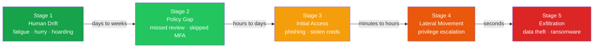
```mermaid
flowchart LR
    A[Stage 1<br/>Human Drift<br/>fatigue · hurry · hoarding] -->|days to weeks| B[Stage 2<br/>Policy Gap<br/>missed review · skipped MFA]
    B -->|hours to days| C[Stage 3<br/>Initial Access<br/>phishing · stolen creds]
    C -->|minutes to hours| D[Stage 4<br/>Lateral Movement<br/>privilege escalation]
    D -->|seconds| E[Stage 5<br/>Exfiltration<br/>data theft · ransomware]

    style A fill:#16a34a,color:#fff
    style B fill:#22c55e,color:#fff
    style C fill:#f59e0b,color:#fff
    style D fill:#ea580c,color:#fff
    style E fill:#dc2626,color:#fff
```

### C.2 Sector Breach Cost — 2024 Averages (source [2])

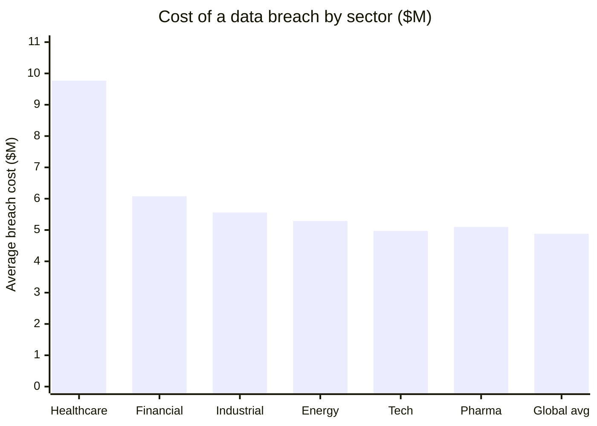
```mermaid
xychart-beta
    title "Cost of a data breach by sector ($M)"
    x-axis ["Healthcare", "Financial", "Industrial", "Energy", "Tech", "Pharma", "Global avg"]
    y-axis "Average breach cost ($M)" 0 --> 11
    bar [9.77, 6.08, 5.56, 5.29, 4.97, 5.10, 4.88]
```

### C.3 Direct Addressable Category — Insider + UEBA

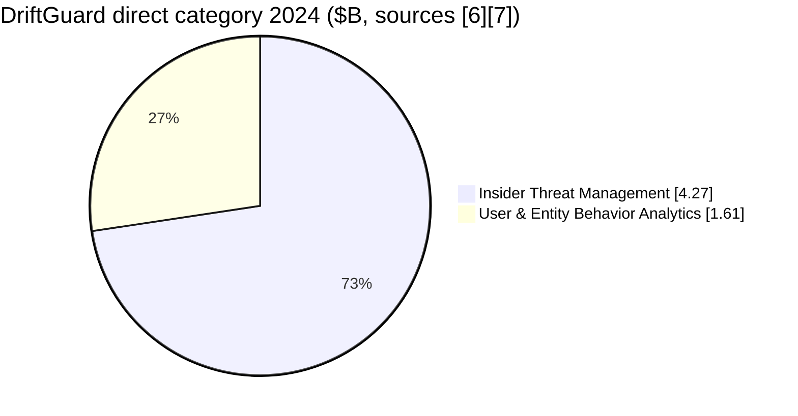
```mermaid
pie showData
    title DriftGuard direct category 2024 ($B, sources [6][7])
    "Insider Threat Management" : 4.27
    "User & Entity Behavior Analytics" : 1.61
```

### C.4 Cybersecurity Spend by Sector (2024)

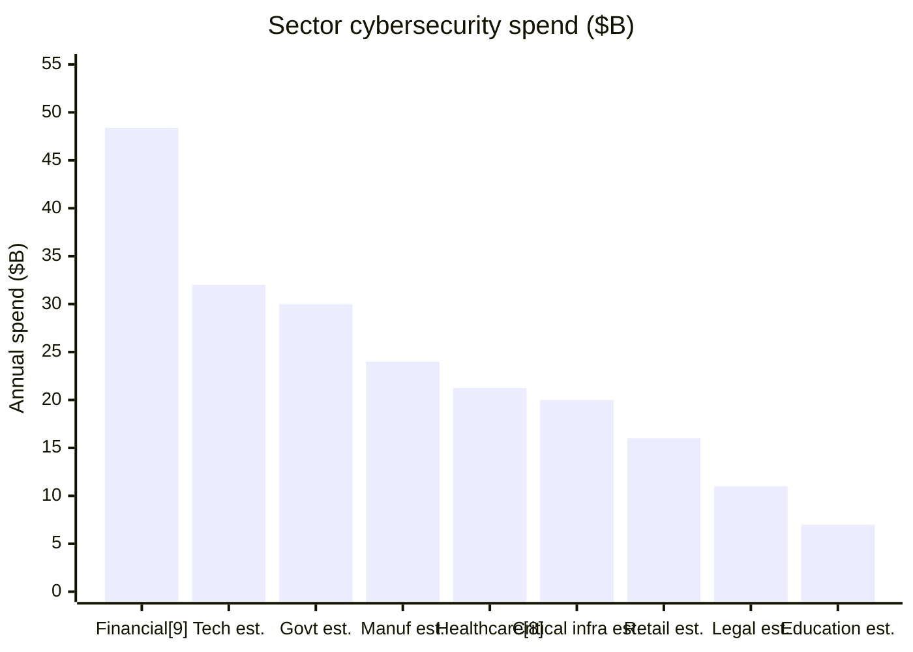
```mermaid
xychart-beta
    title "Sector cybersecurity spend ($B)"
    x-axis ["Financial[9]", "Tech est.", "Govt est.", "Manuf est.", "Healthcare[8]", "Critical infra est.", "Retail est.", "Legal est.", "Education est."]
    y-axis "Annual spend ($B)" 0 --> 55
    bar [48.4, 32, 30, 24, 21.25, 20, 16, 11, 7]
```

### C.5 ARR Trajectory — Four-Year Plan

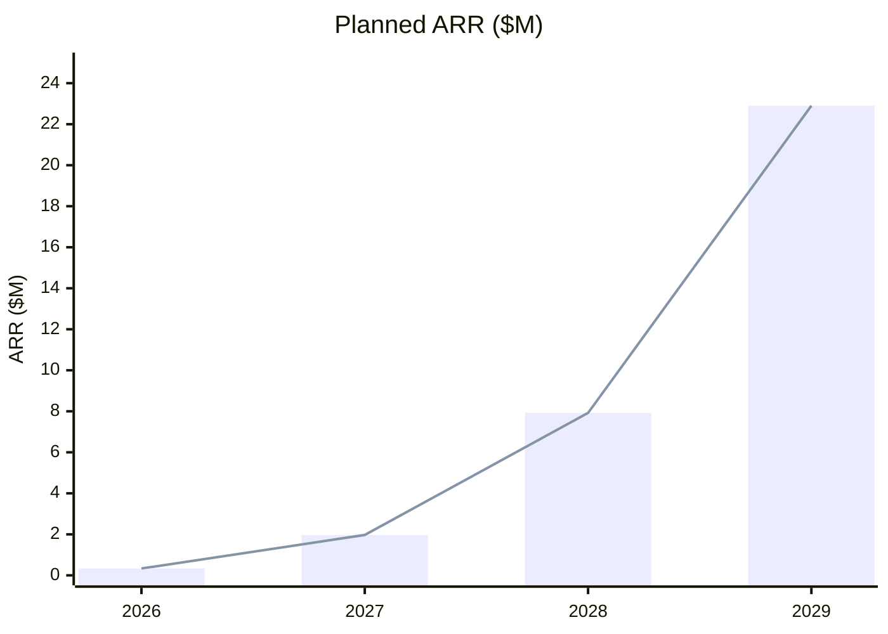
```mermaid
xychart-beta
    title "Planned ARR ($M)"
    x-axis ["2026", "2027", "2028", "2029"]
    y-axis "ARR ($M)" 0 --> 25
    bar [0.336, 1.97, 7.92, 22.9]
    line [0.336, 1.97, 7.92, 22.9]
```

### C.6 Logo Growth Plan

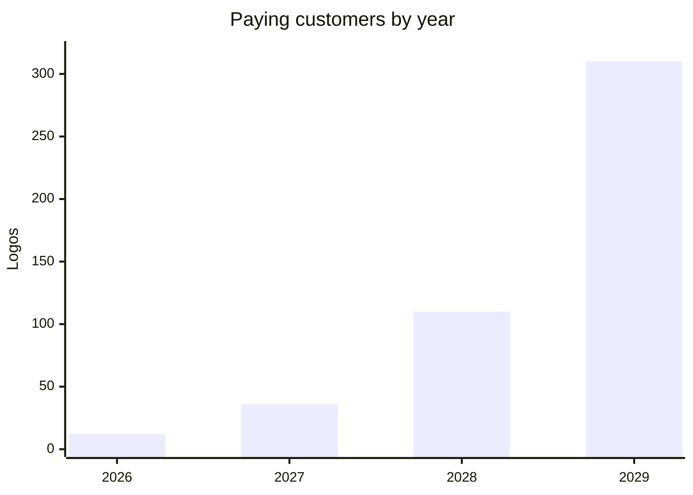
```mermaid
xychart-beta
    title "Paying customers by year"
    x-axis ["2026", "2027", "2028", "2029"]
    y-axis "Logos" 0 --> 320
    bar [12, 36, 110, 310]
```

### C.7 Unit Economics vs SaaS Benchmarks [12]

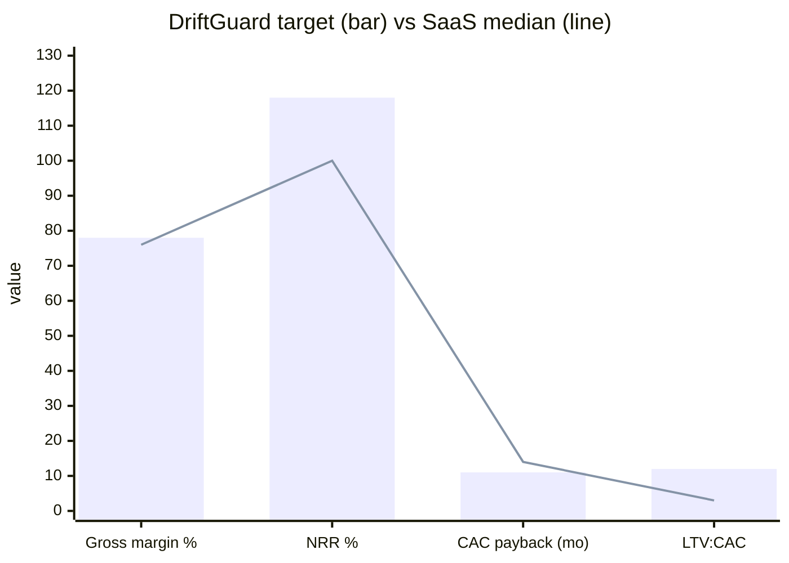
```mermaid
xychart-beta
    title "DriftGuard target (bar) vs SaaS median (line)"
    x-axis ["Gross margin %", "NRR %", "CAC payback (mo)", "LTV:CAC"]
    y-axis "value" 0 --> 130
    bar [78, 118, 11, 12]
    line [76, 100, 14, 3]
```

### C.8 12-Month Execution Gantt

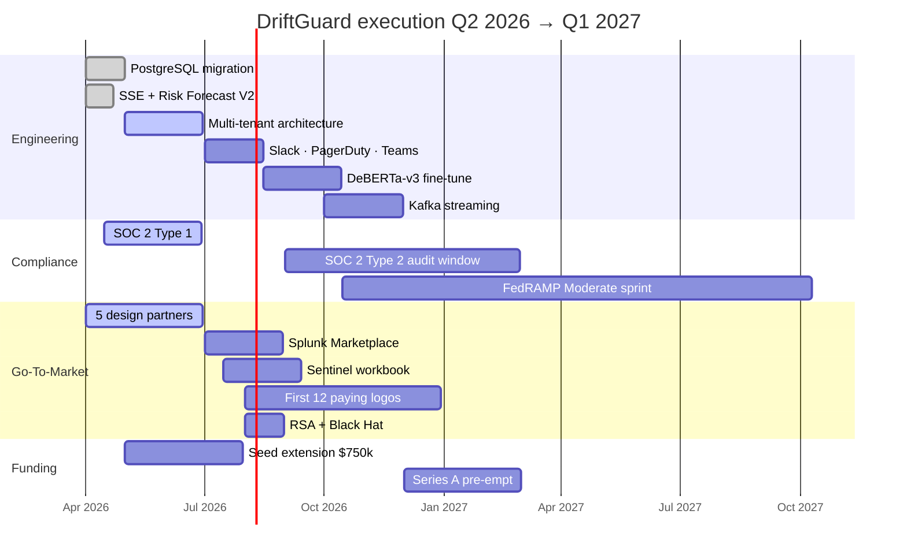
```mermaid
gantt
    title DriftGuard execution Q2 2026 → Q1 2027
    dateFormat  YYYY-MM-DD
    axisFormat  %b %Y

    section Engineering
    PostgreSQL migration               :done,    eng1, 2026-04-01, 30d
    SSE + Risk Forecast V2             :done,    eng2, 2026-04-01, 21d
    Multi-tenant architecture          :active,  eng3, 2026-05-01, 60d
    Slack · PagerDuty · Teams          :         eng4, 2026-07-01, 45d
    DeBERTa-v3 fine-tune               :         eng5, 2026-08-15, 60d
    Kafka streaming                    :         eng6, 2026-10-01, 60d

    section Compliance
    SOC 2 Type 1                       :active,  c1, 2026-04-15, 75d
    SOC 2 Type 2 audit window          :         c2, 2026-09-01, 180d
    FedRAMP Moderate sprint            :         c3, 2026-10-15, 360d

    section Go-To-Market
    5 design partners                  :active,  g1, 2026-04-01, 90d
    Splunk Marketplace                 :         g2, 2026-07-01, 60d
    Sentinel workbook                  :         g3, 2026-07-15, 60d
    First 12 paying logos              :         g4, 2026-08-01, 150d
    RSA + Black Hat                    :         g5, 2026-08-01, 30d

    section Funding
    Seed extension $750k               :         f1, 2026-05-01, 90d
    Series A pre-empt                  :         f2, 2026-12-01, 90d
```

### C.9 System Architecture

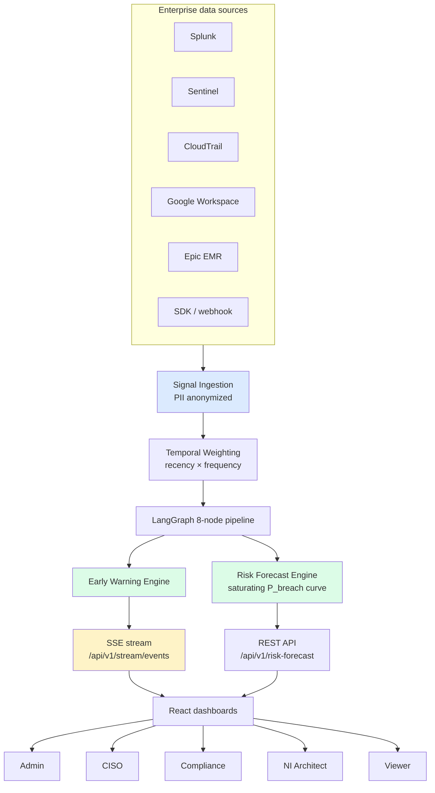
```mermaid
flowchart TB
    subgraph Sources["Enterprise data sources"]
        S1[Splunk]
        S2[Sentinel]
        S3[CloudTrail]
        S4[Google Workspace]
        S5[Epic EMR]
        S6[SDK / webhook]
    end

    Sources --> ING[Signal Ingestion<br/>PII anonymized]
    ING --> TW[Temporal Weighting<br/>recency × frequency]
    TW --> LG[LangGraph 8-node pipeline]

    LG --> RF[Risk Forecast Engine<br/>saturating P_breach curve]
    LG --> EW[Early Warning Engine]
    EW --> SSE[SSE stream<br/>/api/v1/stream/events]
    RF --> API[REST API<br/>/api/v1/risk-forecast]

    SSE --> UI[React dashboards]
    API --> UI
    UI --> R1[Admin]
    UI --> R2[CISO]
    UI --> R3[Compliance]
    UI --> R4[NI Architect]
    UI --> R5[Viewer]

    style ING fill:#dbeafe
    style RF fill:#dcfce7
    style EW fill:#dcfce7
    style SSE fill:#fef3c7
```

### C.10 Six Drift Patterns and NIST Controls (source [5])

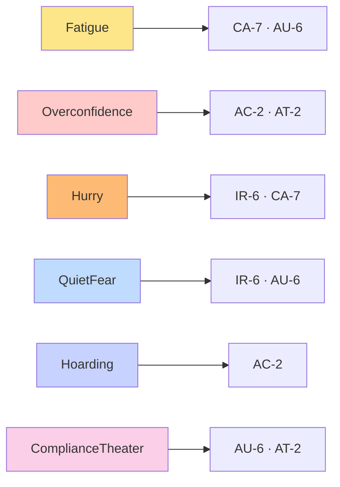
```mermaid
flowchart LR
    F[Fatigue] --> N1[CA-7 · AU-6]
    O[Overconfidence] --> N2[AC-2 · AT-2]
    H[Hurry] --> N3[IR-6 · CA-7]
    Q[QuietFear] --> N4[IR-6 · AU-6]
    HO[Hoarding] --> N5[AC-2]
    CT[ComplianceTheater] --> N6[AU-6 · AT-2]

    style F fill:#fde68a
    style O fill:#fecaca
    style H fill:#fdba74
    style Q fill:#bfdbfe
    style HO fill:#c7d2fe
    style CT fill:#fbcfe8
```

### C.11 Competitive Positioning Quadrant

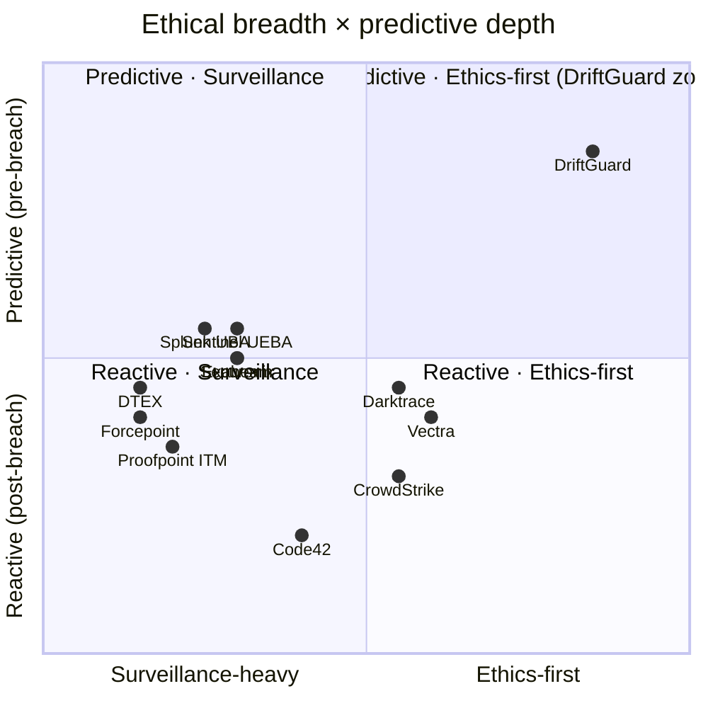
```mermaid
quadrantChart
    title Ethical breadth × predictive depth
    x-axis "Surveillance-heavy" --> "Ethics-first"
    y-axis "Reactive (post-breach)" --> "Predictive (pre-breach)"
    quadrant-1 "Predictive · Ethics-first (DriftGuard zone)"
    quadrant-2 "Predictive · Surveillance"
    quadrant-3 "Reactive · Surveillance"
    quadrant-4 "Reactive · Ethics-first"
    "DriftGuard": [0.85, 0.85]
    "Splunk UBA": [0.25, 0.55]
    "Sentinel UEBA": [0.30, 0.55]
    "Exabeam": [0.30, 0.50]
    "Securonix": [0.30, 0.50]
    "DTEX": [0.15, 0.45]
    "Forcepoint": [0.15, 0.40]
    "Proofpoint ITM": [0.20, 0.35]
    "Code42": [0.40, 0.20]
    "Darktrace": [0.55, 0.45]
    "CrowdStrike": [0.55, 0.30]
    "Vectra": [0.60, 0.40]
```

### C.12 Five Moats (Mind-Map)

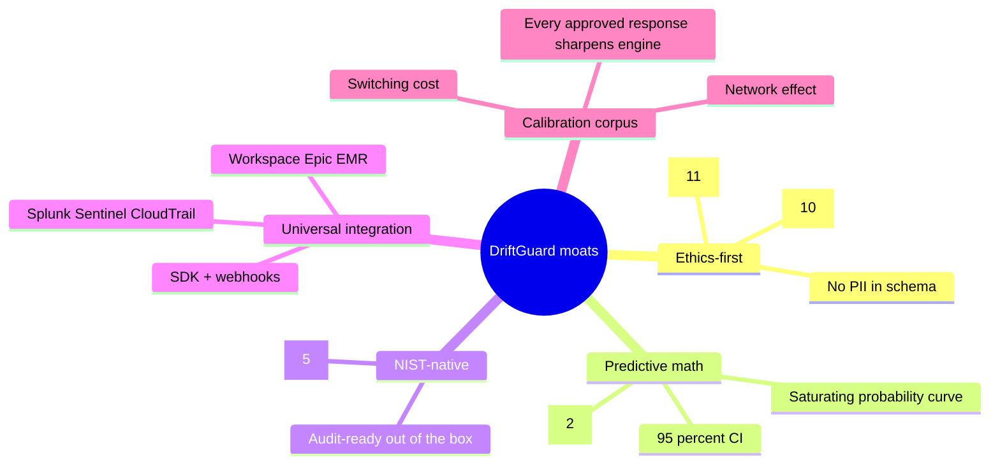
```mermaid
mindmap
  root((DriftGuard moats))
    Ethics-first
      No PII in schema
      GDPR Art. 22 [10]
      EU AI Act safe harbor [11]
    Predictive math
      Saturating probability curve
      95 percent CI
      Calibrated to IBM 2024 [2]
    NIST-native
      AC-2 AT-2 AU-6 CA-7 IR-6 [5]
      Audit-ready out of the box
    Universal integration
      Splunk Sentinel CloudTrail
      Workspace Epic EMR
      SDK + webhooks
    Calibration corpus
      Every approved response sharpens engine
      Network effect
      Switching cost
```

### C.13 Funnel — Outreach to Paid Logo (Year 1)

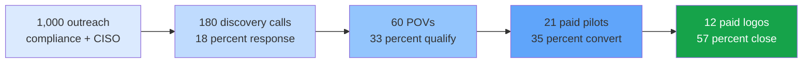
```mermaid
flowchart LR
    A[1,000 outreach<br/>compliance + CISO]
    B[180 discovery calls<br/>18 percent response]
    C[60 POVs<br/>33 percent qualify]
    D[21 paid pilots<br/>35 percent convert]
    E[12 paid logos<br/>57 percent close]
    A --> B --> C --> D --> E

    style A fill:#dbeafe
    style B fill:#bfdbfe
    style C fill:#93c5fd
    style D fill:#60a5fa
    style E fill:#16a34a,color:#fff
```

### C.14 Sales Cycle (Healthcare Example)

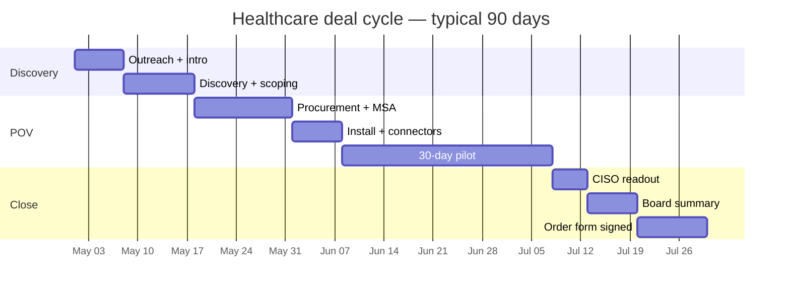
```mermaid
gantt
    title Healthcare deal cycle — typical 90 days
    dateFormat  YYYY-MM-DD
    axisFormat  %b %d

    section Discovery
    Outreach + intro                :a1, 2026-05-01, 7d
    Discovery + scoping             :a2, after a1, 10d

    section POV
    Procurement + MSA               :a3, after a2, 14d
    Install + connectors            :a4, after a3, 7d
    30-day pilot                    :a5, after a4, 30d

    section Close
    CISO readout                    :a6, after a5, 5d
    Board summary                   :a7, after a6, 7d
    Order form signed               :a8, after a7, 10d
```

### C.15 SWOT (Visual)

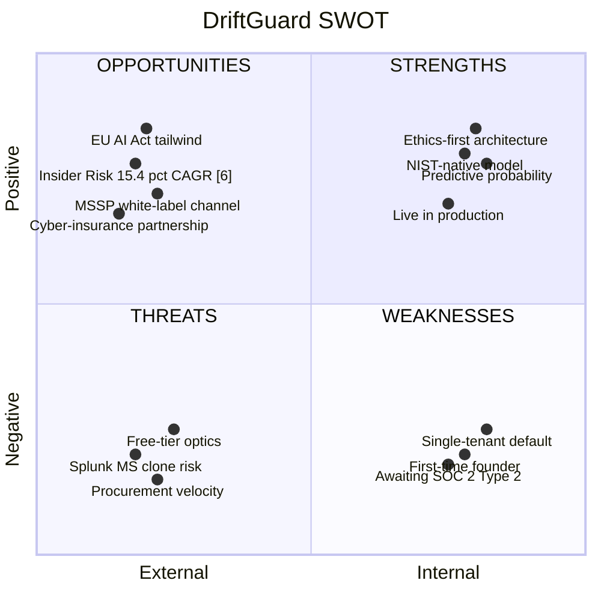
```mermaid
quadrantChart
    title DriftGuard SWOT
    x-axis "External" --> "Internal"
    y-axis "Negative" --> "Positive"
    quadrant-1 "STRENGTHS"
    quadrant-2 "OPPORTUNITIES"
    quadrant-3 "THREATS"
    quadrant-4 "WEAKNESSES"
    "Ethics-first architecture": [0.80, 0.85]
    "NIST-native model": [0.78, 0.80]
    "Predictive probability": [0.82, 0.78]
    "Live in production": [0.75, 0.70]
    "EU AI Act tailwind": [0.20, 0.85]
    "Insider Risk 15.4 pct CAGR [6]": [0.18, 0.78]
    "MSSP white-label channel": [0.22, 0.72]
    "Cyber-insurance partnership": [0.15, 0.68]
    "Splunk MS clone risk": [0.18, 0.20]
    "Procurement velocity": [0.22, 0.15]
    "Free-tier optics": [0.25, 0.25]
    "First-time founder": [0.78, 0.20]
    "Single-tenant default": [0.82, 0.25]
    "Awaiting SOC 2 Type 2": [0.75, 0.18]
```

### C.16 Risk Heatmap

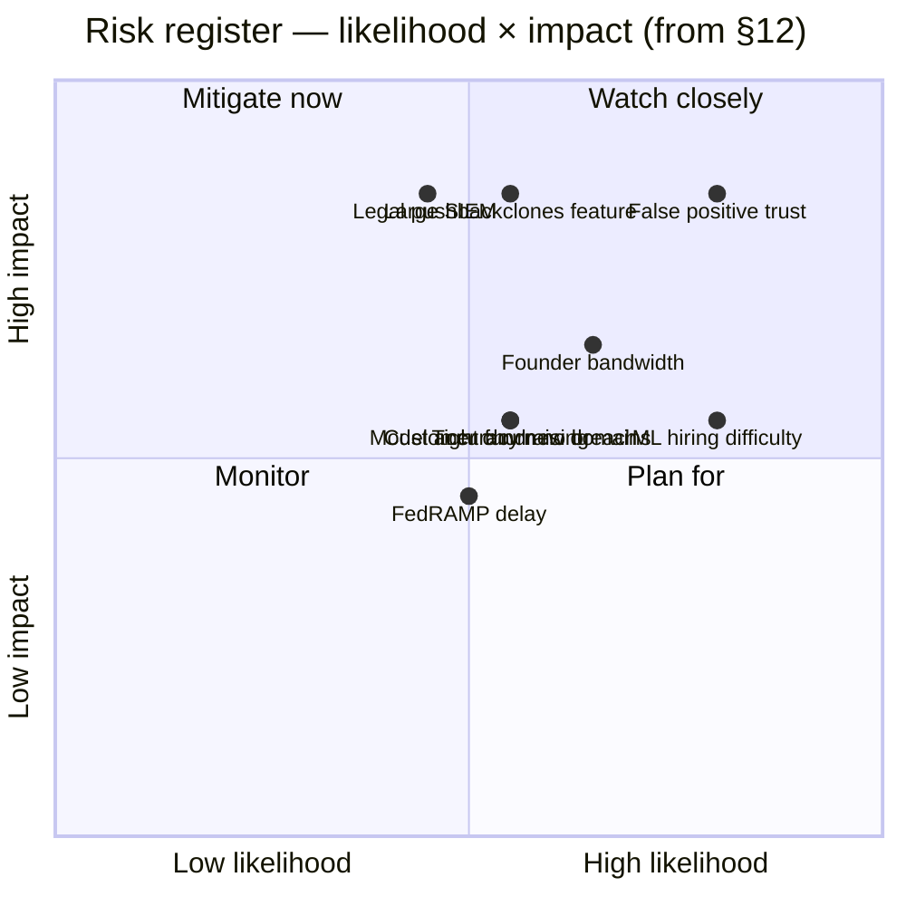
```mermaid
quadrantChart
    title Risk register — likelihood × impact (from §12)
    x-axis "Low likelihood" --> "High likelihood"
    y-axis "Low impact" --> "High impact"
    quadrant-1 "Watch closely"
    quadrant-2 "Mitigate now"
    quadrant-3 "Monitor"
    quadrant-4 "Plan for"
    "False positive trust": [0.80, 0.85]
    "Large SIEM clones feature": [0.55, 0.85]
    "Legal pushback": [0.45, 0.85]
    "Customer churn no breach": [0.55, 0.55]
    "Model accuracy new domains": [0.55, 0.55]
    "ML hiring difficulty": [0.80, 0.55]
    "Tight fundraising": [0.55, 0.55]
    "Founder bandwidth": [0.65, 0.65]
    "FedRAMP delay": [0.50, 0.45]
```

### C.17 KPI Control Plane

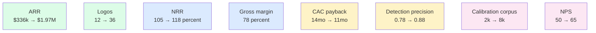
```mermaid
flowchart TB
    K1[ARR<br/>$336k → $1.97M]
    K2[Logos<br/>12 → 36]
    K3[NRR<br/>105 → 118 percent]
    K4[Gross margin<br/>78 percent]
    K5[CAC payback<br/>14mo → 11mo]
    K6[Detection precision<br/>0.78 → 0.88]
    K7[Calibration corpus<br/>2k → 8k]
    K8[NPS<br/>50 → 65]

    style K1 fill:#dcfce7
    style K2 fill:#dcfce7
    style K3 fill:#dbeafe
    style K4 fill:#dbeafe
    style K5 fill:#fef3c7
    style K6 fill:#fef3c7
    style K7 fill:#fce7f3
    style K8 fill:#fce7f3
```

### C.18 Funding Ladder

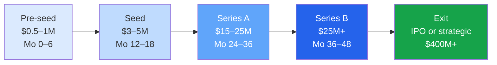
```mermaid
flowchart LR
    PS[Pre-seed<br/>$0.5–1M<br/>Mo 0–6]
    SD[Seed<br/>$3–5M<br/>Mo 12–18]
    SA[Series A<br/>$15–25M<br/>Mo 24–36]
    SB[Series B<br/>$25M+<br/>Mo 36–48]
    EX[Exit<br/>IPO or strategic<br/>$400M+]

    PS --> SD --> SA --> SB --> EX
    style PS fill:#dbeafe
    style SD fill:#bfdbfe
    style SA fill:#60a5fa,color:#fff
    style SB fill:#2563eb,color:#fff
    style EX fill:#16a34a,color:#fff
```

### C.19 Buyer Persona Map

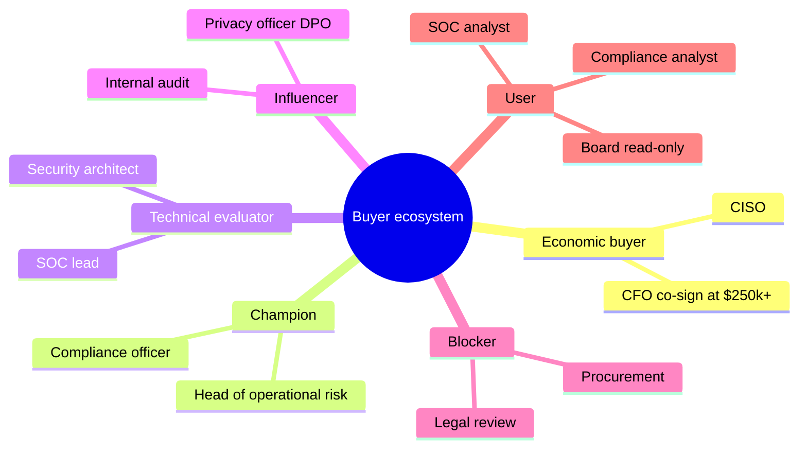
```mermaid
mindmap
  root((Buyer ecosystem))
    Economic buyer
      CISO
      CFO co-sign at $250k+
    Champion
      Compliance officer
      Head of operational risk
    Technical evaluator
      Security architect
      SOC lead
    Influencer
      Internal audit
      Privacy officer DPO
    Blocker
      Procurement
      Legal review
    User
      SOC analyst
      Compliance analyst
      Board read-only
```

### C.20 Ethical Architecture (Visual Promise)

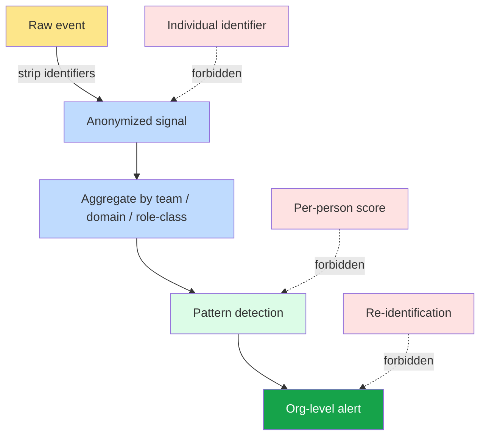
```mermaid
flowchart TB
    A[Raw event] -->|strip identifiers| B[Anonymized signal]
    B --> C[Aggregate by team / domain / role-class]
    C --> D[Pattern detection]
    D --> E[Org-level alert]

    X[Individual identifier] -.forbidden.-> B
    Y[Per-person score] -.forbidden.-> D
    Z[Re-identification] -.forbidden.-> E

    style A fill:#fde68a
    style B fill:#bfdbfe
    style C fill:#bfdbfe
    style D fill:#dcfce7
    style E fill:#16a34a,color:#fff
    style X fill:#fee2e2
    style Y fill:#fee2e2
    style Z fill:#fee2e2
```

> Dashed red lines = explicitly forbidden flows. The schema literally has no fields to support them.

---

## Page Map (≈15 pages when exported to PDF)

| Page | Section | Visual on page |
|---:|---|---|
| 1 | §1 Executive Summary | — |
| 2 | §2 Problem Statement | C.2 sector breach cost |
| 3 | §3 Solution + Pipeline | C.10 patterns map |
| 4 | §4 Market Opportunity | C.3 pie · C.4 sector spend |
| 5 | §5 Product Overview | C.9 architecture |
| 6 | §6 Business Model | C.7 unit-econ vs benchmarks |
| 7 | §7 Go-To-Market | C.13 funnel · C.14 sales cycle |
| 8 | §8 Competitive Landscape | C.11 quadrant · C.12 moats |
| 9 | §9 Financial Projections | C.5 ARR · C.6 logos · C.18 funding ladder |
| 10 | §10 Team + §11 Roadmap | C.8 Gantt |
| 11 | §12 Risks + §13 Open Questions | C.15 SWOT · C.16 risk heatmap |
| 12 | §14 Sources | — |
| 13 | Appendix A — V2 Addendum | C.1 lifecycle |
| 14 | Appendix B — Strategic Deep-Dive | C.19 buyer map · C.17 KPI plane |
| 15 | Appendix C — Visual Pack | C.20 ethical promise |

> **Export to a single PDF** — install the VS Code "Markdown PDF" extension (`yzane.markdown-pdf`), open this file, then `Cmd+Shift+P → Markdown PDF: Export (pdf)`. Mermaid renders automatically. For slides, run `npx @marp-team/marp-cli BUSINESS_PLAN.md --pdf`.

---

*End of business plan v2 — cited + visual edition · 20 diagrams · 15-page PDF layout.*

