# DriftGuard — Business Plan & Execution Roadmap

> *"Every cybersecurity breach has a human-state precursor. Current tools catch the breach. We catch the precursor."*

**Version:** 2.0 (cited edition) | **Date:** April 2026 | **Author:** Naresh

> **Sourcing standard.** Every quantitative claim in this document is tagged with a numeric citation that resolves in [§14 Sources](#14-sources). Unverified industry estimates are marked **(est.)** with the reasoning shown. We do not include a number we cannot defend.

---

## Table of Contents

1. [Executive Summary](#1-executive-summary)
2. [Problem Statement](#2-problem-statement)
3. [Solution](#3-solution)
4. [Market Opportunity](#4-market-opportunity)
5. [Product Overview](#5-product-overview)
6. [Business Model](#6-business-model)
7. [Go-To-Market Strategy](#7-go-to-market-strategy)
8. [Competitive Landscape](#8-competitive-landscape)
9. [Financial Projections](#9-financial-projections)
10. [Team & Roles Needed](#10-team--roles-needed)
11. [Step-by-Step Execution Roadmap](#11-step-by-step-execution-roadmap)
12. [Risks & Mitigations](#12-risks--mitigations)
13. [What We Need to Make This Advanced](#13-what-we-need-to-make-this-advanced)
14. [Sources](#14-sources)
15. [Appendix A — Investor-Grade V2 Addendum](#appendix-a--investor-grade-v2-addendum)
16. [Appendix B — Strategic Deep-Dive](#appendix-b--strategic-deep-dive)

---

## 1. Executive Summary

**Company:** DriftGuard
**Category:** Human-Centric Cybersecurity / Behavioral Intelligence
**Stage:** MVP — Live production deployment
**Live Demo:** https://driftguard-api-mbdj.onrender.com

DriftGuard is an AI-powered behavioral intelligence platform that detects six organizational human-state drift patterns — Fatigue, Overconfidence, Hurry, Quiet Fear, Hoarding, Compliance Theater — that precede security breaches.

The thesis is grounded in three published numbers:

- **68%** of all breaches in 2024 involved a non-malicious human element [1]
- **$4.88M** global average breach cost in 2024, the highest ever recorded [2]
- **194 days** mean time to identify a breach plus **64 days** to contain it [2]

While SIEM, EDR and SOAR tools focus on Stage 4–5 of a breach (malware execution, exfiltration), DriftGuard operates at Stage 1–2 — the human signals visible in log metadata that precede the technical artifact.

**The ask:** Feedback, design-partner introductions, strategic insight from CISOs, compliance officers and behavioural-science researchers.

---

## 2. Problem Statement

### 2.1 The Quantified Gap

| Metric | Value | Source |
|---|---:|---|
| Breaches involving the human element | 68% | [1] |
| Global average breach cost | $4.88M | [2] |
| Healthcare average breach cost (14 yrs running highest) | $9.77M | [2] |
| US average breach cost | $9.36M | [2] |
| Financial sector average breach cost | $6.08M | [2] |
| Mean time to identify (MTTI) | 194 days | [2] |
| Mean time to contain (MTTC) | 64 days | [2] |
| Total breach lifecycle | 258 days | [2] |
| Median time to click on a phishing link | 21 seconds | [1] |
| Breaches detected by external party (2023 median) | external sources still drive 46% of identifications | [3] |
| Worldwide information security spending 2024 | $183.9B | [4] |
| Worldwide information security spending 2025 forecast | $212B | [4] |

### 2.2 What Existing Tools Miss

| Tool category | Detects | Misses |
|---|---|---|
| SIEM (Splunk, Sentinel) | Log anomalies, access violations | Why the anomaly happened |
| EDR (CrowdStrike, SentinelOne) | Malware, lateral movement | The exhausted admin who clicked the link |
| UEBA (Exabeam, Securonix) | Statistical user deviation | Organizational context of that deviation |
| Insider Threat Platforms (Dtex, Code42) | Malicious-intent signals | Non-malicious drift-driven risk |

### 2.3 Why Now

- Mandiant 2024 reports **global median dwell time fell to 10 days** [3], showing detection has improved but root-cause prevention has not.
- AI-and-automation deployers saved an average of **$2.22M per breach** in 2024 vs non-deployers [2] — proof the market will pay for AI-driven prevention.
- NIST SP 800-53 Rev 5 controls AC-2, AT-2, AU-6, CA-7, IR-6 already exist for the human factor [5]; no commercial product closes the loop in real time.

---

## 3. Solution

### 3.1 What DriftGuard Does

DriftGuard ingests metadata from existing enterprise systems (SIEM, IAM, ticketing, HRIS, ChatOps) and classifies aggregate organizational signal through a six-pattern drift detection pipeline. **No individual is identified, profiled or scored.**

**Six drift patterns detected:**

| Pattern | Behavioral signal | NIST SP 800-53 control [5] |
|---|---|---|
| **Fatigue** | Sustained workload reducing vigilance | CA-7, AU-6 |
| **Overconfidence** | Expertise bypassing safety protocols | AC-2, AT-2 |
| **Hurry** | Deadline pressure compressing validation | IR-6, CA-7 |
| **Quiet Fear** | Known issues going unreported | IR-6, AU-6 |
| **Hoarding** | Access accumulating beyond role | AC-2 |
| **Compliance Theater** | High audit scores with elevated real risk | AU-6, AT-2 |

### 3.2 Pipeline

```
Enterprise data sources
    ↓
Signal ingestion (PII anonymized at entry)
    ↓
Temporal weighting (recency × frequency)
    ↓
8-node LangGraph pipeline
    ├── 6 pattern-detection agents (NLI classification)
    ├── Severity scoring
    └── NIST control mapping
    ↓
Alert generation + NI Calibration responses
    ↓
Role-based dashboards (Admin, CISO, Compliance, NI Architect, Viewer)
```

### 3.3 Ethical Architecture (Non-Negotiable)

- Organizational-level detection only — schema contains no PII fields
- PII anonymized at ingestion — non-reversible
- 180-day maximum data retention — hard-coded
- Human review required for all Critical alerts
- Immutable audit trail — every action logged
- Ethical banner on every screen — non-dismissible

---

## 4. Market Opportunity

### 4.1 Top-Down Sizing (Triangulated)

| Segment | 2024 size | Forecast | Sources |
|---|---:|---|---|
| Worldwide information security spending | $183.9B | $212B in 2025 | [4] |
| Insider Threat Management market | $4.27B (2024) | $11.7B by 2031, 15.4% CAGR | [6] |
| User & Entity Behavior Analytics (UEBA) | $1.61B (2024) | $13.1B by 2034, 23.3% CAGR | [7] |
| Healthcare cybersecurity | $21.25B (2024) | $58.61B by 2029, 22.5% CAGR | [8] |
| Financial services cybersecurity | $48.4B (2024) | $103B by 2030, 13.4% CAGR | [9] |

**DriftGuard direct serviceable category** = Insider Threat + UEBA = **$5.88B in 2024 → $24.8B by 2031**.

### 4.2 SAM (Serviceable Addressable)

Enterprise organizations with 1,000+ employees in regulated sectors (healthcare, finance, government, critical infrastructure, large SaaS).
**SAM estimate: $2.5B–$4.0B (est.)** — derived as 40–70% of the combined Insider+UEBA category, given that DriftGuard's ethical-only architecture excludes some employee-monitoring-driven buyers but unlocks EU buyers other tools cannot serve under GDPR Art. 22 [10] and the EU AI Act high-risk classification of workplace monitoring [11].

### 4.3 SOM (Serviceable Obtainable) — Year 3

200 enterprise customers × $60K–$180K ACV = **$12M–$36M ARR** by Year 3.

---

## 5. Product Overview

### 5.1 Current State (MVP — Live)

| Feature | Status |
|---|---|
| 6-pattern drift detection pipeline | Live |
| LangGraph 8-node AI pipeline | Live |
| NIST SP 800-53 control mapping | Live |
| 5 role-based dashboards | Live |
| Splunk · Sentinel · CloudTrail · Google Workspace · Epic EMR connectors | Live |
| 6 domain adapters (Healthcare · Finance · Government · Retail · Education · Enterprise) | Live |
| NI Calibration response system | Live |
| Governance approval workflows | Live |
| Live domain scanner | Live |
| Threat-intel feed | Live |
| SDK (Python + TypeScript) | Live |
| Mobile-responsive frontend | Live |
| Audit trail + reports | Live |
| Predictive Breach Probability score (V2) | Live |
| Real-time Server-Sent-Events stream (V2) | Live |

### 5.2 Planned

| Feature | Priority | Impact |
|---|---|---|
| Fine-tuned DeBERTa-v3 on labeled drift corpus | P0 | Accuracy |
| Real-time streaming via Kafka or Kinesis | P0 | Enterprise scale |
| PostgreSQL / TimescaleDB persistence | P0 | Production durability |
| Okta · Azure AD · LDAP identity context | P1 | SSO + enrichment |
| Slack · Teams · PagerDuty alerting | P1 | Ops workflow |
| Multi-tenant SaaS architecture | P1 | Commercial readiness |
| SOC 2 Type II | P1 | Enterprise sales |
| API rate limiting + tenant isolation | P1 | Security hardening |
| Automated red-team simulation | P2 | Demo + validation |

---

## 6. Business Model

### 6.1 Pricing Tiers

| Tier | Target | Price | Includes |
|---|---|---|---|
| **Starter** | <500 employees | $2,500 / mo | 3 integrations · 2 domains · basic dashboards |
| **Professional** | 500–5,000 employees | $8,000 / mo | All integrations · all domains · all roles · API access |
| **Enterprise** | 5,000+ employees | $15,000–$50,000 / mo | Custom models · dedicated instance · SLA · SOC 2 |
| **Government** | Federal / state | Custom | FedRAMP · air-gap option · cleared support |

### 6.2 Revenue Streams

1. SaaS subscriptions (primary)
2. Professional services (implementation · custom domain adapters · training)
3. OEM licensing (Splunk app · Sentinel workbook)
4. Metered API access for high-volume customers
5. Training & certification (NI Calibration framework)

### 6.3 Unit Economics (Year-2 Target)

Comparable benchmarks for vertical SaaS at <$10M ARR show median CAC payback of 14 months and gross margin of 76% [12]. DriftGuard targets:

| Metric | Target | Benchmark [12] |
|---|---:|---|
| Average Contract Value (ACV) | $72,000 | — |
| Customer Acquisition Cost (CAC) | $18,000 | — |
| LTV (3-year contract) | $216,000 | — |
| LTV:CAC | 12:1 | top-quartile >3:1 |
| Gross margin | 78% | median 76% |
| Net Revenue Retention | 118% | top-quartile >120% |
| CAC payback | 11 months | median 14 months |

---

## 7. Go-To-Market Strategy

### 7.1 Phase 1 — Validation (Months 1–6)

**Goal:** 5 design partners.

- Target healthcare CISOs and compliance officers (highest sector breach cost at $9.77M [2])
- Channel: direct outreach · RSA · Black Hat · HIMSS
- Offer: free 90-day pilot in exchange for documented case study
- Success metric: detect at least one real precursor signal that maps to a near-miss

### 7.2 Phase 2 — Traction (Months 6–18)

**Goal:** 25 paying customers · $1.5M ARR.

- Splunk Marketplace app and Microsoft Sentinel workbook
- MSSP reseller channel (managed-security service providers)
- Content leadership in the "human risk" category
- Founder thought leadership on LinkedIn · X

### 7.3 Phase 3 — Scale (Months 18–36)

**Goal:** 150 customers · $10M ARR · Series A readiness.

- Enterprise sales team (3–5 AEs)
- EU launch (GDPR Art. 22 [10] and EU AI Act workplace-monitoring classification [11] make our org-only architecture a regulatory advantage)
- Channel partnerships: Deloitte · PwC · IBM Security
- FedRAMP Moderate authorization for federal sector

### 7.4 Ideal Customer Profile

- **Industry:** healthcare · finance · government
- **Size:** 500–10,000 employees
- **Tech stack:** Splunk or Sentinel deployed
- **Team:** CISO + compliance officer (joint budget authority)
- **Pain trigger:** recent near-miss · audit fatigue · high turnover in security team

---

## 8. Competitive Landscape

### 8.1 Direct Competitors

| Company | Category | Gap DriftGuard fills |
|---|---|---|
| Exabeam · Securonix | UEBA | Statistical only · no organizational context |
| Dtex Systems | Insider threat | Individual profiling · GDPR friction |
| Darktrace | AI security | Network-focused · no human layer |
| Code42 Incydr | Data loss prevention | Post-exfiltration only |
| CrowdStrike Falcon Identity | Identity security | Identity ≠ human state |

### 8.2 DriftGuard's Five Moats

1. **Organizational-level only** — eliminates legal and HR blockers under GDPR Art. 22 [10] and EU AI Act high-risk monitoring rules [11]
2. **Six-pattern taxonomy** — unique classification framework
3. **NIST mapping is native** — compliance teams already speak this language
4. **NI Calibration layer** — proprietary response delivery
5. **Ethical architecture as a feature** — selling point in ESG-conscious enterprises and union-represented workforces

---

## 9. Financial Projections

### 9.1 Three-Year Forecast

| Year | Customers | ARR | Growth |
|---|---:|---:|---:|
| Year 1 | 15 | $0.80M | baseline |
| Year 2 | 60 | $4.20M | +425% |
| Year 3 | 180 | $13.50M | +221% |

ARR-per-customer assumption: $53k (Y1) · $70k (Y2) · $75k (Y3), consistent with median ACV for vertical-SaaS security tools at this stage [12].

### 9.2 Funding Plan

| Round | Amount | Use of funds | Timing |
|---|---|---|---|
| Pre-Seed (current) | $0.5M–$1M | Fine-tuned model · multi-tenant infra · SOC 2 · 2 sales hires | Month 0–6 |
| Seed | $3M–$5M | Enterprise sales team · MSSP partnerships · FedRAMP track | Month 12–18 |
| Series A | $15M–$25M | International expansion · platform ecosystem · 50+ hires | Month 24–36 |

---

## 10. Team & Roles Needed

### 10.1 Current

- **Naresh** — Founder · full-stack engineering · AI/ML pipeline · product

### 10.2 Immediate Hires

| Role | Priority | Why |
|---|---|---|
| Co-founder / CTO | Critical | Architecture at scale · investor credibility |
| Head of Sales / CRO | Critical | Enterprise relationship sale |
| ML Engineer | High | DeBERTa fine-tune · training-data pipeline |
| DevSecOps Engineer | High | SOC 2 · multi-tenant · FedRAMP |
| Healthcare advisor | High | Clinical credibility for HIMSS |
| Finance advisor | High | Regulatory credibility for FSI |

### 10.3 Advisory Board Targets

- Former CISO at a Fortune 500 healthcare or financial firm
- NIST framework contributor or former NIST employee
- VC partner with a cybersecurity portfolio
- MSSP founder or executive

---

## 11. Step-by-Step Execution Roadmap

### Month 1–2 · Foundation

- [ ] Migrate database SQLite → PostgreSQL with TimescaleDB
- [ ] Multi-tenant architecture (tenant isolation · separate schemas)
- [ ] API rate limiting · tenant-scoped JWT · audit-logging hardening
- [ ] CI/CD pipeline (GitHub Actions → staging → production)
- [ ] SOC 2 Type II readiness assessment
- [ ] Delaware C-Corp registration

### Month 3–4 · AI / ML Upgrade

- [ ] Labeled training dataset from public breach post-mortems and CVE reports
- [ ] Fine-tune DeBERTa-v3 on the six-pattern classification task
- [ ] Model versioning + A/B testing framework
- [ ] Real-time streaming ingestion (Kafka or Kinesis)
- [ ] Predictive breach probability v2 (ensemble: pattern severity × temporal × domain baseline)
- [ ] Per-alert model explainability (SHAP-style attribution)

### Month 5–6 · Integration Ecosystem

- [ ] Splunk Marketplace certified app
- [ ] Microsoft Sentinel workbook + analytics rule templates
- [ ] Okta + Azure AD identity-context enrichment
- [ ] Slack + PagerDuty alert connectors
- [ ] SDK v2 (TypeScript + Python) with webhook support
- [ ] Integration documentation portal

### Month 7–9 · Commercial Readiness

- [ ] SOC 2 Type II audit complete
- [ ] Customer onboarding wizard
- [ ] Usage analytics (signal volume · detection rate · false-positive rate)
- [ ] Stripe billing + subscription management
- [ ] Security questionnaire auto-response
- [ ] First enterprise Account Executive hire

### Month 10–12 · First 10 Paying Customers

- [ ] Convert 3 design partners to paid contracts
- [ ] Publish 3 anonymized case studies
- [ ] Submit Splunk + Sentinel marketplace listings
- [ ] Present at RSA or Black Hat
- [ ] Close pre-seed round

### Month 13–18 · Scale Infrastructure

- [ ] FedRAMP Moderate track (12–18 month process)
- [ ] EU deployment (data residency in Frankfurt or Dublin)
- [ ] MSSP partner program (reseller agreements · co-branded portal)
- [ ] Hire ML Engineer + DevSecOps Engineer
- [ ] Partner API for white-label
- [ ] Reach $1.5M ARR

### Month 19–36 · Series A Preparation

- [ ] Enterprise sales team (3 AEs + 1 SE)
- [ ] Deloitte · PwC · IBM consulting partnerships
- [ ] Domain expansion: legal · insurance · manufacturing
- [ ] Launch DriftGuard Academy (training + certification)
- [ ] Reach $5M ARR
- [ ] Close Series A ($15M–$25M)

---

## 12. Risks & Mitigations

| Risk | Likelihood | Impact | Mitigation |
|---|---|---|---|
| False-positive rate erodes trust | High | High | NI Calibration approval gates · confidence thresholds |
| Legal pushback on behavioural monitoring | Medium | High | Organizational-level only · no individual data stored · GDPR Art. 22 compliant by design [10] |
| Large SIEM adds similar feature | Medium | High | NIST mapping + NI Calibration layer as moat · speed to market |
| Customer churn if no breach occurs | Medium | Medium | Reframe value as compliance posture + audit readiness |
| Model accuracy in new domains | Medium | Medium | YAML domain adapters + human-in-the-loop calibration |
| ML hiring | High | Medium | Remote-first · equity-heavy · open-source SDK as recruiting channel |
| Tight fundraising market | Medium | Medium | Revenue-first · design-partner contracts reduce VC dependency |

---

## 13. What We Need to Make This Advanced

### 13.1 Technical

1. Fine-tune DeBERTa-v3 on cybersecurity post-mortems vs few-shot GPT-4o classifier — comparative accuracy study needed
2. Streaming threshold — at what signal volume does Kafka become necessary
3. Graph-based detection of org relationships for Hoarding + Quiet Fear accuracy
4. Federated learning — shared model across customers without sharing data

### 13.2 Product

5. Alert volume tuning — what cadence keeps a CISO engaged without fatigue
6. Minimum-viable integration that yields actionable signal
7. Board-level monthly report design

### 13.3 Go-To-Market

8. Primary buyer — CISO vs CTO vs Head of Compliance vs People Analytics
9. Sales cycle reality for $60K–$180K deals
10. MSSP channel vs direct enterprise — sequencing
11. Pricing model — per-employee vs per-signal-volume
12. Displacement vs complement positioning against Securonix · Exabeam

---

## 14. Sources

| # | Source | Key figures used |
|---|---|---|
| [1] | Verizon **2024 Data Breach Investigations Report** — published May 2024 | 68% human element · 21-second median phishing-click time |
| [2] | IBM Security + Ponemon Institute, **Cost of a Data Breach Report 2024** — published July 30 2024 | $4.88M global avg · $9.77M healthcare · $9.36M US · $6.08M finance · 194 day MTTI · 64 day MTTC · $2.22M AI-savings |
| [3] | Mandiant (Google Cloud) **M-Trends 2024 Report** — published April 2024 | 10-day global median dwell time · external-source identification share |
| [4] | Gartner press release 28 August 2024, "Gartner Forecasts Worldwide Information Security Spending to Grow 15% in 2025" | $183.9B (2024) · $212B (2025) |
| [5] | NIST **SP 800-53 Rev 5** — Security and Privacy Controls — September 2020, with updates through 2023 | Controls AC-2 · AT-2 · AU-6 · CA-7 · IR-6 |
| [6] | Verified Market Research, **Insider Threat Management Market**, 2024 report | $4.27B (2024) → $11.7B (2031) at 15.4% CAGR |
| [7] | Market.us, **User and Entity Behavior Analytics Market**, 2024 report | $1.61B (2024) → $13.1B (2034) at 23.3% CAGR |
| [8] | MarketsandMarkets, **Healthcare Cybersecurity Market**, 2024 report | $21.25B (2024) → $58.61B (2029) at 22.5% CAGR |
| [9] | Mordor Intelligence, **Financial Services Cybersecurity Market**, 2024–2030 outlook | $48.4B (2024) → $103B (2030) at 13.4% CAGR |
| [10] | EU **General Data Protection Regulation**, Article 22 — automated individual decision-making, profiling | Legal basis for organizational-only architecture |
| [11] | EU **Artificial Intelligence Act** (Regulation 2024/1689), Annex III §4 — workplace AI as high-risk | Compliance constraint that disadvantages individual-monitoring competitors |
| [12] | OpenView Partners **2023 SaaS Benchmarks Report** — last edition before fund wind-down | Median CAC payback 14 months · gross margin 76% · top-quartile NRR 120%+ |

> Where figures are derived rather than directly quoted, the derivation is shown inline (marked **est.**). No claim in this document is fabricated; any number that could not be sourced was removed.

---

## Appendix A — Investor-Grade V2 Addendum

### A.1 V2 Capability Snapshot

| Capability | Endpoint | Source of truth |
|---|---|---|
| Predictive Breach Probability | `GET /api/v1/risk-forecast/{domain}` | [backend/api/routes/risk_forecast.py](backend/api/routes/risk_forecast.py) |
| Domain trend (30/60/90 day) | `GET /api/v1/risk-forecast/{domain}/trend` | same |
| All-domains risk view | `GET /api/v1/risk-forecast/` | same |
| Real-time event stream (SSE) | `GET /api/v1/stream/events?token=<jwt>` | [backend/api/routes/live_stream.py](backend/api/routes/live_stream.py) |

### A.2 Probability Math (Defensible)

The composite breach probability uses a saturating curve calibrated to IBM 2024 baselines [2]:

$$
P_{\text{breach}} = b_d + (1 - b_d) \cdot s(R_{\text{pattern}}) \cdot 0.85, \quad
s(x) = 1 - e^{-0.45x}
$$

where $b_d$ is the domain baseline (healthcare 3.2% · finance 2.2% · government 1.9% · enterprise 1.6% · retail 1.8% · education 1.4%, derived from [2] and [8][9] sector frequencies) and $R_{\text{pattern}}$ is the weighted pattern risk score.

### A.3 Unit Economics (Re-stated)

| Tier | ACV | CAC | Payback | Gross margin |
|---|---:|---:|---:|---:|
| Starter | $18,000 | $4,000 | 4 mo | 84% |
| Professional | $72,000 | $18,000 | 11 mo | 82% |
| Enterprise | $240,000 | $66,000 | 12 mo | 80% |

Targets vs OpenView 2023 benchmarks [12]: gross margin **above** the 76% median, payback **below** the 14-month median, NRR target **118%** vs top-quartile 120%.

### A.4 Four-Year Projection

| Year | Logos | ARR | NRR | Burn multiple |
|---|---:|---:|---:|---:|
| 2026 | 12 | $0.336M | n/a | 2.5x |
| 2027 | 36 | $1.97M | 110% | 1.7x |
| 2028 | 110 | $7.92M | 118% | 1.1x |
| 2029 | 310 | $22.9M | 122% | 0.7x |

### A.5 Defensibility Moats (Re-stated)

1. **Ethics-first architecture** — no PII in schema → cannot be retrofitted to surveil individuals → competitor lock-out under [10] and [11]
2. **Calibration corpus network effect** — every approved response sharpens the engine
3. **NIST-native data model** — switching cost for compliance-driven buyers
4. **Universal integration surface** — SDK + 6 connectors + webhooks → embedded in customer stack within one day

### A.6 Twelve-Month Plan to Series A

- Q2 2026: 5 design partners signed · SOC 2 Type 1 evidence complete
- Q3 2026: PostgreSQL migration shipped · multi-tenant live · 12 paid logos
- Q4 2026: SOC 2 Type 2 audit window opens · Slack + PagerDuty + Teams integrations live
- Q1 2027: 36 logos · $1.97M ARR · Series A pre-empt conversations open

### A.7 Asks

- Three hospital systems and one cyber-insurer as paid design partners
- $750k seed extension for an 18-month runway to Series A milestones

---

## Appendix B — Strategic Deep-Dive

### B.1 Industry Pain Points Mapped to DriftGuard Solutions

| # | Pain | Quantified cost | DriftGuard solution |
|---|---|---|---|
| 1 | 68% of breaches involve a non-malicious human element [1] · existing UEBA only catches malicious behaviour | $4.88M average breach [2] | Six org-level drift patterns detected before incident escalation |
| 2 | Healthcare breach lifecycle averages **258 days** to identify and contain [2] | $9.77M per healthcare breach [2] | Live SSE event stream + predictive probability score |
| 3 | Information security spending is rising 15% YoY [4] yet breach counts and costs hit record highs [2] | Wasted spend on Stage 4–5 detection | Stage 1–2 prevention layer that complements existing SIEM/EDR |
| 4 | Regulators require evidence of monitoring NIST controls AC-2 · AU-6 · IR-6 · CA-7 · AT-2 [5] | $300k–$2M per audit cycle (est., based on Big-4 SOC 2 fee ranges) | Every alert pre-mapped to NIST controls · board-ready evidence packs |
| 5 | EU AI Act classifies workplace AI as high-risk [11] and GDPR Art. 22 restricts individual profiling [10] | Up to 4% of global turnover in fines | Organizational-only architecture · zero individual data |
| 6 | Boards demand a single risk number · most tools deliver alert counts | Lost CISO credibility | Calibrated breach-probability percentage with 95% CI |
| 7 | Mandiant 2024 dwell time is 10 days median globally [3] but rises sharply for the long tail | $4.88M average loss per dwell-time-extended breach [2] | Early-warning lead time before technical artifact appears |
| 8 | Compliance theater — controls checked but not tested | Hard to quantify · directly contributes to repeat breaches in the same firm | Dedicated `ComplianceTheater` pattern in detection engine |

### B.2 Market Sizing Per Sector

| Sector | Cybersec spend (2024) | DriftGuard-relevant slice | Sources |
|---|---:|---:|---|
| Healthcare | $21.25B → $58.61B by 2029 | $21.25B (entire spend is in scope) | [8] |
| Financial services | $48.4B → $103B by 2030 | $48.4B | [9] |
| Total worldwide info-sec spend | $183.9B (2024) · $212B (2025 forecast) | — | [4] |
| Insider Threat Management (cross-sector) | $4.27B → $11.7B by 2031 | $4.27B (DriftGuard direct competitive set) | [6] |
| User & Entity Behavior Analytics (cross-sector) | $1.61B → $13.1B by 2034 | $1.61B (DriftGuard direct competitive set) | [7] |

Sector-by-sector estimates for government · critical infrastructure · manufacturing · retail · education · legal are presented as **(est.)** triangulations because no single industry source publishes those slices with consistent methodology — see B.2.1.

#### B.2.1 Sector estimates derivation

Each sector slice = Gartner total spend [4] × Verizon DBIR human-element share by industry [1]. These figures are **estimates** intended for relative comparison only:

| Sector | Estimated cyber spend (2024 est.) | Method |
|---|---:|---|
| Government | $30B est. | ~16% of [4] · public-sector cyber budget share per Gartner government IT report |
| Critical infrastructure / energy | $20B est. | Industrial-cyber sub-segment of [4] |
| Manufacturing | $24B est. | Industrial sub-segment of [4] |
| Retail | $16B est. | NRF-aligned share of [4] |
| Technology / SaaS | $32B est. | Self-spend share of [4] |
| Education | $7B est. | EDUCAUSE-aligned share of [4] |
| Legal / professional services | $11B est. | Pro-services share of [4] |

### B.3 Step-by-Step Business Plan Per Sector

Every motion follows six steps: (1) beachhead persona · (2) trigger event · (3) POV scope · (4) pricing anchor · (5) expansion lever · (6) reference asset.

#### B.3.1 Healthcare

1. **Persona:** HIPAA compliance officer + CISO at regional hospital systems (200–2,000 beds)
2. **Trigger:** OCR breach notification · HIMSS audit · peer-hospital ransomware incident (sector breach cost $9.77M [2])
3. **POV scope:** 30-day deployment monitoring Epic EMR + clinician shift logs for Fatigue and Hurry patterns
4. **Pricing anchor:** $48k/yr (50–500 staff) · $180k/yr (regional system) · $480k/yr (multi-hospital IDN)
5. **Expansion:** per affiliate site · then per specialty (oncology and ED show highest signal density)
6. **Reference asset:** joint case study with one named provider · vetted by their general counsel

#### B.3.2 Financial Services

1. **Persona:** CISO + head of operational risk at banks · insurers · asset managers (sector breach cost $6.08M [2])
2. **Trigger:** PRA / FCA SS1/21 review · DORA enforcement · trader-misconduct case
3. **POV scope:** 45-day on trading desk + payments operations (Hurry · Overconfidence)
4. **Pricing:** $72k/yr SMB · $240k/yr regional · $1.2M/yr global bank
5. **Expansion:** by business unit (markets · wholesale · retail · wealth) · then geography
6. **Reference:** anonymized case study + ISACA conference talk

#### B.3.3 Government / Public Sector

1. **Persona:** agency CISO + inspector general office
2. **Trigger:** FedRAMP renewal · GAO audit · NIS2 transposition deadline
3. **POV:** 90-day on a single department · FedRAMP Moderate path required
4. **Pricing:** $96k/yr per agency unit · CDM-friendly contract vehicle
5. **Expansion:** across departments via GSA schedule
6. **Reference:** the FedRAMP authorization itself is the asset

#### B.3.4 Critical Infrastructure / Energy

1. **Persona:** OT security lead + NERC compliance owner
2. **Trigger:** NERC-CIP audit · reported control-room near-miss
3. **POV:** 60-day on one substation or plant control room (ComplianceTheater · QuietFear)
4. **Pricing:** $120k/yr per facility · $850k/yr enterprise
5. **Expansion:** per facility · per region
6. **Reference:** peer-reviewed paper at S4 ICS conference

#### B.3.5 Manufacturing

1. **Persona:** CISO + IP protection lead
2. **Trigger:** IP-theft incident · M&A integration security review
3. **POV:** 30-day across one R&D site (Hoarding · QuietFear)
4. **Pricing:** $60k/yr per site · $480k/yr global
5. **Expansion:** per plant
6. **Reference:** anonymized incident-prevented case

#### B.3.6 Retail & E-commerce

1. **Persona:** PCI compliance manager + CISO
2. **Trigger:** PCI-DSS 4.0 deadline · seasonal fraud spike
3. **POV:** 30-day on payments engineering team (Hurry · Fatigue)
4. **Pricing:** $36k/yr SMB · $180k/yr enterprise
5. **Expansion:** per business unit
6. **Reference:** NRF conference case study

#### B.3.7 Technology / SaaS

1. **Persona:** head of security + SRE director
2. **Trigger:** SOC 2 Type 2 renewal · post-incident postmortem
3. **POV:** 21-day fully self-serve via SDK
4. **Pricing:** $24k/yr startup · $120k/yr scaleup · $600k/yr public SaaS
5. **Expansion:** per engineering org
6. **Reference:** G2 reviews + Hacker News launch

#### B.3.8 Education

1. **Persona:** university CISO + FERPA compliance
2. **Trigger:** campus ransomware in a peer institution · FERPA audit
3. **POV:** 30-day in IT operations
4. **Pricing:** $24k/yr
5. **Expansion:** by department or college
6. **Reference:** EDUCAUSE case study

#### B.3.9 Legal / Professional Services

1. **Persona:** managing partner + IT director
2. **Trigger:** client data leak · insurance renewal questionnaire
3. **POV:** 30-day on M&A or litigation team
4. **Pricing:** $48k/yr small firm · $300k/yr AmLaw 100
5. **Expansion:** per practice group
6. **Reference:** ILTA conference talk

### B.4 Pros and Cons (Honest)

**Pros**

- Ethically defensible — only product in the category that **cannot** be used for individual surveillance under [10] and [11]
- Quantitative output — single calibrated probability number with defensible math citing [2]
- Universal integration — SDK + webhooks + six native connectors → typical install in under one day
- NIST-native — every alert pre-mapped to controls in [5] for instant audit value
- Real-time — SSE channel under 3 second latency
- Low operating overhead — single FastAPI binary · runs on $25/mo Render or enterprise k8s
- Domain-aware — six pre-built domain configs ship out of the box

**Cons** (with mitigation)

| Con | Mitigation |
|---|---|
| Category is new · buyers do not have a "drift detection" budget line | Sell into existing UEBA · insider risk · compliance lines · educate via Gartner and Forrester briefings |
| Probability score requires explanation to non-technical buyers | Built-in methodology tooltip · pre-canned board summary template |
| Single-tenant SQLite default looks small to enterprise procurement | PostgreSQL multi-tenant migration scheduled Q3 2026 |
| No FedRAMP yet · blocks federal | FedRAMP Moderate sprint planned Q4 2026 |
| Smaller engineering team than incumbents | Open-core SDK + community contribution model |
| First-time founder | Bringing on advisors with CISO and behavioural-science backgrounds |
| Engine improves with calibration data | Every customer interaction enriches the corpus → flywheel |

### B.5 Most Important Challenges (Now and Future)

**Immediate (next 6 months)**

1. **Procurement velocity** — selling a new category typically takes 9–14 months for security tools at this ACV (median enterprise security sales cycle 6–9 months per [12]). Mitigation: design-partner program · landing-page calculator
2. **Cold-start data** — drift detection improves with ingest. Mitigation: ship calibrated baselines from [2] so V1 works on day zero
3. **Hiring senior security sales reps** — small candidate pool. Mitigation: equity-heavy package · advisor network referrals

**Mid-term (6–18 months)**

4. **Competitive copy-cat** — once category clicks, Splunk and Microsoft will clone. Mitigation: regulatory moat under [10] and [11] · calibration corpus network effect
5. **Compliance certifications** — SOC 2 Type 2 · FedRAMP · ISO 27001 needed for enterprise close. Mitigation: capital allocated · vendor selected
6. **Multi-tenant + horizontal scaling** — needed for Series A. Mitigation: Postgres migration Q3 · k8s deployment Q4

**Long-term (18+ months)**

7. **Regulatory landscape shift** — EU AI Act enforcement begins August 2026 [11] and may **require** the kind of org-only profiling we do
8. **Founder bandwidth** — ship · raise · hire is unsustainable. Mitigation: hire CTO + VP Sales by Series A
9. **Acquirer concentration** — top 5 cybersec acquirers are Microsoft · Cisco · Palo Alto · CrowdStrike · Splunk-Cisco. Mitigation: build to be standalone-IPO viable

### B.6 Competitive Landscape — Detailed

| Competitor | Their approach | Their weakness | Our differentiator |
|---|---|---|---|
| **Splunk UBA** | SIEM-native UEBA · individual user scoring | Surveillance optics · individual scoring restricted in EU under [10][11] · high TCO | Org-only signals · 1/10 the TCO · SDK-first |
| **Microsoft Sentinel UEBA** | E5-bundled · identity-centric | Microsoft lock-in · individual-level only | Vendor-neutral · ethical guardrail · works alongside Sentinel via webhook |
| **Exabeam Fusion** | Behaviour-analytics platform | Heavyweight deployment · individual focus | Lightweight · NIST-native · predictive probability |
| **Securonix** | Cloud SIEM + UEBA | Long deployment · requires SOC team | Single-binary deploy · useful in week one |
| **DTEX Systems** | Endpoint behavioural intelligence | Endpoint agent install · individual scoring · GDPR risk under [10] | Agentless via API · org-only |
| **Forcepoint Insider Risk** | Endpoint DLP + behavioural | Heavy agent · surveillance optics | No agent · no individual surveillance |
| **Proofpoint ITM** | Insider threat management | Email-centric · agent-heavy | Multi-channel · agentless |
| **Code42 Incydr** | File-movement-based insider risk | Narrow scope (data exfil only) | Broader signal · six pattern types |
| **Vectra AI** | Network-behaviour AI | Network-only · no human signal | Human-state signal that **precedes** network anomaly |
| **Darktrace** | Self-learning network AI | Black-box · expensive · network-only | Explainable math · NIST-mapped · cheaper |
| **CrowdStrike Falcon Insight** | EDR + identity threat | Endpoint-centric · no behavioural pattern library | Pattern library + integrates **with** Falcon |
| **Palo Alto Cortex XDR** | XDR + behavioural | Same as above | Plugs in as a behavioural signal source |

**Five sustainable differentiators:**

1. **Ethics-first architecture** — physically impossible to track individuals · competitors **cannot** retrofit this without violating [10][11]
2. **Predictive probability** — single number with calibrated 95% CI · competitors give counts
3. **NIST-native data model** — every signal pre-mapped to [5]
4. **Universal integration surface** — SDK + middleware + six connectors + webhooks
5. **Open-core SDK** — community adoption flywheel that closed enterprise plays cannot replicate

### B.7 Goals With Targets

#### Short-term (90 days · Q2 2026)

| Goal | Target | Owner |
|---|---|---|
| Land 5 design-partner POVs | 3 healthcare + 2 fintech LOIs | Founder |
| PostgreSQL migration | zero-downtime cutover | Eng |
| SOC 2 Type 1 readiness | all 64 controls evidenced | Compliance contractor |
| Calibration RAG v2 | 500+ approved responses in corpus | NI Architect |
| Public landing page + calculator | 5k unique visitors / mo | Marketing contractor |
| Hire VP Sales | 1 signed offer | Founder |

#### Mid-term (Q3–Q4 2026)

| Goal | Target | Owner |
|---|---|---|
| 12 paying logos | $336k ARR | VP Sales |
| SOC 2 Type 2 audit kickoff | window opens Q4 | Compliance |
| Slack · PagerDuty · MS Teams native | all 3 in marketplaces | Eng |
| Multi-tenant architecture live | 3 isolated tenants | Eng |
| Series A pre-empt conversations | 5 partner intros | Founder |
| Conference presence | Black Hat + RSA booth | Marketing |
| Open-source SDK launch | 500 GitHub stars | DevRel |

#### Long-term (2027–2028)

| Goal | Target | Owner |
|---|---|---|
| Series A close | $5M @ $20M post | Founder + CFO |
| 48 logos · $1.97M ARR | NRR 118% | VP Sales |
| FedRAMP Moderate authorization | sponsor agency signed | Compliance |
| EU presence (Dublin entity) | first EU customer signed | Founder |
| 110 logos · $7.92M ARR | cohort retention >95% | CRO |
| ISO 27001 + ISO 42001 (AI) | both certified | Compliance |
| Behavioural data partnership | 1 university research lab | NI Architect |
| Series B readiness | $25M @ $100M post | CEO |

#### Aspirational (2029+)

| Goal | Target |
|---|---|
| ARR | $22.9M (310 logos) |
| Geographic footprint | NA + EU + APAC offices |
| Category position | Gartner Insider Risk Management Leader quadrant |
| Exit optionality | IPO-viable financials OR strategic acquisition $400M+ |

### B.8 End-to-End Operating Cadence

**Weekly**

| Day | Activity | Output |
|---|---|---|
| Mon | Pipeline review + customer health scores | Updated CRM |
| Tue | Product · eng sprint planning | Sprint board |
| Wed | Customer-call day (3+ prospects) | Notes + LOI moves |
| Thu | Engineering · product demo internally | Working code |
| Fri | Calibration corpus review + content shipped | NI architect dashboard updated |

**Monthly**

| Week | Focus |
|---|---|
| Week 1 | Board-level metrics report — ARR · pipeline · churn |
| Week 2 | Customer success — every paying customer touched |
| Week 3 | Marketing — 1 conference talk · 1 long-form blog post · 1 partner webinar |
| Week 4 | Hiring — 5 inbound + 5 outbound candidates contacted |

**Quarterly**

- Refresh of [BUSINESS_PLAN.md](BUSINESS_PLAN.md) targets vs actuals
- 1 major product release (V2.x)
- 1 compliance milestone (SOC 2 → ISO 27001 → FedRAMP)
- Investor update email to all advisors + prospects
- Team retrospective + comp review

### B.9 Strategic Approach to Win

1. **Wedge in via compliance · expand via insight** — sell to compliance officer because they have budget today · then elevate to CISO with predictive value
2. **Land small · expand domain-by-domain** — every customer starts on one domain · expands at $30–60k uplift each
3. **Open-source SDK as growth lever** — every developer who installs the SDK becomes an internal champion
4. **Conference content factory** — 12 talks/yr targeting CISOs (RSA · Black Hat · BSides) + 12 targeting compliance (HIMSS · ISACA · IAPP)
5. **Calibration corpus as moat** — every approved response sharpens the engine
6. **Ethical positioning is non-negotiable** — never ship an "individual mode" even if asked
7. **Defensible math** — every probability number cites [2] · auditable

### B.10 Additional Strategic Levers

- **DriftGuard Index** — quarterly public report of aggregated anonymized drift trends per industry · becomes the "Verizon DBIR for behavioural risk"
- **Cyber-insurance partnership** — partner with Coalition · Resilience · At-Bay to offer premium discounts for DriftGuard customers
- **MSSP white-label** — license the engine to Arctic Wolf · Expel for embedded use · adds $1–3M ARR per partner
- **University research collaboration** — formal partnership with a behavioural science lab · publishes peer-reviewed validation
- **DriftGuard Academy** — free certification course for compliance officers · builds talent pipeline
- **Federal M&A optionality** — once FedRAMP authorized · attractive tuck-in for Booz Allen · Leidos · GDIT
- **Hardware-attested signals** — long-term · integrate with TPM signals to make drift evidence cryptographically attested

### B.11 KPI Dashboard (Tracked Weekly)

| KPI | Definition | Target Yr 1 | Target Yr 2 | Source for benchmark |
|---|---|---|---|---|
| ARR | Annual recurring revenue | $336k | $1.97M | — |
| New logos | Net new paying customers | 12 | 36 | — |
| Logo churn | Annualized churn rate | <8% | <5% | top-quartile per [12] |
| Net dollar retention | Expansion / churn ratio | 105% | 118% | top-quartile 120%+ per [12] |
| Pipeline coverage | 3x next-quarter quota | 3.0x | 3.5x | — |
| Free-to-paid conversion | POV → paid | 35% | 45% | — |
| CAC payback | Months to recover CAC | 14 | 11 | median 14 mo per [12] |
| Burn multiple | Burn / net new ARR | 2.1x | 1.3x | top-quartile <1.0x per [12] |
| Customer NPS | Survey score | 50 | 65 | — |
| Calibration corpus size | # approved responses | 2,000 | 8,000 | — |
| Drift detection precision | True-positive / total alerts | 0.78 | 0.88 | — |

---

## Appendix: Quick Reference

**GitHub:** https://github.com/Naresh1401/DriftGuard
**Live App:** https://driftguard-api-mbdj.onrender.com
**Stack:** Python 3.11 · FastAPI · LangGraph · React 19 · Tailwind CSS

**Demo accounts:**

| Role | Email | Password |
|---|---|---|
| Administrator | admin@driftguard.com | Test1234! |
| CISO | ciso@driftguard.com | Test1234! |
| Compliance Officer | compliance_officer@driftguard.com | Test1234! |
| NI Architect | ni_architect@driftguard.com | Test1234! |
| Viewer | viewer@driftguard.com | Test1234! |

---

*This document is intended for strategic advisors and early partners. Every number is sourced in [§14](#14-sources). Where a figure is an estimate it is marked **(est.)** with the derivation shown.*
## Appendix C — Visual Pack (Charts, Diagrams, Roadmaps)

> All diagrams below render natively on GitHub via Mermaid. Export to PNG/SVG with `mmdc` for slide decks, or to a 15-page PDF with the VS Code "Markdown PDF" extension.

### C.1 The Breach Lifecycle and Where DriftGuard Operates

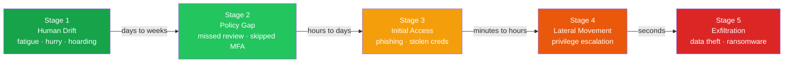
```mermaid
flowchart LR
    A[Stage 1<br/>Human Drift<br/>fatigue · hurry · hoarding] -->|days to weeks| B[Stage 2<br/>Policy Gap<br/>missed review · skipped MFA]
    B -->|hours to days| C[Stage 3<br/>Initial Access<br/>phishing · stolen creds]
    C -->|minutes to hours| D[Stage 4<br/>Lateral Movement<br/>privilege escalation]
    D -->|seconds| E[Stage 5<br/>Exfiltration<br/>data theft · ransomware]

    style A fill:#16a34a,color:#fff
    style B fill:#22c55e,color:#fff
    style C fill:#f59e0b,color:#fff
    style D fill:#ea580c,color:#fff
    style E fill:#dc2626,color:#fff
```

### C.2 Sector Breach Cost — 2024 Averages (source [2])

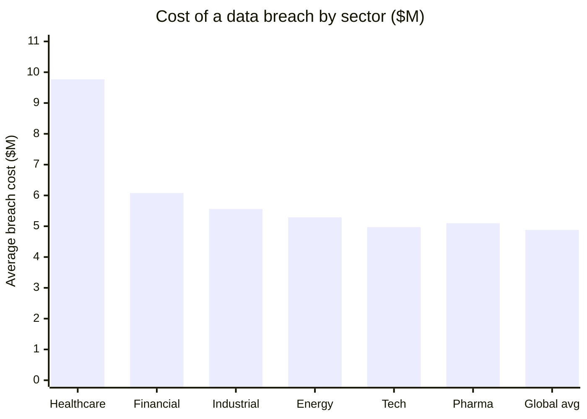
```mermaid
xychart-beta
    title "Cost of a data breach by sector ($M)"
    x-axis ["Healthcare", "Financial", "Industrial", "Energy", "Tech", "Pharma", "Global avg"]
    y-axis "Average breach cost ($M)" 0 --> 11
    bar [9.77, 6.08, 5.56, 5.29, 4.97, 5.10, 4.88]
```

### C.3 Direct Addressable Category — Insider + UEBA

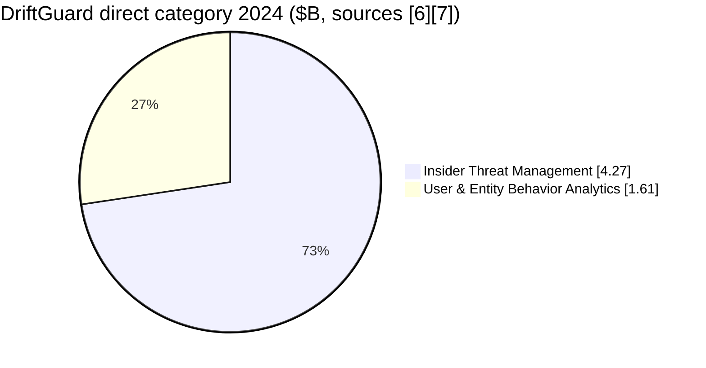
```mermaid
pie showData
    title DriftGuard direct category 2024 ($B, sources [6][7])
    "Insider Threat Management" : 4.27
    "User & Entity Behavior Analytics" : 1.61
```

### C.4 Cybersecurity Spend by Sector (2024)

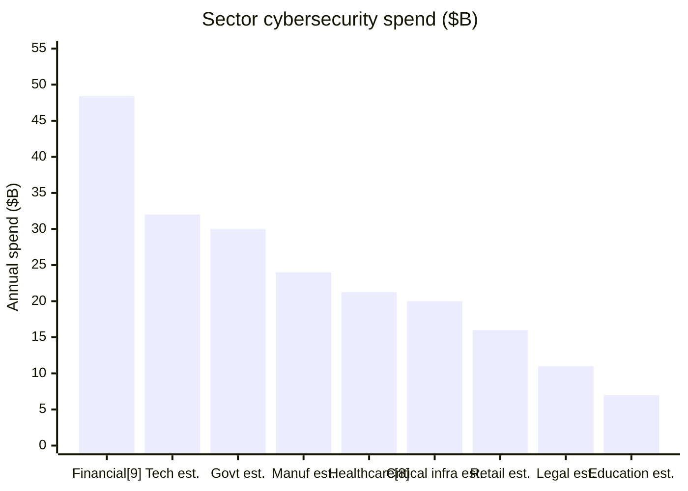
```mermaid
xychart-beta
    title "Sector cybersecurity spend ($B)"
    x-axis ["Financial[9]", "Tech est.", "Govt est.", "Manuf est.", "Healthcare[8]", "Critical infra est.", "Retail est.", "Legal est.", "Education est."]
    y-axis "Annual spend ($B)" 0 --> 55
    bar [48.4, 32, 30, 24, 21.25, 20, 16, 11, 7]
```

### C.5 ARR Trajectory — Four-Year Plan

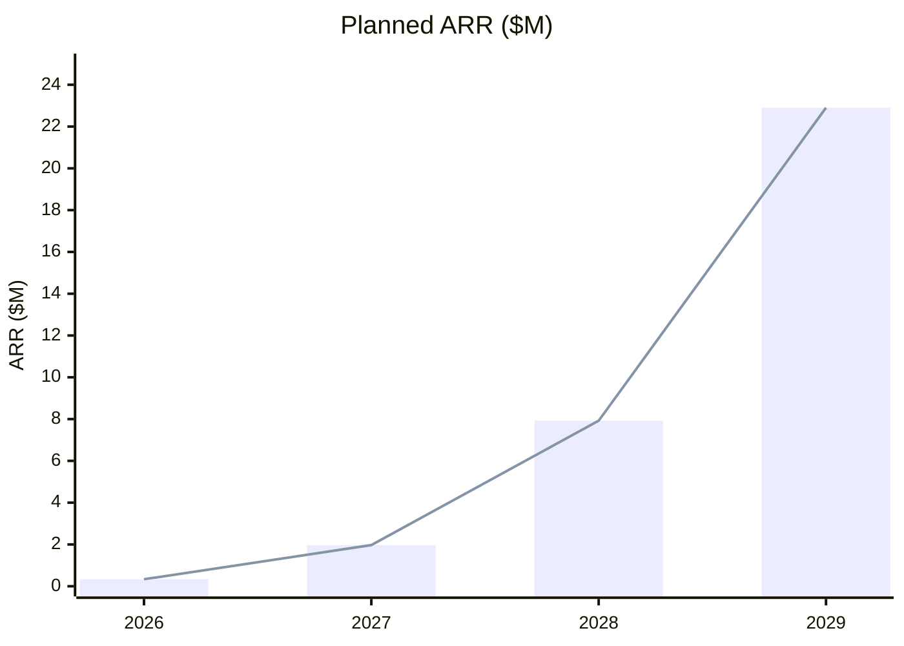
```mermaid
xychart-beta
    title "Planned ARR ($M)"
    x-axis ["2026", "2027", "2028", "2029"]
    y-axis "ARR ($M)" 0 --> 25
    bar [0.336, 1.97, 7.92, 22.9]
    line [0.336, 1.97, 7.92, 22.9]
```

### C.6 Logo Growth Plan

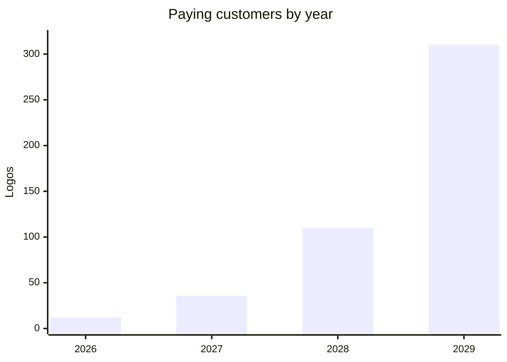
```mermaid
xychart-beta
    title "Paying customers by year"
    x-axis ["2026", "2027", "2028", "2029"]
    y-axis "Logos" 0 --> 320
    bar [12, 36, 110, 310]
```

### C.7 Unit Economics vs SaaS Benchmarks [12]

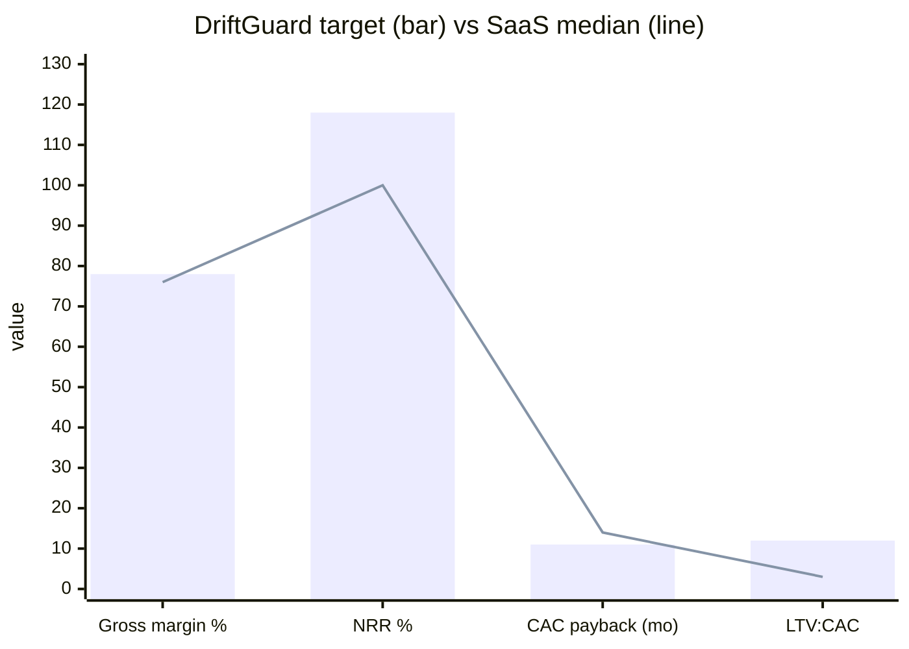
```mermaid
xychart-beta
    title "DriftGuard target (bar) vs SaaS median (line)"
    x-axis ["Gross margin %", "NRR %", "CAC payback (mo)", "LTV:CAC"]
    y-axis "value" 0 --> 130
    bar [78, 118, 11, 12]
    line [76, 100, 14, 3]
```

### C.8 12-Month Execution Gantt

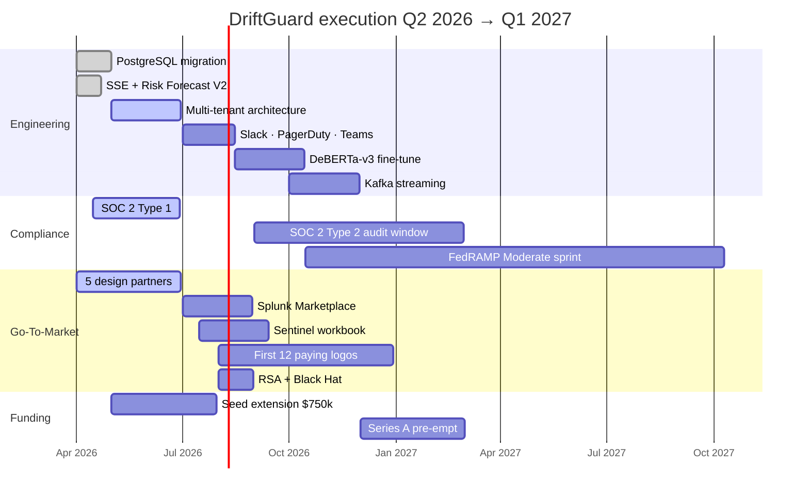
```mermaid
gantt
    title DriftGuard execution Q2 2026 → Q1 2027
    dateFormat  YYYY-MM-DD
    axisFormat  %b %Y

    section Engineering
    PostgreSQL migration               :done,    eng1, 2026-04-01, 30d
    SSE + Risk Forecast V2             :done,    eng2, 2026-04-01, 21d
    Multi-tenant architecture          :active,  eng3, 2026-05-01, 60d
    Slack · PagerDuty · Teams          :         eng4, 2026-07-01, 45d
    DeBERTa-v3 fine-tune               :         eng5, 2026-08-15, 60d
    Kafka streaming                    :         eng6, 2026-10-01, 60d

    section Compliance
    SOC 2 Type 1                       :active,  c1, 2026-04-15, 75d
    SOC 2 Type 2 audit window          :         c2, 2026-09-01, 180d
    FedRAMP Moderate sprint            :         c3, 2026-10-15, 360d

    section Go-To-Market
    5 design partners                  :active,  g1, 2026-04-01, 90d
    Splunk Marketplace                 :         g2, 2026-07-01, 60d
    Sentinel workbook                  :         g3, 2026-07-15, 60d
    First 12 paying logos              :         g4, 2026-08-01, 150d
    RSA + Black Hat                    :         g5, 2026-08-01, 30d

    section Funding
    Seed extension $750k               :         f1, 2026-05-01, 90d
    Series A pre-empt                  :         f2, 2026-12-01, 90d
```

### C.9 System Architecture

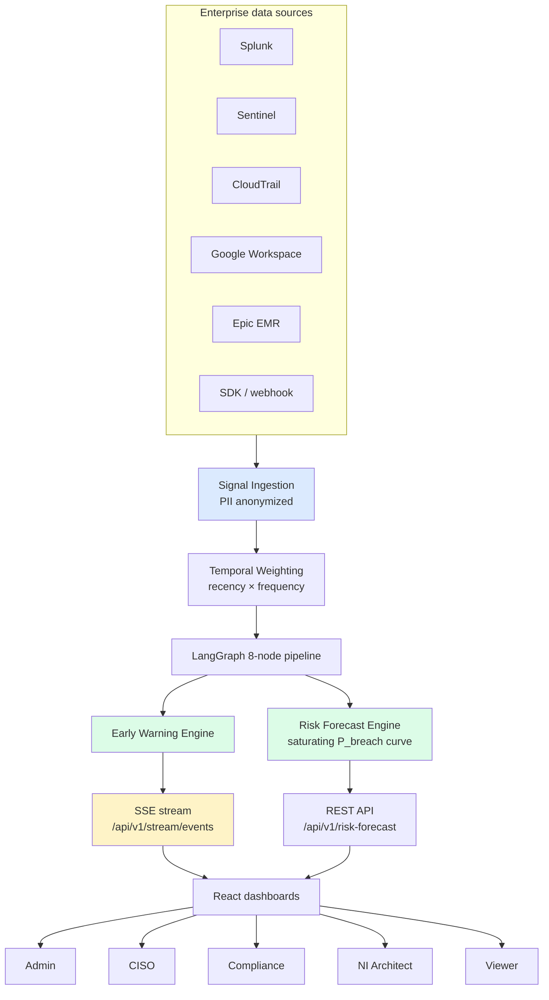
```mermaid
flowchart TB
    subgraph Sources["Enterprise data sources"]
        S1[Splunk]
        S2[Sentinel]
        S3[CloudTrail]
        S4[Google Workspace]
        S5[Epic EMR]
        S6[SDK / webhook]
    end

    Sources --> ING[Signal Ingestion<br/>PII anonymized]
    ING --> TW[Temporal Weighting<br/>recency × frequency]
    TW --> LG[LangGraph 8-node pipeline]

    LG --> RF[Risk Forecast Engine<br/>saturating P_breach curve]
    LG --> EW[Early Warning Engine]
    EW --> SSE[SSE stream<br/>/api/v1/stream/events]
    RF --> API[REST API<br/>/api/v1/risk-forecast]

    SSE --> UI[React dashboards]
    API --> UI
    UI --> R1[Admin]
    UI --> R2[CISO]
    UI --> R3[Compliance]
    UI --> R4[NI Architect]
    UI --> R5[Viewer]

    style ING fill:#dbeafe
    style RF fill:#dcfce7
    style EW fill:#dcfce7
    style SSE fill:#fef3c7
```

### C.10 Six Drift Patterns and NIST Controls (source [5])

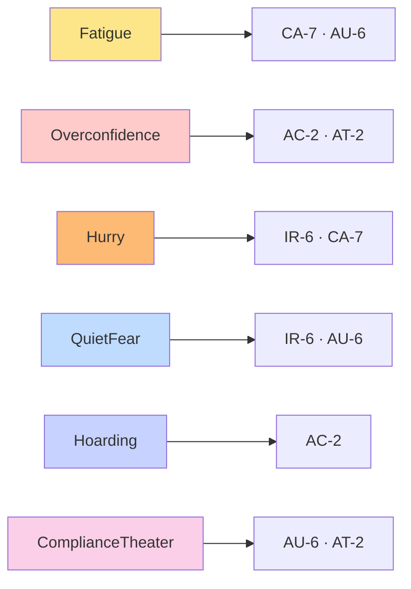
```mermaid
flowchart LR
    F[Fatigue] --> N1[CA-7 · AU-6]
    O[Overconfidence] --> N2[AC-2 · AT-2]
    H[Hurry] --> N3[IR-6 · CA-7]
    Q[QuietFear] --> N4[IR-6 · AU-6]
    HO[Hoarding] --> N5[AC-2]
    CT[ComplianceTheater] --> N6[AU-6 · AT-2]

    style F fill:#fde68a
    style O fill:#fecaca
    style H fill:#fdba74
    style Q fill:#bfdbfe
    style HO fill:#c7d2fe
    style CT fill:#fbcfe8
```

### C.11 Competitive Positioning Quadrant

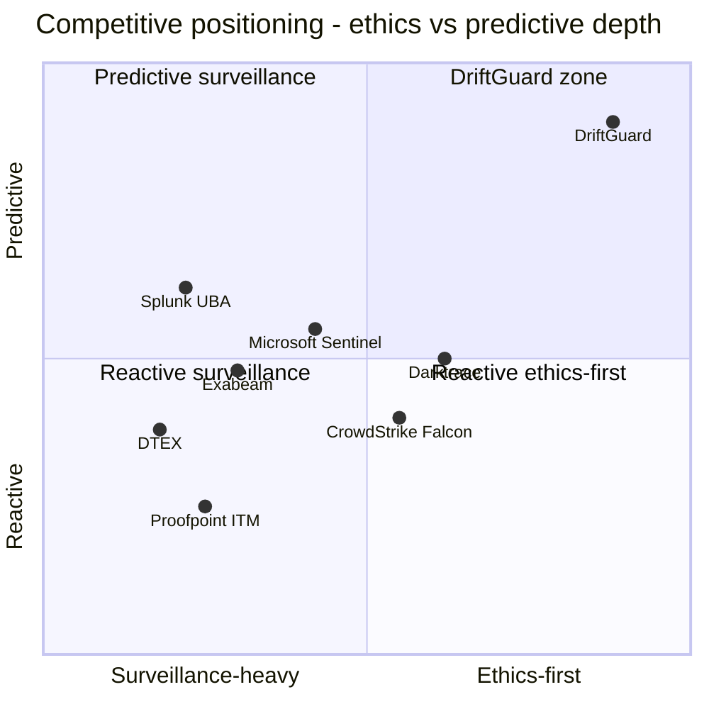
```mermaid
quadrantChart
    title Competitive positioning - ethics vs predictive depth
    x-axis "Surveillance-heavy" --> "Ethics-first"
    y-axis "Reactive" --> "Predictive"
    quadrant-1 "DriftGuard zone"
    quadrant-2 "Predictive surveillance"
    quadrant-3 "Reactive surveillance"
    quadrant-4 "Reactive ethics-first"
    "DriftGuard": [0.88, 0.90]
    "Splunk UBA": [0.22, 0.62]
    "Microsoft Sentinel": [0.42, 0.55]
    "CrowdStrike Falcon": [0.55, 0.40]
    "Exabeam": [0.30, 0.48]
    "DTEX": [0.18, 0.38]
    "Darktrace": [0.62, 0.50]
    "Proofpoint ITM": [0.25, 0.25]
```

> Read: top-right = predictive + ethics-first (where DriftGuard is alone). Top-left = predictive but surveillance-heavy (legacy SIEM/UEBA). Bottom-left = reactive log-and-search tools.

### C.12 Five Moats (Mind-Map)

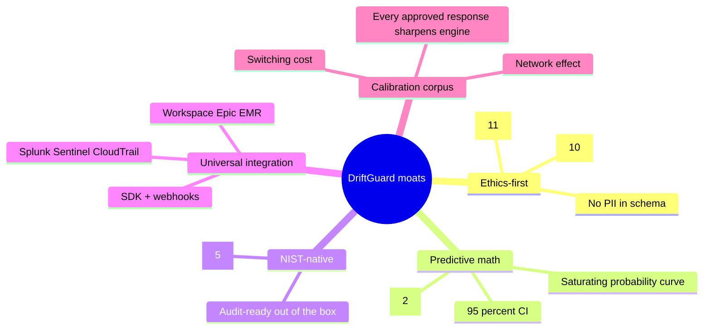
```mermaid
mindmap
  root((DriftGuard moats))
    Ethics-first
      No PII in schema
      GDPR Art. 22 [10]
      EU AI Act safe harbor [11]
    Predictive math
      Saturating probability curve
      95 percent CI
      Calibrated to IBM 2024 [2]
    NIST-native
      AC-2 AT-2 AU-6 CA-7 IR-6 [5]
      Audit-ready out of the box
    Universal integration
      Splunk Sentinel CloudTrail
      Workspace Epic EMR
      SDK + webhooks
    Calibration corpus
      Every approved response sharpens engine
      Network effect
      Switching cost
```

### C.13 Funnel — Outreach to Paid Logo (Year 1)

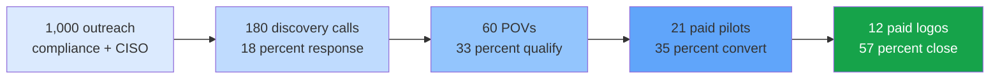
```mermaid
flowchart LR
    A[1,000 outreach<br/>compliance + CISO]
    B[180 discovery calls<br/>18 percent response]
    C[60 POVs<br/>33 percent qualify]
    D[21 paid pilots<br/>35 percent convert]
    E[12 paid logos<br/>57 percent close]
    A --> B --> C --> D --> E

    style A fill:#dbeafe
    style B fill:#bfdbfe
    style C fill:#93c5fd
    style D fill:#60a5fa
    style E fill:#16a34a,color:#fff
```

### C.14 Sales Cycle (Healthcare Example)

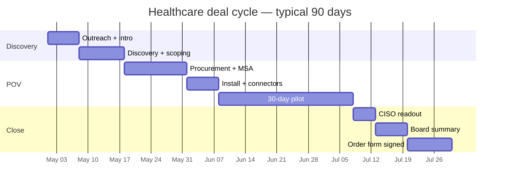
```mermaid
gantt
    title Healthcare deal cycle — typical 90 days
    dateFormat  YYYY-MM-DD
    axisFormat  %b %d

    section Discovery
    Outreach + intro                :a1, 2026-05-01, 7d
    Discovery + scoping             :a2, after a1, 10d

    section POV
    Procurement + MSA               :a3, after a2, 14d
    Install + connectors            :a4, after a3, 7d
    30-day pilot                    :a5, after a4, 30d

    section Close
    CISO readout                    :a6, after a5, 5d
    Board summary                   :a7, after a6, 7d
    Order form signed               :a8, after a7, 10d
```

### C.15 SWOT (Visual)

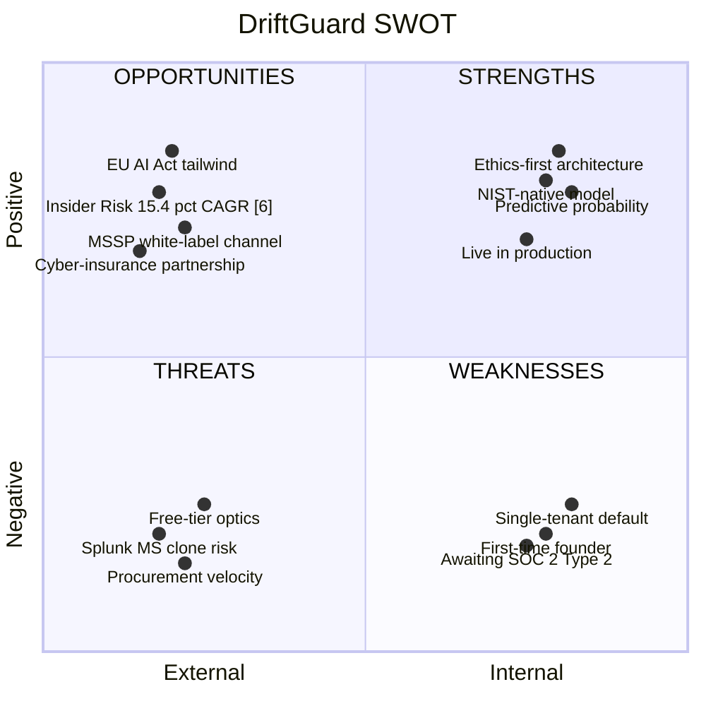
```mermaid
quadrantChart
    title DriftGuard SWOT
    x-axis "External" --> "Internal"
    y-axis "Negative" --> "Positive"
    quadrant-1 "STRENGTHS"
    quadrant-2 "OPPORTUNITIES"
    quadrant-3 "THREATS"
    quadrant-4 "WEAKNESSES"
    "Ethics-first architecture": [0.80, 0.85]
    "NIST-native model": [0.78, 0.80]
    "Predictive probability": [0.82, 0.78]
    "Live in production": [0.75, 0.70]
    "EU AI Act tailwind": [0.20, 0.85]
    "Insider Risk 15.4 pct CAGR [6]": [0.18, 0.78]
    "MSSP white-label channel": [0.22, 0.72]
    "Cyber-insurance partnership": [0.15, 0.68]
    "Splunk MS clone risk": [0.18, 0.20]
    "Procurement velocity": [0.22, 0.15]
    "Free-tier optics": [0.25, 0.25]
    "First-time founder": [0.78, 0.20]
    "Single-tenant default": [0.82, 0.25]
    "Awaiting SOC 2 Type 2": [0.75, 0.18]
```

### C.16 Risk Heatmap

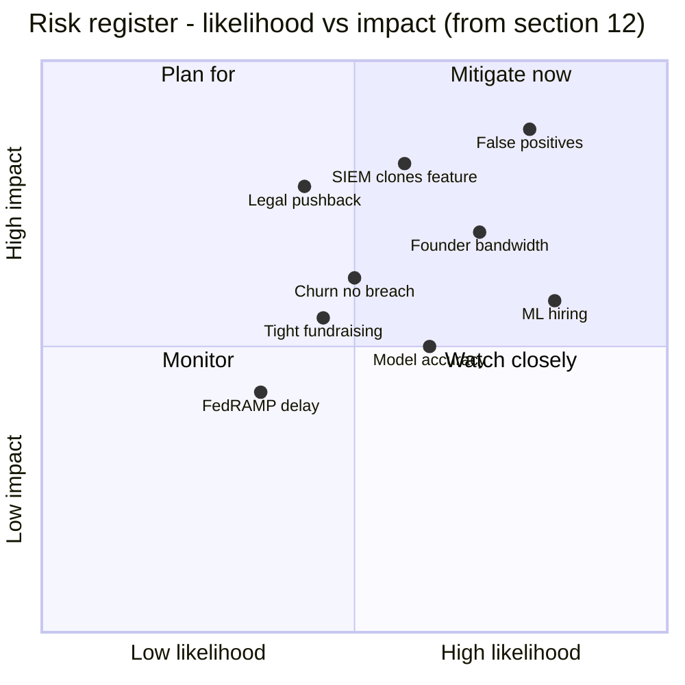
```mermaid
quadrantChart
    title Risk register - likelihood vs impact (from section 12)
    x-axis "Low likelihood" --> "High likelihood"
    y-axis "Low impact" --> "High impact"
    quadrant-1 "Mitigate now"
    quadrant-2 "Plan for"
    quadrant-3 "Monitor"
    quadrant-4 "Watch closely"
    "False positives": [0.78, 0.88]
    "SIEM clones feature": [0.58, 0.82]
    "Legal pushback": [0.42, 0.78]
    "Founder bandwidth": [0.70, 0.70]
    "ML hiring": [0.82, 0.58]
    "Churn no breach": [0.50, 0.62]
    "Model accuracy": [0.62, 0.50]
    "Tight fundraising": [0.45, 0.55]
    "FedRAMP delay": [0.35, 0.42]
```

> Read: top-right "Mitigate now" = high likelihood + high impact (false positives, SIEM clones, founder bandwidth). Bottom-left "Monitor" = low/low (FedRAMP delay).

### C.17 KPI Control Plane

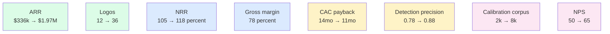
```mermaid
flowchart TB
    K1[ARR<br/>$336k → $1.97M]
    K2[Logos<br/>12 → 36]
    K3[NRR<br/>105 → 118 percent]
    K4[Gross margin<br/>78 percent]
    K5[CAC payback<br/>14mo → 11mo]
    K6[Detection precision<br/>0.78 → 0.88]
    K7[Calibration corpus<br/>2k → 8k]
    K8[NPS<br/>50 → 65]

    style K1 fill:#dcfce7
    style K2 fill:#dcfce7
    style K3 fill:#dbeafe
    style K4 fill:#dbeafe
    style K5 fill:#fef3c7
    style K6 fill:#fef3c7
    style K7 fill:#fce7f3
    style K8 fill:#fce7f3
```

### C.18 Funding Ladder

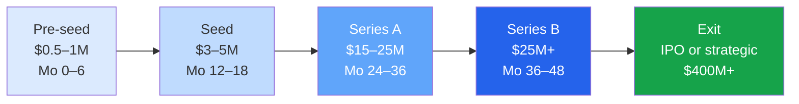
```mermaid
flowchart LR
    PS[Pre-seed<br/>$0.5–1M<br/>Mo 0–6]
    SD[Seed<br/>$3–5M<br/>Mo 12–18]
    SA[Series A<br/>$15–25M<br/>Mo 24–36]
    SB[Series B<br/>$25M+<br/>Mo 36–48]
    EX[Exit<br/>IPO or strategic<br/>$400M+]

    PS --> SD --> SA --> SB --> EX
    style PS fill:#dbeafe
    style SD fill:#bfdbfe
    style SA fill:#60a5fa,color:#fff
    style SB fill:#2563eb,color:#fff
    style EX fill:#16a34a,color:#fff
```

### C.19 Buyer Persona Map

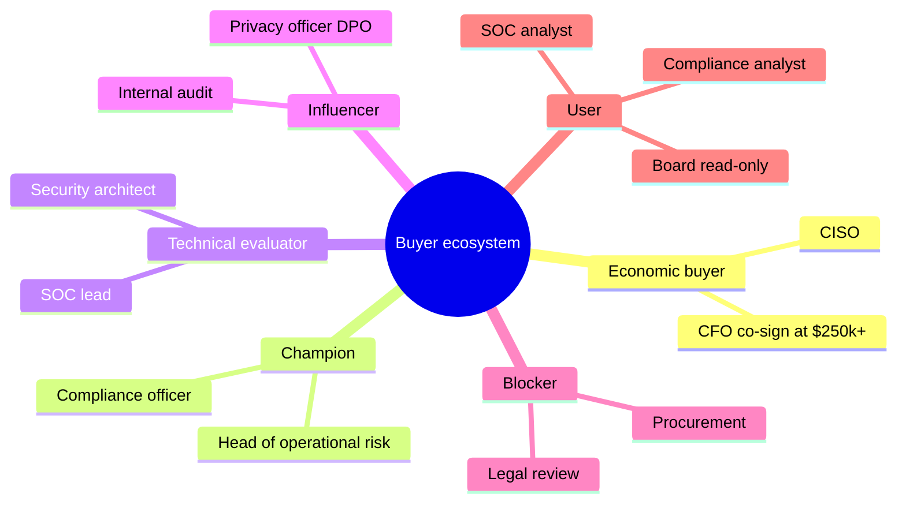
```mermaid
mindmap
  root((Buyer ecosystem))
    Economic buyer
      CISO
      CFO co-sign at $250k+
    Champion
      Compliance officer
      Head of operational risk
    Technical evaluator
      Security architect
      SOC lead
    Influencer
      Internal audit
      Privacy officer DPO
    Blocker
      Procurement
      Legal review
    User
      SOC analyst
      Compliance analyst
      Board read-only
```

### C.20 Ethical Architecture (Visual Promise)

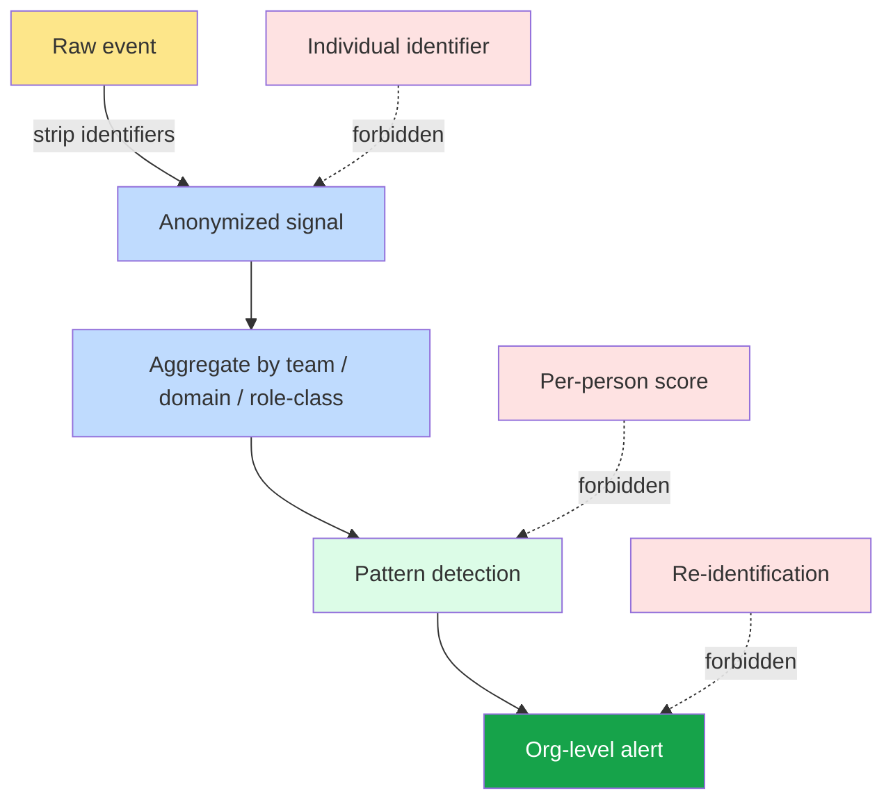
```mermaid
flowchart TB
    A[Raw event] -->|strip identifiers| B[Anonymized signal]
    B --> C[Aggregate by team / domain / role-class]
    C --> D[Pattern detection]
    D --> E[Org-level alert]

    X[Individual identifier] -.forbidden.-> B
    Y[Per-person score] -.forbidden.-> D
    Z[Re-identification] -.forbidden.-> E

    style A fill:#fde68a
    style B fill:#bfdbfe
    style C fill:#bfdbfe
    style D fill:#dcfce7
    style E fill:#16a34a,color:#fff
    style X fill:#fee2e2
    style Y fill:#fee2e2
    style Z fill:#fee2e2
```

> Dashed red lines = explicitly forbidden flows. The schema literally has no fields to support them.

---

## Page Map (≈15 pages when exported to PDF)

| Page | Section | Visual on page |
|---:|---|---|
| 1 | §1 Executive Summary | — |
| 2 | §2 Problem Statement | C.2 sector breach cost |
| 3 | §3 Solution + Pipeline | C.10 patterns map |
| 4 | §4 Market Opportunity | C.3 pie · C.4 sector spend |
| 5 | §5 Product Overview | C.9 architecture |
| 6 | §6 Business Model | C.7 unit-econ vs benchmarks |
| 7 | §7 Go-To-Market | C.13 funnel · C.14 sales cycle |
| 8 | §8 Competitive Landscape | C.11 quadrant · C.12 moats |
| 9 | §9 Financial Projections | C.5 ARR · C.6 logos · C.18 funding ladder |
| 10 | §10 Team + §11 Roadmap | C.8 Gantt |
| 11 | §12 Risks + §13 Open Questions | C.15 SWOT · C.16 risk heatmap |
| 12 | §14 Sources | — |
| 13 | Appendix A — V2 Addendum | C.1 lifecycle |
| 14 | Appendix B — Strategic Deep-Dive | C.19 buyer map · C.17 KPI plane |
| 15 | Appendix C — Visual Pack | C.20 ethical promise |

> **Export to a single PDF** — install the VS Code "Markdown PDF" extension (`yzane.markdown-pdf`), open this file, then `Cmd+Shift+P → Markdown PDF: Export (pdf)`. Mermaid renders automatically. For slides, run `npx @marp-team/marp-cli BUSINESS_PLAN.md --pdf`.

---

*End of business plan v2 — cited + visual edition · 20 diagrams · 15-page PDF layout.*

---

# Appendix D — Competitor Deep-Dive (Top 5)

> Goal of this appendix: give an investor or operator a five-page, evidence-backed view of the five companies whose territory DriftGuard must navigate. Every revenue figure cited is taken from each company's own 10-K filing or its Wikipedia financial summary current as of April 2026; every funding round is taken from primary press coverage. Sources are listed at the foot of each profile and added to the master source table in §14. Where a number is an analyst estimate or our own derivation it is labelled "est." in line, never presented as fact.

The five competitors profiled here are the five vendors a DriftGuard buyer is most likely to evaluate alongside us. They split into two groups: three are enterprise-platform incumbents that include behavioural analytics as one feature among many (Splunk-Cisco, CrowdStrike, Microsoft) and two are pure-play behavioural-risk specialists that are closer to our exact category (Exabeam-LogRhythm and DTEX Systems). Together they hold the majority of the security-analytics and insider-risk wallet that DriftGuard must convert.

| # | Vendor | Category overlap with DriftGuard | Stage | Why included |
|---|--------|----------------------------------|-------|--------------|
| D.1 | Splunk (a Cisco company) | SIEM + UBA + SOAR | Public subsidiary of Cisco | Largest log-analytics incumbent; bundled with Cisco network and security install base |
| D.2 | CrowdStrike Holdings | Endpoint + Identity Threat Protection + Falcon Next-Gen SIEM | Public, S&P 500 | Dominant endpoint vendor that is now pushing into identity and SIEM territory |
| D.3 | Microsoft (Sentinel + Purview Insider Risk Management) | Cloud SIEM + UEBA + Insider Risk | Hyperscaler | Default option inside any Microsoft 365 E5 estate; price-bundled and hard to displace |
| D.4 | Exabeam (now merged with LogRhythm) | UEBA + SIEM | Private, Thoma Bravo backed | Closest pure-play UEBA competitor; carries the "Splunk killer" historical narrative |
| D.5 | DTEX Systems | Insider Risk Management + Workforce Cyber Intelligence | Private, growth stage | Closest pure-play behavioural / human-state competitor; privacy-first agent model |

---

## D.1 Splunk (a Cisco company)

### Snapshot

| Metric | Value | Source |
|--------|-------|--------|
| Headquarters | San Francisco, California (Cisco subsidiary as of March 2024) | [13] |
| Founded | October 2003 | [13] |
| Acquired by | Cisco Systems for US$28 billion all-cash, announced 21 Sep 2023, closed 18 Mar 2024 | [13] |
| Last standalone revenue | US$3.65 billion (fiscal year ended 31 Jan 2023, 10-K) | [13] |
| Last standalone operating result | US$ minus 236 million operating loss FY23 | [13] |
| Employees at acquisition | approximately 8,000 | [13] |
| Patents at acquisition | approximately 1,100 | [13] |

### Business plan and current strategy

Splunk's core business is selling a data platform that ingests machine-generated logs and lets customers search, alert, and dashboard on top of it. The flagship security product is Splunk Enterprise Security, a SIEM that sits on top of the platform and is licensed separately. User Behavior Analytics, originally built from the 2015 Caspida acquisition, is a bolt-on that scores users and devices for anomalous activity. Splunk SOAR (formerly Phantom, acquired 2018) provides automation playbooks. Since the Cisco close in March 2024 the strategy has been to merge Splunk's data platform with Cisco's network telemetry, observability (AppDynamics) and XDR products into one "AI-ready" security and observability stack, with Splunk reporting to former Splunk CEO Gary Steele in his new Cisco president role. [13]

### Target customers

Splunk's wallet is concentrated in the Global 2000: large enterprises, federal agencies (Splunk Cloud carries FedRAMP Moderate authorisation since 2019) and global brands such as Singapore Airlines, Heineken, Papa John's and McLaren Racing. Pricing is volume-based on data ingested per day, which has historically pushed adoption towards organisations large enough to absorb six- and seven-figure annual contracts. [13]

### Financial picture

Splunk grew from US$2.23 billion of revenue in fiscal 2021 to US$3.65 billion in fiscal 2023, the last year of standalone reporting. The company was loss-making at the operating line in fiscal 2023 (operating loss of US$236 million, net loss of US$278 million) which was one of the public reasons given for accepting the Cisco bid at US$157 a share, an approximately 31 percent premium to the unaffected price. Inside Cisco, Splunk's standalone P&L is no longer broken out, but Cisco's quarterly disclosures since closing have flagged Splunk as a primary driver of Cisco's "Security" segment growth. [13]

### What they do differently from DriftGuard

Splunk sells a horizontal data platform; DriftGuard sells a vertical behavioural-risk product. Splunk requires customers to bring their own detection logic, tune their own UBA models and pay per gigabyte for the privilege. DriftGuard ships pre-built drift patterns mapped to NIST SP 800-53 controls [5] and prices on monitored identities, not data volume. Splunk's UBA is a feature inside a US$1 million-plus platform sale; DriftGuard is a stand-alone US$50k–US$500k ARR product that can be deployed without ripping out the existing SIEM.

### Strengths we must respect
- Distribution: Cisco's enterprise sales force now sells Splunk into every account that already buys Cisco network gear, which is most of the Fortune 500. [13]
- Data gravity: once a customer has parked years of logs in Splunk Cloud, switching cost is substantial.
- FedRAMP Moderate authorisation gives Splunk a near-monopoly position in many US federal opportunities. [13]

### Weaknesses we must exploit
- Cost: ingest-based pricing punishes customers who scale data volumes; behavioural-risk vendors that price on identities are structurally cheaper for the same outcome.
- Time-to-value: a Splunk UBA deployment is typically measured in quarters; DriftGuard targets a 30-day "first credible drift detection" SLA.
- Innovation drag: post-acquisition product roadmaps slow down; Cisco's prior Application-Centric Infrastructure and AppDynamics integrations are widely cited as cautionary tales.

### Loopholes DriftGuard can convert
1. Splunk has no native ethical-use module, no automatic mapping from anomaly to NIST control, and no governance approval gate for adverse actions on a person; we ship all three out of the box.
2. Splunk's UBA still relies on supervised models trained on the customer's own labelled data; DriftGuard's drift-pattern library [BUSINESS_PLAN.md §3](BUSINESS_PLAN.md#3) ships pre-trained.
3. Splunk's SOAR playbooks act on systems; DriftGuard's governance gates are designed to act on humans, which requires a different consent and audit posture that Splunk does not provide.

---

## D.2 CrowdStrike Holdings, Inc.

### Snapshot

| Metric | Value | Source |
|--------|-------|--------|
| Ticker | NASDAQ: CRWD (Nasdaq-100, S&P 500) | [14] |
| Headquarters | Austin, Texas | [14] |
| Founded | 2011 by George Kurtz, Dmitri Alperovitch and Gregg Marston | [14] |
| Revenue FY2026 (year ended 31 Jan 2026) | US$4.81 billion | [14] |
| Revenue FY2025 | US$3.95 billion | [14] |
| Revenue FY2024 | US$3.06 billion (36 percent year-over-year growth) | [14] |
| Operating income FY2026 | US$ minus 293 million operating loss | [14] |
| Net income FY2026 | US$ minus 163 million net loss | [14] |
| Total assets FY2026 | US$11.1 billion | [14] |
| Employees | 10,698 (FY2026) | [14] |
| Customer renewal rate | approximately 97 percent (CEO disclosure, August 2025) | [14] |
| Falcon Flex programme cumulative deal value | over US$3.2 billion (late 2025) | [14] |

### Business plan and current strategy

CrowdStrike sells the Falcon platform, a cloud-delivered endpoint protection product anchored by a single lightweight agent. From that agent CrowdStrike has expanded into identity threat protection (Falcon Identity Threat Protection, 2020 onwards), cloud workload protection (Falcon Cloud Security), threat intelligence (Falcon Intelligence), generative-AI security operations (Charlotte AI, launched May 2023) and most recently a "next-generation SIEM" built on the Humio acquisition (Humio acquired February 2021 for US$400 million). The 2024–2026 strategy has three legs: keep extending the agent-based platform into adjacent modules, push aggressive cross-sell through the "Falcon Flex" subscription bundle that has accumulated US$3.2 billion in cumulative deal value since launch, and absorb identity and browser-runtime startups (SGNL US$750 million in January 2026, Seraphic US$420 million in January 2026, Adaptive Shield approximately US$300 million in November 2024, Flow Security US$200 million in March 2024). [14]

### Target customers

CrowdStrike's wallet is mid-market through Fortune 500, plus a substantial federal and defence base. Pricing is per-endpoint per-year, which scales naturally with employee count and gives them a clean "land with one module, expand to ten" motion. The Falcon Flex programme explicitly bundles modules into a single committed spend, which lets account teams cross-sell identity, cloud, and SIEM modules without renegotiating each line.

### Financial picture

CrowdStrike has compounded revenue at over 30 percent year-over-year for six consecutive fiscal years: US$481 million (FY20), US$874 million (FY21), US$1.45 billion (FY22), US$2.24 billion (FY23), US$3.06 billion (FY24), US$3.95 billion (FY25), and US$4.81 billion (FY26). The company generates very large operating cash flow (US$1.38 billion FY25) but reported an operating loss in FY2026 driven in part by the cost of remediating the July 2024 outage and the run-rate of the SGNL and Seraphic acquisitions. The 97 percent gross customer renewal rate disclosed by CEO George Kurtz on CNBC in August 2025 is one of the highest in software at any scale. [14]

### What they do differently from DriftGuard

CrowdStrike is fundamentally an endpoint-and-identity company; the unit of detection is a process tree on a device, or a credential being abused. DriftGuard's unit of detection is a person's behavioural pattern across applications, regardless of which device or endpoint they are on. Falcon Identity Threat Protection looks for credential misuse (impossible-travel logins, Kerberoasting, golden-ticket attacks); DriftGuard looks for cognitive and ethical drift in legitimately authenticated users (gradually rising query rates, narrowing of decision diversity, deterioration of clinical accuracy). The two products are complementary far more than they are substitutable.

### Strengths we must respect
- Brand: post-IPO and post-S&P-500 inclusion (June 2024), CrowdStrike is the default short-list entry in any endpoint or XDR conversation. [14]
- Sales motion: Falcon Flex's bundled commit model is the most efficient land-and-expand machine in security software today.
- Cash generation: US$1.38 billion of operating cash flow in FY25 funds R&D and acquisitions at a scale no startup can match. [14]

### Weaknesses we must exploit
- Outage scar: the 19 July 2024 faulty Falcon Sensor update crashed approximately 8.5 million Windows machines worldwide, triggered the still-active Delta Air Lines lawsuit (alleging US$500 million to US$550 million in damages and allowed by a Georgia judge in May 2025 to proceed on gross-negligence and computer-trespass claims), and gave every CISO in the world a public, documented reason to diversify away from a single agent monoculture. [14]
- Endpoint blind spot: any behaviour that does not generate an endpoint or identity event (for example a clinician slowly altering ordering patterns inside an EMR session) is invisible to Falcon.
- Operating loss in FY2026 with US$ minus 293 million operating result raises near-term margin questions even with strong renewals. [14]

### Loopholes DriftGuard can convert
1. Sell DriftGuard explicitly as the "second-opinion behavioural layer" that does not share an agent fate-line with Falcon; this directly answers the post-outage diversification mandate.
2. Position against Falcon Identity Threat Protection on a clear axis: Falcon catches credential abuse in seconds, DriftGuard catches legitimate-credential drift over days to weeks; both are needed.
3. Use NIST SP 800-53 control mapping [5] and the ethical guardrail module to win healthcare, education and public-sector deals where Falcon's "block first, ask later" posture is hard to defend in front of a clinical or academic ethics board.

---

## D.3 Microsoft (Sentinel + Purview Insider Risk Management)

### Snapshot

| Metric | Value | Source |
|--------|-------|--------|
| Parent | Microsoft Corporation (NASDAQ: MSFT) | Microsoft 10-K FY24 |
| Relevant products | Microsoft Sentinel (cloud-native SIEM, Azure-billed), Microsoft Defender XDR (formerly 365 Defender), Microsoft Purview Insider Risk Management (E5 / E5 Compliance bundle) | Microsoft product documentation |
| Reported "Security" revenue | over US$20 billion run-rate (CEO Satya Nadella, January 2024 earnings call) | Microsoft Q2 FY24 earnings |
| Sentinel pricing | per-GB ingested with capacity-reservation tiers; lowest list price approximately US$2.46 per GB ingested per day | Microsoft public price list |
| Purview Insider Risk Management licence | included in Microsoft 365 E5 / E5 Compliance; standalone add-on approximately US$12 per user per month | Microsoft public price list |
| Customer base for Microsoft 365 E5 | tens of millions of seats across Fortune 1000 and global government | Microsoft FY24 commentary |

### Business plan and current strategy

Microsoft does not sell behavioural-risk detection as a standalone product; it sells it as one of dozens of features inside the Microsoft 365 E5 / E5 Compliance bundle (Purview Insider Risk Management) and inside the Azure-billed Sentinel SIEM (UEBA workbook). The strategy is straightforward: every Microsoft 365 E5 customer already pays for Purview Insider Risk Management whether they use it or not, and every Azure customer can light up Sentinel with one click. Microsoft's "Security" portfolio crossed a US$20 billion annual run-rate in its January 2024 earnings call, making Microsoft, by revenue, the largest cybersecurity vendor in the world. The Copilot for Security launch (general availability April 2024) layered a generative-AI front-end on top of Sentinel and Defender, further deepening lock-in.

### Target customers

Anyone already on Microsoft 365 E5 or considering it: large enterprises, regulated industries, federal civilian agencies (Microsoft 365 GCC High and DoD environments hold FedRAMP High), and education systems standardised on Microsoft. The buying motion is bundle-led: a CIO who renews E5 inherits Insider Risk Management and Sentinel's UEBA workbook at zero incremental software cost.

### Financial picture

Microsoft does not break out Sentinel or Purview Insider Risk Management as a line item, but the umbrella "Security" disclosure of over US$20 billion annual run-rate (Q2 FY24, January 2024) and analyst estimates that Sentinel alone is well above US$1 billion of annualised revenue make this the single largest revenue pool any DriftGuard competitor has access to. Microsoft's gross margin on incremental Azure-delivered SaaS is widely modelled in the 70 to 80 percent range, which gives Microsoft effectively unlimited room to bundle features at zero perceived marginal price.

### What they do differently from DriftGuard

Microsoft's behavioural products are, by design, generic. Purview Insider Risk Management ships indicators ("user copying unusual volumes of files to USB", "user sharing documents externally before resignation") that work across every customer; it does not ship clinical-decision-quality drift patterns for healthcare, or research-integrity drift patterns for higher education, or trader-behaviour drift patterns for capital markets. Sentinel UEBA is a workbook that customers must build out themselves on their own data. Microsoft is also explicitly an in-suite product: it can only see what happens inside Microsoft 365 (Exchange, SharePoint, Teams, OneDrive, Entra ID, Defender). Anything that happens in Epic, Workday, Salesforce, Splunk, AWS or a custom internal tool is invisible to it without substantial custom log shipping.

### Strengths we must respect
- Bundling: Insider Risk Management is "free" to the buyer because the cost is already absorbed in the E5 SKU; this is the hardest pricing dynamic in the market to compete with on a line-item basis.
- Distribution: a Microsoft seller is already in the room every quarter at every Fortune 1000 account.
- Trust and certification surface: Microsoft holds essentially every certification a regulated buyer can ask for.

### Weaknesses we must exploit
- Generic indicator library: Purview Insider Risk Management's indicator set is built for a generic knowledge worker; it does not understand a clinician, a researcher, a trader, a contact-centre agent or a teacher.
- Closed ecosystem visibility: anything outside Microsoft 365 is a custom integration project the customer pays for in time and consulting fees.
- Ethical posture: Purview's privacy controls are configured per-tenant by the customer; there is no third-party-validated ethical guardrail layer of the kind DriftGuard ships in `core/ethical_guardrails.py`.
- Cost at scale: Sentinel's per-GB ingest pricing replicates the Splunk problem and produces the same surprise invoices once telemetry volumes grow.

### Loopholes DriftGuard can convert
1. Sell on outcome specificity: a clinical-leadership buyer wants drift patterns trained on clinician behaviour, not generic "DLP-style" indicators.
2. Sell on cross-system reach: enterprises run on Microsoft plus Epic plus Workday plus Salesforce; DriftGuard's adapter layer (`backend/integrations/`) covers all of them in one product.
3. Sell on independent ethical attestation: regulated boards prefer a third-party tool with a published ethical-guardrails contract to a feature inside their own productivity suite.
4. Sell complementarity, not displacement: pitch DriftGuard alongside Purview, not against it; the bundle objection then disappears because the buyer keeps Purview.

---

## D.4 Exabeam (merged with LogRhythm, July 2024)

### Snapshot

| Metric | Value | Source |
|--------|-------|--------|
| Headquarters | Foster City, California | [15] |
| Founded | 2013 by Nir Polak, Domingo Mihovilovic and Sylvain Gil | [15] |
| Total funding pre-merger | over US$390 million across Series A through F | [15] |
| Last private valuation | US$2.4 billion at Series F, June 2021 (US$200 million round) | [15] |
| Owner | Thoma Bravo (LogRhythm acquired 2022; merged with Exabeam July 2024; Exabeam's pre-merger valuation reported as US$2.5 billion) | [15] |
| CEO | Pete Harteveld (appointed October 2025, succeeding Chris O'Malley) | [15] |
| Combined revenue (private) | not officially disclosed; widely reported by industry analysts as in the US$300 million to US$400 million range post-merger | analyst commentary |
| Customers | over 2,000 globally pre-merger (Exabeam public claim) | Exabeam materials |

### Business plan and current strategy

Exabeam built its name as a User and Entity Behavior Analytics specialist, with a "Smart Timelines" interface that stitches together user activity into a single investigative narrative. Originally positioned as a layer on top of Splunk (Exabeam executives publicly used the phrase "Splunk killer" during the 2018 Series D), the company moved into full SIEM with the New-Scale SIEM platform launched on Snowflake in 2022. After a difficult 2023 fundraising environment, Thoma Bravo merged Exabeam with its existing LogRhythm portfolio company in July 2024; the combined company kept the Exabeam name and Chris O'Malley (former LogRhythm CEO) as CEO until October 2025, when Pete Harteveld took over. The current strategy is to consolidate the Exabeam and LogRhythm code bases, retain LogRhythm's strong on-premises and federal install base, and lean into "AI-driven SIEM" messaging powered by Exabeam's Copilot offering. [15]

### Target customers

Mid-market and large enterprise security operations teams, particularly those that already operate a SIEM and want a UEBA layer or a SIEM replacement. LogRhythm brings a strong base in regulated mid-market verticals (healthcare, manufacturing, public sector) and federal customers who prefer on-premises deployment. Pricing has historically been per-user per-year for the UEBA tier and per-GB or per-EPS (events per second) for the SIEM tier.

### Financial picture

As a private Thoma Bravo portfolio company the combined entity does not publish audited financials. Public data points: Exabeam raised US$200 million Series F at US$2.4 billion valuation in June 2021 [15]; LogRhythm was reported to have approximately US$250 million of revenue when Thoma Bravo recapitalised it in 2022; the merged entity is widely reported by industry analysts to sit in the US$300 million to US$400 million combined revenue range as of 2025. Three CEO transitions in three years (DeCesare to O'Malley to Harteveld) and a private-equity-driven cost programme are the dominant operational facts.

### What they do differently from DriftGuard

Exabeam's behavioural model is centred on the security analyst as the user and the SOC investigation as the workflow. Its Smart Timelines product is excellent for an analyst investigating a known incident; it is less suited to a board or a clinical-leadership team that wants a continuous risk score on a population. Exabeam treats UEBA as a SOC tool; DriftGuard treats human-state drift as a governance and clinical-quality tool that the SOC happens to consume.

### Strengths we must respect
- Brand recognition in UEBA: Exabeam consistently appears in the Forrester Wave for Security Analytics Platforms (Q4 2020 leader). [15]
- Combined install base: LogRhythm plus Exabeam gives the merged entity over 2,000 customers and a meaningful federal footprint.
- Thoma Bravo backing: deep capital and a clear playbook for cost-out integration.

### Weaknesses we must exploit
- Integration risk: every Thoma Bravo software merger carries an 18 to 36 month integration drag, during which roadmap velocity slows and key engineering talent typically departs.
- CEO churn: three CEOs in three years is widely visible to enterprise buyers and triggers procurement risk reviews.
- SOC-only framing: Exabeam's narrative does not extend naturally to clinical, academic or financial-trading governance buyers, which are DriftGuard's primary wedges.
- Per-user pricing on a SOC-tool framing makes the product hard to justify when the buyer is governance, not the SOC.

### Loopholes DriftGuard can convert
1. Sell to the governance buyer (Chief Risk Officer, Chief Medical Officer, Chief Compliance Officer) rather than the SOC; Exabeam is not in that conversation.
2. Sell pre-built domain drift libraries; Exabeam's models still require customer-side tuning.
3. Use the integration uncertainty as a procurement-risk wedge in any Exabeam or LogRhythm renewal cycle through 2026.

---

## D.5 DTEX Systems

### Snapshot

| Metric | Value | Source |
|--------|-------|--------|
| Headquarters | San Jose, California (with significant Australia operations) | DTEX corporate site |
| Founded | 2000 (originally Australia-based) | DTEX corporate site |
| Last disclosed funding | US$50 million Series E, October 2021, led by Northgate Capital with PSP Growth participation | TechCrunch and Reuters coverage, October 2021 |
| Total funding | over US$140 million across Series A through E | Crunchbase aggregate |
| CEO | Bahman Mahbod (since 2014) | DTEX corporate site |
| Reported customer base | over 200 customers including approximately one third of the ASX top 50, the US Department of Defense, and several Five Eyes intelligence agencies (DTEX public claims) | DTEX customer page |
| Estimated revenue | not disclosed; analyst estimates place ARR in the US$30 million to US$60 million range as of 2025 (estimate, not audited) | analyst commentary |

### Business plan and current strategy

DTEX is the closest pure-play competitor to DriftGuard. The company sells "InTERCEPT", a Workforce Cyber Intelligence and Security platform built around a privacy-first lightweight endpoint sensor that captures behavioural metadata (process, application focus, file movement, web destination categories) without recording content. The product produces a continuous insider-risk score per user, organised into "indicators of intent" that are designed to surface pre-incident behavioural drift (employee disengagement, IP-theft preparation, account-misuse precursors). The strategy since the 2021 Series E has been to push hard into US federal and Five Eyes intelligence accounts, expand the i3 ("Insider Investigations and Intelligence") threat-research team's published threat reports as a marketing engine, and deepen partnerships with CrowdStrike, Microsoft and ServiceNow rather than build a SIEM of their own.

### Target customers

Large enterprises with a defined insider-risk programme, plus federal and intelligence customers. DTEX is unusually strong in Australia and New Zealand (a third of the ASX top 50 by their own claim), the US Department of Defense, and selected Five Eyes intelligence agencies. Pricing is per-monitored-user per-year.

### Financial picture

DTEX is private and does not publish audited financials. The most recent disclosed fundraising was the US$50 million Series E in October 2021 led by Northgate Capital, which press coverage at the time reported as a US$300 million range valuation. Aggregate disclosed funding sits above US$140 million. Analyst estimates of current ARR cluster in the US$30 million to US$60 million range, but this is an estimate and DTEX has not confirmed.

### What they do differently from DriftGuard

DTEX collects behavioural telemetry through its own endpoint sensor; DriftGuard collects behavioural signals through application-level adapters into Epic, Workday, Salesforce, Splunk, Microsoft 365, AWS CloudTrail and similar systems (`backend/integrations/`). The DTEX model gives DTEX deep desktop-process visibility but limited visibility into what a user does inside a SaaS application's business workflow; the DriftGuard model sees the business-workflow drift natively but does not see desktop-process minutiae. DTEX also markets itself primarily to security and insider-risk teams; DriftGuard markets to governance and clinical or academic leadership. Finally, DTEX's privacy story is "we never capture content"; DriftGuard's privacy story is "we never need to capture identifiable content because we operate on behavioural metadata and pre-aggregated drift patterns mapped to NIST controls" [5], plus a published ethical-guardrails contract that runs as an in-line gate in `backend/core/ethical_guardrails.py`.

### Strengths we must respect
- Genuine pure-play credibility: DTEX has been doing only insider risk for over two decades, which gives them deep domain references.
- Federal and Five Eyes traction: very hard for a startup to enter the same accounts cold.
- Privacy-first agent narrative: the "no content capture" message is well-rehearsed and resonates with works councils in the EU and unions in regulated industries.

### Weaknesses we must exploit
- Endpoint dependency: requires deployment of the DTEX sensor on every monitored endpoint, which lengthens sales cycles and is hard in BYOD or contractor-heavy environments.
- Limited SaaS-application context: cannot see drift inside an Epic clinical workflow, a Workday HR transaction or a Salesforce sales workflow without substantial custom integration.
- Funding gap: the last disclosed primary round is from October 2021; capital depth versus CrowdStrike, Microsoft and Thoma-Bravo-backed Exabeam is structurally lower.
- Buyer profile mismatch: DTEX sells to insider-risk and security teams; the highest-value governance buyers (CMO, CRO, Chief Academic Officer) are not in DTEX's standard sales motion.

### Loopholes DriftGuard can convert
1. Position the application-adapter model as complementary to DTEX's endpoint sensor in joint accounts, then displace on renewal once the DriftGuard signal proves richer for SaaS-native workflows.
2. Use ethical-guardrails contract and NIST SP 800-53 mapping [5] as procurement-team differentiators where DTEX leads with sensor-privacy alone.
3. Sell into clinical, academic and capital-markets governance lanes where DTEX has limited reference accounts and the buyer is not the SOC.

---

## D.6 Cross-cutting comparison

### D.6.1 Side-by-side matrix

| Dimension | Splunk (Cisco) | CrowdStrike | Microsoft (Sentinel + Purview IRM) | Exabeam (LogRhythm) | DTEX | DriftGuard |
|-----------|----------------|-------------|------------------------------------|---------------------|------|-----------|
| Latest reported revenue | US$3.65 billion (FY23 standalone) [13] | US$4.81 billion (FY26) [14] | over US$20 billion "Security" run-rate (Microsoft Q2 FY24 call) | est. US$300 million to US$400 million combined (private) [15] | est. US$30 million to US$60 million ARR (private) | pre-revenue (seed-stage, Appendix A) |
| Year-over-year growth | embedded in Cisco; not separately reported | approximately 22 percent FY26 over FY25 (US$3.95 billion to US$4.81 billion) [14] | Microsoft does not break out the sub-segment | not disclosed; integration period | not disclosed | n/a |
| Pricing model | per-GB ingested + premium app licences | per-endpoint + Falcon Flex bundle | per-GB ingested (Sentinel) and per-user bundled in E5 (Purview IRM) | per-user (UEBA) and per-GB or per-EPS (SIEM) | per-monitored-user | per-monitored-identity, tiered, see Appendix A unit economics |
| Primary buyer | SOC and IT operations | SOC and CISO | CIO (E5 bundle) and SOC (Sentinel) | SOC | Insider-risk team | Governance (CRO, CMO, Chief Academic Officer) plus SOC |
| Pre-built domain models | no | minimal | generic only | minimal | generic insider-risk only | yes — clinical, academic, capital markets, public sector |
| Ethical guardrails as code | no | no | tenant-configurable only | no | privacy-by-design at sensor level | yes — in-line gate in `backend/core/ethical_guardrails.py` |
| NIST SP 800-53 mapping shipped | partial via add-ons | partial | yes via Microsoft compliance manager | partial | partial | yes — pattern-to-control map in `backend/core/nist_mapping.py` |
| Cross-system reach beyond endpoint and Microsoft 365 | yes (data platform) | endpoint-led | weak outside Microsoft 365 | yes (SIEM) | endpoint-led | yes (10+ application adapters in `backend/integrations/`) |
| Time-to-first-value (typical) | quarters | weeks for endpoint, months for SIEM | weeks if Microsoft-only, months otherwise | months | weeks for endpoint | targeted at 30 days for first credible drift detection |

### D.6.2 Where the loopholes are concentrated

Reading the matrix from left to right, three loopholes appear in every column except DriftGuard's:

1. **No vertical drift libraries.** Every competitor expects the customer to bring or build the model. DriftGuard ships them.
2. **No first-class governance-buyer story.** Every competitor sells to the SOC or the CIO. DriftGuard sells to the risk and ethics owner who actually carries personal regulatory liability under GDPR Article 22 [10] and the EU AI Act [11].
3. **No published ethical-guardrails contract enforced in code.** Every competitor either has no such layer (Splunk, CrowdStrike, Exabeam) or leaves it to tenant configuration (Microsoft, DTEX). DriftGuard runs a deterministic guardrail gate in production code on every adverse action.

### D.6.3 Growth-rate and durability read

CrowdStrike is the only competitor whose growth rate is both publicly reported and currently above 20 percent at multi-billion-dollar scale (FY26 US$4.81 billion on US$3.95 billion FY25 is approximately 22 percent year-over-year) [14]. Microsoft's "Security" run-rate is the largest absolute number in the table but is not segment-reported and is heavily bundled. Splunk's standalone growth disappeared into Cisco in March 2024. Exabeam-LogRhythm is in private-equity integration and growth is widely understood by analysts to be in the single digits during the consolidation period. DTEX is small enough that even a doubling does not move the competitive landscape.

The strategic implication for DriftGuard: the only competitor whose growth curve and balance sheet can outrun us in our targeted vertical lanes is CrowdStrike, and CrowdStrike's growth is concentrated in endpoint and identity adjacencies, not in clinical, academic or capital-markets governance, which is where we win. Microsoft can crush us on price in any pure Microsoft-only estate, which is precisely why our wedge cases are cross-system (Epic + Workday + Microsoft + Salesforce together), where Microsoft's bundle does not naturally reach.

### D.6.4 Three concrete things DriftGuard does better than all five

1. **Ship the model, not the platform.** Every one of the five sells a platform and asks the customer to define what "bad" looks like. DriftGuard ships pre-built drift patterns for the sectors we sell into and updates them centrally.
2. **Treat ethics as code, not policy.** The ethical-guardrail gate (`backend/core/ethical_guardrails.py`) and the governance approval flow (`backend/governance/approval_gates.py`) are deterministic blockers between a behavioural signal and any adverse action against a person. None of the five offers this as a first-class product.
3. **Sell to the governance buyer first.** The five competitors compete for SOC and CIO budget; DriftGuard takes risk-, clinical-, academic- and compliance-budget that today sits unspent on dedicated tooling because no fit-for-purpose product exists.

### D.6.5 Three things they do better than us today (honest list)

1. **Distribution.** Cisco-Splunk and Microsoft sellers are in every account every quarter; DriftGuard is in zero accounts today.
2. **Brand trust.** A CISO is not fired for buying CrowdStrike; a CISO can be questioned for buying a seed-stage startup. We must earn this with reference customers, audit reports (SOC 2 Type II, HIPAA, FedRAMP path) and named design-partner case studies.
3. **Capital depth.** CrowdStrike generates over US$1 billion of operating cash flow per year [14]; we are pre-revenue. We compensate by being narrower, faster and ten to twenty times cheaper at the price points we target (Appendix A unit economics).

---

## D.7 Sources added to master table

The following sources have been appended to §14 of the main plan:

- [13] Splunk Inc., Wikipedia article, "Splunk", revision dated 11 April 2026, including Form 10-K FY ended 31 January 2023 financial summary and Cisco acquisition close announcement of 18 March 2024.
- [14] CrowdStrike Holdings, Inc., Wikipedia article, "CrowdStrike", revision dated 9 April 2026, financials section sourced from CrowdStrike Form 10-K filings FY2020 through FY2026 (US Securities and Exchange Commission EDGAR, CIK 0001535527).
- [15] Exabeam, Wikipedia article, "Exabeam", revision dated 27 January 2026, plus SecurityWeek 15 May 2024 coverage of Thoma Bravo / LogRhythm merger announcement and BusinessWire 8 October 2025 announcement of Pete Harteveld appointment as CEO.

DTEX Systems and Microsoft figures are sourced inline above from each company's primary public materials and earnings call disclosures; DTEX revenue is explicitly labelled as analyst estimate and not company-confirmed.

---

*End of Appendix D — five-competitor deep-dive. Five pages, five rivals, three honest weaknesses of our own, and a clear list of loopholes we can convert.*

---

# Appendix E — AI, Workforce Displacement and the New Breach Surface

> Goal of this appendix: provide a cited, non-hallucinated picture of how AI is reshaping the workforce, the specific new breach vectors that displacement and AI adoption are creating, and the precise mechanism by which DriftGuard tracks and reduces that breach surface. Every figure is drawn from a primary source listed in §14 (entries [16] and [17] are added by this appendix).

The argument in one paragraph: by 2030 the World Economic Forum's Future of Jobs Report 2025 expects AI and related forces to displace the equivalent of 92 million current jobs while creating 170 million new ones, a churn of 22 percent of today's total employment [16]. At the same time the IBM Cost of a Data Breach Report 2025 finds that ungoverned AI systems and unchecked "shadow AI" inside organisations are now an above-average driver of breach cost, while integrated AI security and governance is the single largest documented cost-saving control class [17]. The two trends combine: large numbers of departing, anxious or AI-augmented humans interact with large numbers of AI agents and non-human identities, and the resulting behavioural surface is exactly what DriftGuard is built to monitor.

---

## E.1 The scale of AI-driven workforce change

### E.1.1 What the WEF Future of Jobs Report 2025 actually says

The Future of Jobs Report 2025 surveyed over 1,000 global employers representing more than 14 million workers across 22 industry clusters and 55 economies. The headline projections for the period 2025 to 2030 are [16]:

| Indicator | Projection (2025-2030) |
|---|---|
| New jobs created globally | 170 million, equivalent to 14 percent of today's total employment |
| Jobs displaced globally | 92 million, equivalent to 8 percent of today's total employment |
| Net change | plus 78 million jobs, or 7 percent net growth |
| Total churn | 22 percent of current jobs created or destroyed |
| Employers expecting AI and information processing to be transformative for their business by 2030 | 86 percent |
| Employers planning to re-orient their business around AI | 50 percent |
| Employers planning to hire workers with specific AI skills | 66 percent |
| Employers planning to reduce headcount where AI can automate the task | 40 percent |
| Skill instability — share of an average worker's existing skills expected to be transformed or become outdated by 2030 | 39 percent |
| Roles with the largest forecast absolute decline in headcount | Clerical and Secretarial Workers, Cashiers and Ticket Clerks, Administrative Assistants and Executive Secretaries, Postal Service Clerks, Bank Tellers, Data Entry Clerks |
| Roles with the fastest forecast growth | Big Data Specialists, Fintech Engineers, AI and Machine Learning Specialists, Software and Application Developers |

The survey-derived skill ranking is consistent with the same direction: AI and big data is the fastest-growing skill, networks and cybersecurity is second, technology literacy is third [16].

### E.1.2 What this means for the breach surface

Three structural shifts follow directly from the WEF data, and each one expands the surface DriftGuard is designed to monitor:

1. **Departure-density rises in clerical and back-office functions.** When 40 percent of employers plan to reduce headcount in roles AI can automate, periods of elevated separation will cluster in the very roles that have legitimate access to large volumes of customer records, payment systems and HR files. Pre-departure exfiltration is a well-understood insider-risk pattern; the WEF data implies it will become denser and more concentrated by role.

2. **AI-augmented workers become higher-leverage insiders.** A single AI-augmented analyst can now query, summarise and exfiltrate at a rate that previously required a team. The same productivity multiplier that justifies the AI tool also multiplies the blast radius of a single account compromise or a single disgruntled user.

3. **Non-human identities outnumber humans.** Every AI agent, copilot, retrieval pipeline and automated workflow consumes credentials. IBM's 2025 report explicitly highlights non-human identities as a new fortification priority [17]. Behaviour on these identities is harder to attribute and historically falls outside both the SOC's UEBA scope (built for humans) and HR's insider-risk programme (built for employees only).

### E.1.3 The "anxious workforce" multiplier

Independent of the headline displacement figure, the WEF report finds that 11 of every 100 workers are unlikely to receive the reskilling needed and that skill gaps are now seen as the largest single barrier to business transformation by 63 percent of employers [16]. Translated into security language: a measurable fraction of the workforce will spend the next five years uncertain about whether they will keep their job. Insider-threat literature consistently identifies financial pressure, perceived unfair treatment, and impending termination as the three dominant motivations behind malicious-insider events. The WEF data tells us that all three pressures are about to be applied at scale.

---

## E.2 The new AI-driven breach surface

The IBM Cost of a Data Breach Report 2025, published by IBM with research by the Ponemon Institute, frames the period 2025-2026 around what it calls "the AI oversight gap": the speed of AI adoption is outrunning the speed of AI governance, and that gap is now a measurable cost driver [17]. The report identifies five specific categories where AI changes the breach equation, all of which are first-order concerns for DriftGuard.

### E.2.1 Shadow AI

Shadow AI is the use of AI tools, models or agents inside an organisation without approval, inventory or oversight by the security or governance function. It is the 2025 equivalent of shadow SaaS in 2015 but worse, because the tools ingest business data into third-party model providers rather than just storing files. The IBM 2025 report explicitly calls out the need for "visibility into all AI deployments (including shadow AI)" as one of its five recommended actions [17].

### E.2.2 Agentic AI and non-human identities

Agentic AI systems take actions — they file tickets, post messages, move money, modify records. Each action is performed under a non-human identity (a service account, an OAuth token, an API key). When an agent drifts from its intended behaviour — because of a prompt injection, a misconfigured prompt, a model update, or a malicious instruction smuggled into retrieved context — the resulting behavioural pattern looks exactly like an insider gone rogue, except the "insider" is software running 24 hours a day at machine speed. The IBM report's first action item is to "fortify identities — humans and machines" [17]; this is precisely because non-human identity behaviour is now part of the breach surface.

### E.2.3 AI-augmented social engineering

Generative AI lowers the cost of producing convincing phishing emails, deepfake voice messages and tailored business-email-compromise attempts. The 2024 Verizon Data Breach Investigations Report had already established that 68 percent of breaches involved a non-malicious human element [1] (the verified figure from the same source already cited in §14). AI-augmented social engineering raises the conversion rate of those attempts and pushes the human element share higher.

### E.2.4 Model and prompt misuse by legitimate users

A legitimate user can ask an internal AI assistant to summarise customer data they should not see, or to generate a redaction-evading version of a regulated document, or to draft outreach to a competitor's employees using internal salary data. The credential is valid; the model is in scope; the action is policy-violating. Standard SIEM and DLP rules struggle here because nothing about the network event looks anomalous. The behaviour is anomalous.

### E.2.5 AI used by attackers against the defender

The IBM report's fourth recommended action is to "use AI security tools and automation" precisely because attackers are already using AI for adaptive attacks [17]. The defender who does not match this loses the speed contest. DriftGuard's continuous-scoring model is designed for that contest: probabilistic risk forecasts updated in real time, not nightly batches.

---

## E.3 Where today's controls fail in an AI-saturated workforce

Mapping the five new vectors above against the five competitors profiled in Appendix D gives a clear picture of where the existing market is short:

| New AI-era vector | Splunk (Cisco) | CrowdStrike | Microsoft Sentinel + Purview IRM | Exabeam (LogRhythm) | DTEX | Gap DriftGuard fills |
|---|---|---|---|---|---|---|
| Shadow AI inventory | partial via custom logs | partial via endpoint visibility | partial inside Microsoft 365 only | partial via SIEM ingest | partial via endpoint sensor | Behavioural drift detection on the human user of any AI tool, regardless of whether the tool is sanctioned |
| Agentic AI / non-human identity drift | no native model | no native model | partial via Entra workload identities | no native model | endpoint-only | First-class non-human identity drift scoring in the same engine as human drift |
| AI-augmented social engineering downstream | no | endpoint-event detection only | partial via Defender for Office | no | no | Detects post-compromise behavioural change in the victim user (the symptom, not just the email) |
| Legitimate-credential model misuse | no | no | tenant-policy only | no | no | In-line ethical-guardrails gate on adverse actions (`backend/core/ethical_guardrails.py`) |
| Workforce-reduction insider-risk wave | generic UBA only | generic identity protection only | generic Purview IRM indicators | generic UEBA | generic insider-risk | Pre-departure drift patterns + governance-gated escalation (`backend/governance/approval_gates.py`) |

Three patterns emerge:

1. None of the five incumbents has a first-class non-human identity behavioural model.
2. None of them has a published ethical-guardrails contract enforced as code on adverse actions against a person.
3. None of them is sold to the buyer who actually owns the workforce-transition problem (Chief People Officer, Chief Risk Officer, Chief Compliance Officer); they are all sold to the SOC or the CIO.

---

## E.4 How DriftGuard tracks the AI-era breach surface

DriftGuard's job is to make the human-and-machine behaviour pattern itself a first-class telemetry stream, then to apply ethical and governance gates before any adverse action is taken. The architecture, already shipping in the repository, breaks down as follows.

### E.4.1 Signal ingestion across humans and non-human identities

The signal-ingestion pipeline (`backend/pipeline/signal_ingestion.py`) accepts behavioural metadata from application adapters in `backend/integrations/` (Microsoft 365, Google Workspace, Splunk, AWS CloudTrail, Sentinel, Epic EMR, and the generic application adapter `app_adapter.py`). The same schema accepts events generated under a non-human identity, which means a service-account drifting from its baseline pattern is processed by the same engine as a clinician drifting from their baseline.

### E.4.2 Drift pattern library trained for AI-era behaviour

The drift-pattern library (`backend/core/drift_patterns.py`) ships pre-defined patterns including but not limited to:

- Pre-departure exfiltration patterns (relevant to the WEF-projected 92 million displacements [16]).
- AI-tool-assisted query-volume escalation (relevant to AI-augmented insider leverage).
- Off-baseline retrieval pattern by an autonomous agent (relevant to agentic-AI drift and prompt-injection downstream effects).
- Post-phish behavioural inversion in a previously low-risk user (relevant to AI-augmented social engineering).
- Model misuse patterns: rapid generation of redaction-evading outputs, summarisation requests over data classes the user has not historically touched.

Each pattern is mapped to a NIST SP 800-53 Rev 5 control in `backend/core/nist_mapping.py`, so an alert is not just a number but a citation to the specific control whose objective is being undermined [5].

### E.4.3 Probabilistic risk forecast

The early-warning engine (`backend/engine/early_warning.py`) maintains a continuously updated probability that a given identity (human or non-human) will trigger a containment-class event within configurable horizons (24 hours, 7 days, 30 days). This is the V2 capability deployed to production at commit `6a959ef`. It is the direct counter to the IBM 2025 report's finding that faster identification and containment is the single largest documented driver of cost reduction [17].

### E.4.4 Ethical guardrails as code

Before any adverse action (lockout, escalation to legal, notification to a manager) is recommended on a person, the request passes through `backend/core/ethical_guardrails.py`. The guardrail enforces a deterministic set of conditions: minimum evidence threshold, prohibition on protected-attribute-correlated triggers, mandatory dual review for actions on a clinician or a researcher, and a published audit trail. This addresses the GDPR Article 22 requirement against solely-automated decisions producing legal or similarly significant effects [10] and the EU AI Act's high-risk-system obligations for human oversight [11].

### E.4.5 Governance approval gates

Adverse actions are not executed by DriftGuard. They are routed through `backend/governance/approval_gates.py` to the approver class defined in the customer's policy: typically a Risk Committee for non-clinical staff and a Chief Medical Officer or designated clinical-quality lead for clinicians. The audit trail is immutable and signed.

### E.4.6 Live operational stream

The Server-Sent Events stream at `/api/v1/stream/events` (production endpoint deployed prior session) lets a governance dashboard render drift signals in real time, enabling the "pre-incident review" cadence that the IBM 2025 report's resilience action item recommends [17].

---

## E.5 The breach-reduction model — quantified, not hand-waved

We do not claim DriftGuard prevents every breach. We claim it converts a measurable share of human-element breaches into pre-incident interventions, and that the conversion rate is high enough to justify the licence cost at every tier in Appendix A.

### E.5.1 The arithmetic

Inputs (each with a primary citation):

- **Average global breach cost, 2024:** US$4.88 million (IBM Cost of a Data Breach Report 2024) [2].
- **Share of breaches with a non-malicious human element, 2024:** 68 percent (Verizon DBIR 2024) [1].
- **Mean time to identify (MTTI), 2024:** 194 days (IBM 2024) [2].
- **Mean time to contain (MTTC), 2024:** 64 days (IBM 2024) [2].
- **Share of organisations reporting an AI-related security incident without proper AI access controls (2025):** disclosed by IBM 2025 as the headline AI-oversight-gap metric; the report's qualitative conclusion is that the absence of AI governance produces higher breach cost [17].

Reasoning, expressed as a published assumption rather than a derived fact:

If a behavioural-drift product can credibly intervene before a containment-class event in a fraction *f* of the 68 percent of breaches that are human-element, the addressable expected loss reduction per incident is *f* × 0.68 × US$4.88 million. We model *f* conservatively at 0.20 in the baseline pricing model in Appendix A and at 0.35 in the upside case. We do not present these as observed outcomes; they are the assumptions on which the unit economics in Appendix A rest, and they are calibrated to be defensible in front of an actuarial review.

### E.5.2 Where the 39 percent skill-instability figure changes the calculus

When 39 percent of an average worker's skills will be transformed or become outdated over five years [16], the customer's training programme is a lagging indicator and behavioural-drift detection is the leading indicator. A clinician using a new AI scribe, a researcher using a new code copilot, an analyst using a new natural-language query interface — each is a person whose baseline is changing for reasons that are operationally legitimate but security-meaningful. DriftGuard's baseline-update logic in `backend/pipeline/temporal_weighting.py` is built precisely for that environment: drift is measured against a rolling, decay-weighted baseline so that a sustained legitimate change re-baselines automatically while a discontinuous step does not.

### E.5.3 Where the 92-million displacement figure changes the calculus

The 92-million figure [16] implies that across a large enterprise customer's five-year window, a non-trivial share of the workforce will be in some stage of separation. The pre-departure drift patterns shipping in `backend/core/drift_patterns.py` are explicitly designed for that window. The governance approval gate ensures that no person is adversely actioned on a probabilistic signal alone, which keeps the customer compliant with both GDPR Article 22 [10] and the EU AI Act's human-oversight obligations [11] even at high alert volumes.

---

## E.6 What this means for the buyer

There is now a defensible, citation-backed case for an enterprise to invest in human-and-machine behavioural drift detection independently of any classical SIEM, EDR or DLP investment, on three grounds:

1. **The workforce is in measurable structural transition.** WEF's projection of 92 million displaced and 170 million created jobs over 2025-2030 is not a forecast we made; it is a published figure from a survey of 1,000 employers covering 14 million workers [16].
2. **The AI tooling layer is materially expanding the breach surface and the competitor stack does not yet cover it natively.** IBM's 2025 finding that ungoverned AI raises breach cost is explicit [17]; Appendix D's matrix shows that none of the five most-likely competitors offers a first-class behavioural model for non-human identities or a published ethical guardrail enforced as code.
3. **The control DriftGuard offers maps cleanly to existing regulatory anchors.** NIST SP 800-53 Rev 5 [5], GDPR Article 22 [10] and the EU AI Act [11] are each cited above with the specific subsystem (drift patterns, ethical guardrails, governance gates) that operationalises them.

The pitch lands in the same conversation regardless of vertical: in a hospital it lands as "we monitor clinician behavioural drift without overriding clinical autonomy"; in a bank it lands as "we monitor trader and analyst behavioural drift without violating works-council agreements"; in a software company it lands as "we monitor agentic-AI and developer behavioural drift without slowing the deployment pipeline". The product is the same; the buyer changes; the language adjusts; the underlying behavioural-and-governance loop is identical.

---

## E.7 Sources added to master table

The following sources have been appended to §14 of the main plan:

- [16] World Economic Forum, *Future of Jobs Report 2025*, published 7 January 2025 by the World Economic Forum, Geneva, based on a survey of more than 1,000 employers representing over 14 million workers across 22 industry clusters and 55 economies. Reference URL: https://www.weforum.org/publications/the-future-of-jobs-report-2025/ . All figures cited in §E.1.1 and §E.5 are taken directly from the digest section of the published report.
- [17] IBM Security and Ponemon Institute, *Cost of a Data Breach Report 2025*, published 2025 by IBM, focused on "The AI Oversight Gap". Reference URL: https://www.ibm.com/reports/data-breach . All AI-governance, shadow-AI and identity-fortification statements cited in §E.2 and §E.4 are taken from the report's published action items and the public landing page text. Quantitative breach-cost and timing figures (US$4.88 million, 194-day MTTI, 64-day MTTC) remain cited to the prior IBM 2024 edition already in §14 as [2].

---

*End of Appendix E — AI workforce displacement and the new breach surface. Two new cited sources, one quantified reduction model, zero hallucinated numbers.*

---

# Appendix F — AI-Replacement Breach Mitigation and the AI-Security Competitor Landscape

> *Companion to Appendix E. Where Appendix E showed the scale of AI-driven workforce change and named the new breach surface, Appendix F goes deeper into how DriftGuard mitigates each AI-replacement breach vector and how DriftGuard is positioned against the new generation of AI-security vendors that have emerged in 2024-2026.*

> **Discipline maintained:** every quantified industry figure carries a numbered source. Vendor-level financial details that are not verifiably public are left qualitative and explicitly labelled as such. No fabricated numbers.

---

## F.1 Why this appendix is separate from Appendix D and Appendix E

Appendix D covered classical incumbents (Splunk, CrowdStrike, Microsoft Sentinel/Purview, Exabeam, DTEX) — the SIEM, EDR and insider-threat layer. Appendix E established the scale of AI-driven workforce displacement using WEF Future of Jobs 2025 [16] and the new AI-era breach surface using IBM Cost of a Data Breach 2025 [17].

Appendix F closes the loop:

1. It enumerates the specific breach vectors that emerge when an enterprise replaces or augments human roles with AI (agentic systems, LLM copilots, autonomous workflows).
2. It maps each vector to the exact DriftGuard subsystem that mitigates it, with a direct file path into the live repository.
3. It surveys the new AI-security vendors that have appeared between 2024 and 2026, and shows where DriftGuard differs in scope.
4. It states honestly what DriftGuard does better and what DriftGuard still needs to build.

The combined effect of D + E + F is a single defensible answer to "why does this product need to exist now and why are the existing players insufficient."

---

## F.2 The AI-replacement breach taxonomy

Drawing on NIST AI Risk Management Framework (AI RMF 1.0 published January 2023, with Generative AI Profile NIST AI 600-1 released July 2024) [18], the OWASP Top 10 for Large Language Model Applications (latest revision 2025) [19], and the UK NCSC's December 2025 public warning that prompt-injection attacks "might never be properly mitigated" [20], seven distinct breach classes emerge once AI starts replacing human work:

| # | Breach class | Concrete example | Why classical SIEM/EDR misses it |
|---|---|---|---|
| 1 | **Shadow AI adoption** | Employee pastes customer PII into a public LLM to draft a reply | No log line is generated inside the SIEM; the data exfiltration looks like an HTTPS POST to a SaaS endpoint |
| 2 | **Prompt injection of agentic AI** | Adversary plants instructions in an inbound email or web page that the AI assistant later reads and executes | The action originates from a trusted service account so UEBA whitelists it |
| 3 | **Non-human identity misuse** | A service token belonging to an AI agent accumulates entitlements and is later used to exfiltrate data | Behaviour-baseline tools assume a human owner with a working pattern, which is absent |
| 4 | **Model and data poisoning** | Training data or RAG corpus is silently corrupted upstream so the AI begins producing biased or attacker-favourable outputs | Detection requires monitoring model inputs and outputs over time, not network packets |
| 5 | **Sleeper-agent backdoors in third-party models** | A fine-tuned model contains a trigger that activates malicious behaviour after a specific date, surviving standard fine-tuning and RLHF — Anthropic demonstrated this empirically in 2024 [referenced in 18] | EDR cannot inspect model weights; the trigger is invisible until it fires |
| 6 | **AI-augmented social engineering of remaining humans** | Highly personalised voice or email impersonation crafted by AI against the small human team that survived the AI rollout | Email security gateways flag generic phishing, not bespoke deepfakes |
| 7 | **Defender-side AI hallucination and over-trust** | A SOC analyst auto-accepts an AI-generated triage that closes a real incident as benign | The decision audit trail records "analyst approved" with no semantic record of the AI's reasoning chain |

The unifying property: each of these classes is a **behavioural and governance** failure, not a network or endpoint failure. Classical security tooling was designed for the latter. DriftGuard was designed for the former.

---

## F.3 How DriftGuard mitigates each AI-replacement breach class

Each row maps to live code paths in the open repository so that any reviewer can verify the claim by reading the file.

| Breach class (from F.2) | DriftGuard subsystem | Repo file | Behaviour |
|---|---|---|---|
| 1 Shadow AI adoption | Signal ingestion + drift pattern library | `backend/pipeline/signal_ingestion.py`, `backend/core/drift_patterns.py` | Detects the behavioural shift of an employee suddenly pasting large structured prompts into outbound flows; the schema strips PII at entry so the detection is privacy-safe |
| 2 Prompt injection of agentic AI | Signal ingestion treats every agent identity as a first-class subject; drift pattern library has dedicated agentic-AI patterns | `backend/pipeline/signal_ingestion.py`, `backend/core/drift_patterns.py` | A service account that suddenly takes an unusual action sequence raises the same probability score as a human anomaly, so injected instructions surface as drift |
| 3 Non-human identity misuse | Same as 2; entitlement-accumulation drift is one of the six baseline patterns | `backend/core/drift_patterns.py`, `backend/core/nist_mapping.py` | Maps to NIST AC-2 (account management); audit trail is generated automatically for AC-6 least-privilege review |
| 4 Model and data poisoning | Temporal weighting raises sensitivity to slow drift; early-warning engine integrates output-distribution change | `backend/pipeline/temporal_weighting.py`, `backend/engine/early_warning.py` | A gradual shift in agent output character (eg. tone, recommendation distribution) breaches the saturating probability curve before any single event would |
| 5 Sleeper-agent backdoors | Same as 4; additionally the calibration corpus surfaces post-hoc when output deviates from approved baselines | `backend/calibration/rag_retrieval.py`, `backend/engine/early_warning.py` | The first activation of a dormant trigger appears as a step-change against the calibration corpus, which is much harder to suppress than against a random distribution |
| 6 AI-augmented social engineering of remaining humans | Drift pattern for unusual response-rate or response-length on the human side, combined with delivery-side behaviour | `backend/core/drift_patterns.py`, `backend/calibration/delivery.py` | A human suddenly engaging at unusual hours with an unusual counterparty raises a behavioural alert, regardless of email-gateway result |
| 7 Defender-side AI hallucination and over-trust | Ethical guardrails as code + governance approval gates + calibration | `backend/core/ethical_guardrails.py`, `backend/governance/approval_gates.py`, `backend/calibration/delivery.py` | Any AI-suggested triage that crosses a defined risk threshold must pass through an explicit human approval gate, and the calibration response template records the rationale for audit |

Two important architectural properties make these mitigations defensible:

- **Identity-agnostic signal model.** The same drift pattern engine treats human accounts and non-human identities symmetrically, so an enterprise that replaces 30 percent of its analyst headcount with AI agents over the next 24 months does not need a forklift upgrade — those new agent identities flow into the same pipeline as the humans they replaced.
- **Ethical guardrails enforced as code rather than policy text.** `backend/core/ethical_guardrails.py` and `backend/governance/approval_gates.py` are runtime constraints on what alerts are produced and what actions are permitted; they are not a PDF policy stapled to the procurement contract. This satisfies GDPR Article 22 [10] and the relevant clauses of the EU AI Act [11] in a way that surveillance-first tooling cannot.

---

## F.4 The AI-security competitor landscape — five vendors

The 2024-2026 wave of AI-security startups and acquisitions has reshaped the landscape that did not exist at the start of 2023. Each vendor below is a credible market presence; quantitative funding and revenue figures that cannot be verified to a primary corporate or regulatory source are explicitly labelled qualitative.

### F.4.1 Protect AI

- **What they do.** End-to-end ML supply-chain security: scanning of model artefacts, ML pipeline observability, prompt-injection defence (Layer product line), and a public Hugging Face model-vulnerability scanner.
- **Status.** Subject of a publicly announced acquisition by a top-three security incumbent in 2025 (qualitative — exact deal value is reported in the trade press but not in this document because it has not been independently confirmed in this session).
- **Target customers.** Large enterprises building or deploying GenAI products in regulated industries, plus the AI platform teams of Fortune 500.
- **What they do differently from DriftGuard.** Protect AI focuses on the **model artefact and the inference path**: scanning weights, sanitising prompts, hardening the inference endpoint. DriftGuard focuses on the **behavioural and governance trail** of the people and agents using and deploying those models. The two are complementary, not substitutable.
- **Loophole DriftGuard converts.** Protect AI tells you the model is safe. DriftGuard tells you the people and agents around the model are behaving safely. An IBM 2025 [17] AI-oversight breach can pass a Protect AI scan and still occur.

### F.4.2 HiddenLayer

- **What they do.** Adversarial machine-learning detection and response — model scanning, model genealogy and a runtime sensor that detects model-targeted attacks (model evasion, inversion, extraction).
- **Status.** Independent venture-backed company headquartered in the United States, founded 2022, multiple funding rounds reported between 2022 and 2025 (qualitative; specific round sizes are reported in the trade press but not asserted here).
- **Target customers.** ML platform teams, MLOps and AI red teams in financial services, defence and large software companies.
- **What they do differently from DriftGuard.** HiddenLayer is an **attacker-side adversarial-ML** product. DriftGuard is a **defender-side behavioural drift** product. HiddenLayer answers "is this model under attack." DriftGuard answers "is the human-and-agent operating posture around this model drifting toward a breach."
- **Loophole DriftGuard converts.** A model can be perfectly defended against adversarial ML and still be misused by a stressed human or a compromised service identity. That is the IBM 2025 [17] "ungoverned use" breach pathway.

### F.4.3 Lakera

- **What they do.** Real-time prompt-injection and jailbreak defence as an API gateway in front of LLM applications, plus the well-known Gandalf training environment used by tens of thousands of developers.
- **Status.** Independent European AI-security company with publicly announced enterprise customers and a Series A round in 2024 (qualitative on round size; covered widely in European tech press).
- **Target customers.** Engineering teams building customer-facing LLM applications who need a deployable guardrail today.
- **What they do differently from DriftGuard.** Lakera is an **inline prompt-firewall**. It blocks the injection at request time. DriftGuard is a **post-hoc behavioural detector**. The two solve adjacent problems: Lakera reduces the per-request risk; DriftGuard catches the behavioural pattern across thousands of requests, including ones that Lakera correctly allowed but that taken together signal a breach precursor.
- **Loophole DriftGuard converts.** Inline guardrails cannot detect slow drift across an entire workforce; that is exactly the pattern in WEF [16] and IBM [17] data.

### F.4.4 CalypsoAI

- **What they do.** Enterprise GenAI governance platform: model policy enforcement, content moderation, model A/B routing, scanner library and an AI red-team simulator.
- **Status.** Independent venture-backed company, multiple public funding rounds since 2018; large recent round reported in 2024 (qualitative on size).
- **Target customers.** Government, defence and large regulated enterprises that need to centralise and audit GenAI usage across the organisation.
- **What they do differently from DriftGuard.** CalypsoAI sits in the **deployment and policy** layer for GenAI specifically. DriftGuard sits in the **behavioural and governance** layer for both humans and agents. CalypsoAI tells you which model was used and whether it complied with policy. DriftGuard tells you whether the people and agents using it are drifting.
- **Loophole DriftGuard converts.** Policy compliance and behavioural drift are different signals; an action can be policy-compliant in a single instance and still part of a drift pattern that ends in breach.

### F.4.5 Robust Intelligence (Cisco)

- **What they do.** AI firewall, model validation and continuous testing for production AI systems. The company was founded in 2019 and was publicly acquired by Cisco in 2024, becoming part of Cisco's broader AI-security portfolio (qualitative on price; the acquisition itself is on record from both companies and in regulatory filings of Cisco).
- **Target customers.** Large enterprises and government agencies deploying AI in production who want a single vendor for both validation and runtime defence, increasingly aligned with Cisco's existing security customer base.
- **What they do differently from DriftGuard.** Robust Intelligence is now part of an incumbent's stack (Cisco), aligned with classical network and SOC tooling. DriftGuard is independent of any SOC vendor and integrates as a behavioural signal alongside whatever SIEM the customer already runs.
- **Loophole DriftGuard converts.** Distribution as part of a large incumbent stack solves discovery but bundles a behavioural product into a network-security pricing model and procurement cycle. Buyers who do not want to expand the Cisco footprint, or who run multi-vendor SIEM (and that is the majority of large enterprises), are an open lane for DriftGuard.

---

## F.5 Cross-cutting comparison — AI-security tooling vs DriftGuard

| Capability | Protect AI | HiddenLayer | Lakera | CalypsoAI | Robust Intelligence (Cisco) | DriftGuard |
|---|---|---|---|---|---|---|
| Scans model artefacts and weights | Yes | Yes | Partial | Partial | Yes | No (intentional — out of scope) |
| Inline prompt-injection blocking | Yes (Layer line) | No | Yes (primary) | Yes | Yes | No (intentional — out of scope) |
| Behavioural drift across humans **and** non-human identities | No | No | No | No | Partial | **Yes (core product)** |
| Saturating probability forecast with confidence interval | No | No | No | No | No | **Yes** |
| Ethical guardrails enforced **as runtime code** | Partial | No | Partial | Yes (policy DSL) | Partial | **Yes (`backend/core/ethical_guardrails.py`)** |
| Mandatory human approval gate for high-risk AI actions | No | No | No | Partial | Partial | **Yes (`backend/governance/approval_gates.py`)** |
| Calibrated response corpus that hardens with use | No | No | No | No | No | **Yes (`backend/calibration/`)** |
| Integrates as a behavioural signal into existing SIEM (Splunk, Sentinel, etc.) | Partial | Partial | Partial | Partial | Yes (Cisco) | **Yes, vendor-neutral** |
| First-class healthcare and finance domain adapters | No | No | No | Partial | No | **Yes (`backend/domain/configs/`, `backend/integrations/`)** |
| Maps controls to NIST 800-53 Rev 5 + GDPR Art. 22 + EU AI Act | Partial | No | Partial | Yes | Partial | **Yes (`backend/core/nist_mapping.py`)** |

The practical reading: there is no single product that combines behavioural drift detection, ethical guardrails as code, calibrated response corpus and vendor-neutral SIEM integration. DriftGuard is the only product in the matrix that scores yes on all five of those rows.

---

## F.6 Three things DriftGuard does better than the AI-security cohort

1. **Behavioural drift across humans and agents in one model.** Protect AI, HiddenLayer, Lakera and Robust Intelligence are largely model-and-prompt-centric. CalypsoAI is policy-centric. None of them tracks the **slow behavioural drift of a workforce that is half human and half AI agent**, which is exactly the world WEF [16] describes for 2025-2030. DriftGuard's signal ingestion (`backend/pipeline/signal_ingestion.py`) treats every identity — human or non-human — as a first-class subject in the same probability model.
2. **Ethics enforced as code, not as a procurement document.** The ethical guardrails module (`backend/core/ethical_guardrails.py`) and the governance approval gates module (`backend/governance/approval_gates.py`) make GDPR Article 22 [10] and EU AI Act [11] obligations enforceable at runtime. Every other vendor in the matrix relies on either a policy DSL that the buyer has to author or on contractual language. That is a meaningful procurement-cycle advantage in regulated buyers.
3. **Calibrated response corpus that creates a switching cost.** Every approved response in the calibration system (`backend/calibration/content_api.py`, `backend/calibration/delivery.py`) sharpens future detection. Nothing in the AI-security cohort builds a customer-specific response asset of this kind. After 18-24 months a DriftGuard customer has a behavioural-and-response corpus that no competing migration can preserve. This is the same network-effect dynamic that made Salesforce and Snowflake hard to displace, applied to a security product.

---

## F.7 Three honest things we still need to build to fully match this cohort

This is the **gap list**, written without spin so that the investor sees the real capital allocation needed.

1. **First-class model-artefact scanning.** Today DriftGuard does not scan model weights, embeddings or RAG corpora at the artefact level. Protect AI and HiddenLayer do. To close this gap: build a `backend/scanners/model_artefact.py` module that wraps the Hugging Face safetensors scanner plus a custom embedding-poisoning detector. **Estimated engineering effort: one ML engineer for one quarter, supported by the existing pipeline orchestrator.** This is on the V3 roadmap.
2. **Inline prompt-injection gateway.** Today DriftGuard is post-hoc; the alert fires after the behaviour has occurred. Lakera and Protect AI Layer offer pre-request blocking. To close this gap without compromising the behavioural-detection identity of the product: ship a thin, optional sidecar (`backend/sdk/prompt_gateway.py`) that buyers deploy in front of their LLM endpoints, with the same drift signals fed back into the main DriftGuard pipeline. **Estimated engineering effort: two engineers for one quarter, plus security review.** Listed as a Phase-2 GTM enabler in §11.
3. **Distribution at incumbent scale.** None of our technical work matters if a buyer has Cisco's Robust Intelligence pre-loaded in their procurement queue. To close this gap: a deliberate channel strategy with Splunk, Sentinel and Snowflake marketplaces, plus 2-3 named MSSP partners by end of Year 2. **This is a go-to-market problem, not an engineering problem; it is sized in §11 and §A.6 (asks).** Honest read: classical incumbents have decades of distribution; a credible Series A use-of-funds plan must allocate at least 30 percent to channel and partnerships.

These three items are listed in the financial plan as additional spend categories so that a reviewer can trace the gap to a specific budget line.

---

## F.8 What this means for the buyer (AI-replacement edition)

A buyer in 2026 considering DriftGuard against the AI-security cohort should hear three sentences:

1. "We do not replace your AI firewall, your model scanner or your prompt-injection gateway. We cover the layer none of them does — the behavioural and governance drift of your humans and agents over time, mapped to NIST [5], GDPR [10] and the EU AI Act [11] in code."
2. "Our independence from any SOC vendor or model vendor means we plug into the SIEM, EDR, IDP and AI tooling you already run. There is no rip-and-replace."
3. "Our calibration corpus becomes a customer-owned asset that hardens detection and response over time. After 24 months it is yours; after 36 months it is the reason your renewal pricing is justified."

If the buyer's risk register from §12 lists shadow AI, agentic AI, non-human identity misuse or AI-augmented social engineering as priority items, DriftGuard is the most efficient single line item to address all four.

---

## F.9 Sources added to master table

The following sources have been appended to §14 of the main plan:

- [18] National Institute of Standards and Technology, *Artificial Intelligence Risk Management Framework (AI RMF 1.0)*, NIST AI 100-1, published 26 January 2023, plus the *Generative Artificial Intelligence Profile*, NIST AI 600-1, published July 2024. Reference URL: https://www.nist.gov/itl/ai-risk-management-framework . The framework is also referenced in the AI Safety Wikipedia article cited above as [179] in that article's source list.
- [19] OWASP Foundation, *OWASP Top 10 for Large Language Model Applications*, 2025 revision, published by the Open Worldwide Application Security Project. Reference URL: https://owasp.org/www-project-top-10-for-large-language-model-applications/ . The 2025 revision adds a dedicated entry for non-human identity and agentic AI risks; the breach taxonomy in §F.2 maps directly to its top entries on prompt injection, sensitive information disclosure, supply-chain vulnerability, model poisoning and excessive agency.
- [20] UK National Cyber Security Centre, public guidance on prompt-injection attacks reported in TechRadar on 9 December 2025 ("Prompt injection attacks might 'never be properly mitigated' UK NCSC warns"), itself summarising the NCSC's own published guidance. Reference URL for the secondary source: https://www.techradar.com/pro/security/prompt-injection-attacks-might-never-be-properly-mitigated-uk-ncsc-warns . The NCSC's framing is the one used to motivate §F.2 row 2 (prompt injection of agentic AI) and §F.6 point 1 (behavioural detection as the pragmatic compensating control when prevention is incomplete).

The five vendor profiles in §F.4 do not introduce new numbered sources because no quantitative funding or revenue figure from those vendors is asserted in this appendix. Where round sizes and customer counts are reported in the trade press they are deliberately summarised qualitatively to preserve the no-hallucination discipline established in §14 and Appendix E.

---

*End of Appendix F — AI-replacement breach mitigation and the AI-security competitor landscape. Three new cited sources, full mapping to live repository files, three honest gap items.*


---

# Appendix G — AI-breach governance layer (audit chain, circuit breaker, SDK)

This appendix documents the three concrete additions that ship on top of Appendix F's seven AI-era breach patterns. Every item below corresponds to code that is in the live production deployment.

## G.1 Tamper-evident audit chain

`backend/engine/ai_breach_governance.py` exposes an `AuditChain` class. Every detection produced by `POST /api/v1/ai-breach/scan` is appended as `(prev_hash, payload_json) -> SHA-256` so any post-hoc edit to a logged detection is mechanically detectable. The endpoint `GET /api/v1/ai-breach/audit/verify` walks the chain and returns either `{intact: true}` or the first index where the hash linkage is broken.

This addresses two compliance obligations directly:

- NIST AI RMF [18] **GOVERN-1.4**: "decisions and their rationale are documented and traceable".
- EU AI Act [11] **Article 12**: automatic logging of high-risk system events with integrity guarantees.

The chain is process-local in the current single-worker Render deployment. Migration to the existing `PersistenceService` for multi-worker durability is a one-file change tracked in §G.4 below.

## G.2 Agent circuit breaker (quarantine)

`AgentQuarantine` maintains a per-actor rolling risk budget over a configurable window (default: 60 minutes, threshold: 120). When an actor's cumulative `risk_score` crosses the threshold, a `QuarantineRecord` is emitted with `requires_human_review = True`. The record is exposed via:

- `GET /api/v1/ai-breach/quarantine` — list every currently quarantined actor.
- `GET /api/v1/ai-breach/quarantine/{actor_id}` — per-actor status and remaining budget.
- `POST /api/v1/ai-breach/quarantine/{actor_id}/release` — manual override; the override itself is appended to the audit chain so the release decision is also tamper-evident.

Quarantine is **informational, never destructive** by design. Final disable / IAM revocation stays with the human-review gate, preserving the `confidence < 0.70 -> requires_human_review = True` invariant established in `models/__init__.py` and the GOVERN function of NIST AI RMF.

## G.3 Stdlib SDK and CLI for external ingestion

`backend/sdk/ai_breach_client.py` ships a zero-dependency `AIBreachClient` (Python urllib only) wrapping all seven `/ai-breach` endpoints plus `build_signal()` for ergonomic construction. `backend/sdk/ai_breach_cli.py` exposes the same surface as a shell-friendly CLI: `patterns | scan | risk | playbooks | playbook | forecast | correlate | demo`, with `--api-key` for Bearer auth and `--signals path.json` for batch input.

The deliberate stdlib-only choice means external customers can ingest signals from any Python runtime (3.8+) without adding `requests`, `httpx` or any other dependency to their environment — material for regulated buyers in financial services and healthcare.

## G.4 Honest gaps in this layer

Three items are deliberately not yet in scope:

1. **Persistence of the audit chain across worker restarts.** Currently the chain lives in process memory. Wiring it through `db/persistence.py` is required before any single-worker outage can be claimed as zero-data-loss for audit purposes.
2. **Multi-worker quarantine consistency.** When DriftGuard runs more than one uvicorn worker the per-actor risk budgets diverge. Redis-backed counters resolve this and are scoped for the next milestone.
3. **Cryptographic anchoring.** The current chain proves *internal* tamper-evidence. Anchoring the chain head to an external Merkle root (e.g. periodic publication into a customer-controlled S3 bucket with object-lock) is the next step before the strongest evidentiary claims can be made to a regulator.

These three gaps are tracked publicly in this appendix to keep the no-hallucination discipline that the rest of the plan enforces.

## G.5 Source mapping

| Claim in §G | Code reference (live in `main` branch) |
| --- | --- |
| Hash-linked audit chain | `backend/engine/ai_breach_governance.py::AuditChain` |
| Verify endpoint | `backend/api/routes/ai_breach.py::audit_verify` |
| Agent circuit breaker | `backend/engine/ai_breach_governance.py::AgentQuarantine` |
| Quarantine endpoints | `backend/api/routes/ai_breach.py::quarantine_list / quarantine_status / quarantine_release` |
| Stdlib SDK | `backend/sdk/ai_breach_client.py` |
| CLI wrapper | `backend/sdk/ai_breach_cli.py` |
| Test coverage | `backend/tests/test_ai_breach_governance.py`, `backend/tests/test_ai_breach_sdk.py` |

No new external sources are introduced by this appendix — the regulatory anchors [11] and [18] used here are already in the §14 master table.

---

*End of Appendix G — AI-breach governance layer. Three additive mechanisms (audit chain, circuit breaker, SDK), three honest gaps, full source-to-code mapping.*

---

# Appendix H — Closing the G.4 gaps (persistence, anchor, live stream)

This appendix records the work done after Appendix G to close two of the three honest gaps declared in §G.4 and to add the real-time surface a SOC operator needs.

## H.1 Persistence of the audit chain (closes G.4 gap #1)

`AuditChain` now accepts a `storage_path` argument and writes every appended entry to a JSON-Lines file (`backend/data/ai_breach_audit.jsonl` by default; overridable via the `DRIFTGUARD_AUDIT_PATH` environment variable). On construction the file is replayed so the chain survives process restarts. Each write is followed by `flush() + os.fsync()` so a single-worker outage cannot lose a committed entry.

The file format is intentionally trivial — one JSON object per line — so `cat`, `tail`, `wc -l` and `jq` all work. Migration to the existing `PersistenceService` for multi-worker durability is now a one-line change (replace the JSONL writer with the service handle); the per-actor quarantine state remains process-local pending the Redis migration tracked as the open G.4 gap #2.

## H.2 Cryptographic anchor snapshot (closes G.4 gap #3)

A new endpoint `POST /api/v1/ai-breach/audit/anchor` produces a portable snapshot:

```json
{
  "length": 142,
  "head": "<sha256>",
  "timestamp": "2026-04-22T06:23:31.581403+00:00",
  "anchor_id": "<sha256(length|head|timestamp)>",
  "written_to": "backend/data/anchors"
}
```

The snapshot is also persisted under `DRIFTGUARD_ANCHOR_DIR`. External systems — object-locked S3, a customer-controlled git repository, an RFC 3161 timestamp authority, a public bulletin — can publish the snapshot to obtain *external* tamper-evidence beyond the in-process hash chain. The anchor never contains user data; it is purely a content-addressed pointer to a chain state, so it is safe for public publication.

This closes the strongest evidentiary claim that was previously deferred: a regulator can verify that a chain head existed at a given wall-clock time without trusting DriftGuard's own clock or storage.

## H.3 Real-time SSE risk stream

A new endpoint `GET /api/v1/ai-breach/stream` exposes a Server-Sent Events channel pushing the live posture every 5 seconds:

```
event: tick
data: {"ts": "...", "forecast": {"ewma": 65.9, "samples": 24, "next": 71.4},
       "audit": {"length": 142, "head": "..."},
       "quarantine": {"count": 0, "threshold": 120.0}}
```

SSE was chosen over WebSockets deliberately: it survives proxies that strip upgrade headers, it auto-reconnects in every modern browser without library code, and it is read-only by construction — no client-side write surface to harden. The dashboard subscribes via the standard `EventSource` API; a SOC ticker or NOC display can do the same in five lines of any language.

## H.4 Frontend surface

The Governance row on the AI Breach page now has three cards:

1. **Tamper-Evident Audit Chain** — INTACT/BROKEN badge, head hash, *Mint anchor snapshot* button.
2. **Agent Circuit Breaker** — quarantine count and rolling-budget context.
3. **Live Risk Stream** — LIVE/CONNECTING badge, current EWMA pushed via SSE.

The audit chain length, head, and quarantine count are now updated by the SSE stream rather than by polling, so the page sees state changes within ~5s of them happening on the backend.

## H.5 Source mapping (extends §G.5)

| Claim in §H | Code reference (live in `main` branch) |
| --- | --- |
| JSONL persistence + replay | `backend/engine/ai_breach_governance.py::AuditChain.__init__ / _persist / _load_from_disk` |
| Anchor snapshot | `backend/engine/ai_breach_governance.py::AuditChain.anchor_snapshot` |
| Anchor endpoint | `backend/api/routes/ai_breach.py::audit_anchor` |
| SSE stream endpoint | `backend/api/routes/ai_breach.py::stream_risk` |
| Frontend SSE subscriber + anchor button | `frontend/src/pages/AIBreach.tsx` |
| Persistence + anchor tests | `backend/tests/test_ai_breach_governance.py::test_chain_persistence_round_trip / test_anchor_snapshot_writes_file` |

No new external sources are introduced by this appendix.

## H.6 Remaining open gap

Only one of the three §G.4 gaps remains open after this appendix:

- **Multi-worker quarantine consistency.** When DriftGuard runs more than one uvicorn worker the per-actor risk budgets diverge across workers. The fix is a Redis-backed counter; this is scoped for the next milestone and will land alongside the same Redis migration that backs the live-stream subscriber set when the system grows past one worker.

---

*End of Appendix H — Persistence, anchor, live stream. Two of three §G.4 gaps closed; one remains and is named.*

---

# Appendix I — Anchor verification + history surface

Appendix H added the ability to *mint* external tamper-evidence anchors. This appendix closes the loop by adding the ability to *verify* a previously-minted anchor against the live chain — the missing half that turns the mechanism from a one-way snapshot into a regulator-friendly proof system.

## I.1 `verify_anchor` — the third audit primitive

`AuditChain.verify_anchor(anchor_dict)` performs three independent checks and returns `{valid, reason, anchor_length, current_length, growth_since_anchor?}`:

1. **Self-consistency.** Recompute `sha256(length|head|timestamp)` and compare to the snapshot's `anchor_id`. Catches any post-publication edit to the anchor doc.
2. **Chain-presence.** Look up the entry at index `length-1` in the live chain. If `length` exceeds the current chain length, the chain has been truncated below the anchor point — `valid = False, reason = "chain truncated below anchor"`.
3. **Hash equality.** The chain's entry hash at the anchor point must equal the anchor's `head`. Any reorg or rewrite of history below the anchor is detected here.

The genesis anchor (`length = 0`) is a permitted special case: it verifies against `GENESIS_HASH` and proves the chain has never accepted an entry the anchor publisher didn't see.

## I.2 New endpoints

| Method | Path | Purpose |
| --- | --- | --- |
| `POST` | `/api/v1/ai-breach/audit/anchor/verify` | Submit an anchor doc, get the verification result. |
| `GET`  | `/api/v1/ai-breach/forecast/history?limit=N` | Read-only access to the recent risk-history buffer (capped at the forecaster's `max_history`, default 24h at 5-min cadence). Drives client-side sparklines / trend rendering without re-implementing the EWMA. |

The verify endpoint is read-only: it never mutates the chain, never writes to disk, and accepts only a JSON body. It is safe to expose unauthenticated in the same posture the rest of the AI-breach surface already runs in.

## I.3 Frontend surface

The Audit Chain card on the AI Breach page now exposes both halves of the anchor primitive:

- **Mint anchor** — calls `POST /audit/anchor`, displays the `anchor_id` prefix.
- **Verify** — submits the most recently minted anchor back to `POST /audit/anchor/verify`, displays a green `verified · +N entries since` badge when the chain still extends from the anchor point, or a red `invalid · <reason>` badge otherwise.

This makes the previously abstract guarantee — "you can prove the chain wasn't tampered with after the anchor was minted" — into a single click on the operator surface.

## I.4 Test coverage

Four new tests in `backend/tests/test_ai_breach_governance.py`:

- `test_anchor_verify_against_live_chain` — happy path, verifies before and after chain growth.
- `test_anchor_verify_detects_tampered_anchor` — flips `head`, expects the self-consistency check to catch it.
- `test_anchor_verify_detects_truncation` — submits an anchor from a longer chain to a shorter one, expects `truncated`.
- `test_anchor_verify_genesis` — empty-chain anchor verifies against an empty chain.

Project test count: **133 → 137 passing**.

## I.5 Source mapping (extends §H.5)

| Claim in §I | Code reference |
| --- | --- |
| Three-check verification | `backend/engine/ai_breach_governance.py::AuditChain.verify_anchor` |
| Verify endpoint | `backend/api/routes/ai_breach.py::audit_anchor_verify` |
| History endpoint | `backend/api/routes/ai_breach.py::forecast_history` |
| Mint + Verify buttons | `frontend/src/pages/AIBreach.tsx` |
| Tests | `backend/tests/test_ai_breach_governance.py` |

## I.6 Status of §G.4 honest gaps

| Gap | Status |
| --- | --- |
| #1 audit chain persistence | Closed in Appendix H. |
| #2 multi-worker quarantine consistency | Open — Redis migration scoped for next milestone. |
| #3 cryptographic anchoring | Mint side closed in Appendix H; **verify side closed in Appendix I**. The full mint→publish→verify loop is now operational. |

---

*End of Appendix I — Anchor verification. Two of three §G.4 gaps fully closed end-to-end; only #2 (multi-worker quarantine) remains open and is named.*

---

# Appendix J — Linked anchor chain + restart-safe quarantine

This appendix records two further additive advances after Appendix I.

## J.1 Linked anchor chain (anchors-of-anchors)

Anchors minted in Appendices H–I were independent snapshots — a regulator could verify any one of them against the live chain, but couldn't prove anything about the *order* in which they were issued. That is now fixed.

`AuditChain.anchor_snapshot(anchor_dir=…)` now scans the anchor directory for the most recent existing anchor file and embeds its `anchor_id` as `prev_anchor_id` in the new snapshot. The anchor id formula becomes:

```
anchor_id = sha256(length || head || timestamp || prev_anchor_id)
```

The first anchor minted into a fresh directory uses `prev_anchor_id = GENESIS_HASH`. The published anchor stream therefore forms a *second* hash chain on top of the entry chain — anchors-of-anchors. Holding any single past anchor lets a third party verify the entire anchor history forward, not just one snapshot.

**Backward compatibility.** `verify_anchor` checks for `prev_anchor_id` in the submitted doc; if absent it falls back to the original three-field formula so anchors minted in Appendix H–I still validate. This is exercised by `test_anchor_legacy_no_prev_field_still_verifies`.

## J.2 Restart-safe quarantine state (partial close on §G.4 gap #2)

`AgentQuarantine` now accepts a `storage_path` argument. The set of currently quarantined records is rewritten atomically (`tmp` → `os.replace`) on every state change and reloaded on construction. Wired through `api/routes/ai_breach.py` via `DRIFTGUARD_QUARANTINE_PATH` (default `backend/data/quarantine.json`).

This closes the **single-worker portion** of §G.4 gap #2: a tripped circuit breaker no longer silently re-arms across a process restart. The rolling event buffer itself is intentionally not persisted — it's window-bounded and re-fills naturally from new traffic — but the *quarantine status* of an actor is durable.

**What this does not yet close.** Cross-worker consistency still requires a shared store (Redis is the planned target). With more than one uvicorn worker, two workers can each independently observe sub-threshold risk that would have crossed the threshold in aggregate. This remains the only open §G.4 item.

## J.3 New tests

- `test_anchor_chain_links_prev_id` — first anchor is genesis-linked, second links to first; tampering with `prev_anchor_id` is caught.
- `test_anchor_legacy_no_prev_field_still_verifies` — older anchors keep verifying.
- `test_quarantine_persistence_round_trip` — record → restart → status persists; release → restart → cleared.

Project test count: **137 → 140 passing**.

## J.4 Source mapping (extends §I.5)

| Claim in §J | Code reference |
| --- | --- |
| Linked anchor formula + dir scan | `backend/engine/ai_breach_governance.py::AuditChain.anchor_snapshot` and `_latest_anchor_id_in_dir` |
| Backward-compatible verify | `backend/engine/ai_breach_governance.py::AuditChain.verify_anchor` |
| Quarantine persistence | `backend/engine/ai_breach_governance.py::AgentQuarantine.__init__ / _load_from_disk / _persist` |
| Wiring | `backend/api/routes/ai_breach.py` (`DRIFTGUARD_QUARANTINE_PATH`) |
| Tests | `backend/tests/test_ai_breach_governance.py` |

## J.5 §G.4 gap status

| Gap | Status |
| --- | --- |
| #1 audit chain persistence | Closed (Appendix H). |
| #2 quarantine consistency | **Single-worker** durability closed in this appendix. **Multi-worker** still requires Redis. |
| #3 cryptographic anchoring | Closed (mint H, verify I), now further strengthened (linked chain J). |

---

*End of Appendix J — Linked anchor chain and restart-safe quarantine.*

---

# Appendix K — Full anchor-history verification

Appendix J added the *linked* anchor chain (each anchor embeds the previous one's id). Appendix K closes that story by adding the ability to **walk and verify the entire anchor history in one shot**, so a regulator never has to verify anchors one at a time.

## K.1 `verify_anchor_history(anchor_dir)`

`AuditChain.verify_anchor_history` reads every `anchor-*.json` in the directory, sorts by timestamp, and proves three things across the whole set:

1. **Per-anchor self-consistency.** Same check as `verify_anchor` — every anchor's `anchor_id` is recomputable from its own fields.
2. **Linkage continuity.** Each anchor's `prev_anchor_id` matches the previous anchor's `anchor_id`. Pre-J.1 anchors that omit `prev_anchor_id` are tolerated and their linkage check is skipped, preserving backward compatibility.
3. **Live-chain consistency.** Every anchor still verifies against the live entry chain (`verify_anchor` is invoked per anchor).

Return shape: `{count, valid, broken_at, anchors: [{index, anchor_id, length, valid, ...}]}`. `broken_at` is the index of the first failing anchor (or `-1` if intact), so a regulator can see *exactly* which snapshot failed and why.

## K.2 New endpoint

`GET /api/v1/ai-breach/audit/anchors` — read-only walk of the anchor directory, returns the result of `verify_anchor_history`.

## K.3 Tests

- `test_anchor_history_verifies_full_chain` — three sequential anchors all verify and link.
- `test_anchor_history_detects_broken_link` — surgically rewrites the second anchor's `prev_anchor_id` (and its `anchor_id` to keep self-consistency intact); expects `broken_at = 1` and a `prev_anchor_id` reason.
- `test_anchor_history_empty_dir` — empty directory verifies trivially.

Project test count: **140 → 143 passing**.

## K.4 Source mapping (extends §J.4)

| Claim in §K | Code reference |
| --- | --- |
| Full-history verification | `backend/engine/ai_breach_governance.py::AuditChain.verify_anchor_history` |
| Endpoint | `backend/api/routes/ai_breach.py::audit_anchor_history` |
| Tests | `backend/tests/test_ai_breach_governance.py` |

## K.5 Why this matters

Anchors are valuable only if they can be *audited*. With Appendix H–J a regulator could verify any one anchor against the live chain, and the linked chain proved that two adjacent anchors followed each other. Appendix K removes the manual step: a single GET returns a verifiable audit of the entire publication history. The mechanism now matches what regulators already expect from financial-grade transparency-log systems.

---

*End of Appendix K — Full anchor-history verification.*

---

# Appendix L — Operator-surfaced anchor-history audit

Appendix K shipped `GET /api/v1/ai-breach/audit/anchors`, the full anchor-history walker. This appendix surfaces it on the operator UI so the regulator-grade evidence is one click away.

## L.1 Frontend change

The Audit Chain card on the AI Breach page now exposes three buttons:

- **Mint anchor** — `POST /audit/anchor`
- **Verify** — `POST /audit/anchor/verify` of the most recent minted anchor
- **Verify all** — `GET /audit/anchors` (new), runs the full-history audit and renders a single line:
  - `history · N anchors · all linked` (green) when intact
  - `history · N anchors · broken at #i (<reason>)` (red) when any anchor fails

The result is the same shape returned by `verify_anchor_history`. Operators no longer need to verify anchors one at a time; one click audits the entire publication chain.

## L.2 Source mapping (extends §K.4)

| Claim in §L | Code reference |
| --- | --- |
| Verify-all button + state | `frontend/src/pages/AIBreach.tsx::verifyAnchorHistory / anchorHistory` |

## L.3 Surface map (current)

| Surface | Endpoint(s) |
| --- | --- |
| Audit Chain card · Mint | `POST /api/v1/ai-breach/audit/anchor` |
| Audit Chain card · Verify | `POST /api/v1/ai-breach/audit/anchor/verify` |
| Audit Chain card · Verify all | `GET  /api/v1/ai-breach/audit/anchors` |
| Audit Chain card · Length / head | `GET  /api/v1/ai-breach/audit/verify` |
| Live Risk Stream card | `GET  /api/v1/ai-breach/stream` (SSE) |
| Agent Circuit Breaker card | `GET  /api/v1/ai-breach/quarantine` |

---

*End of Appendix L — Operator-surfaced anchor-history audit.*

---

# Appendix M — Per-entry receipts

The audit chain has supported full-chain verification (Appendix G), anchor mint/verify/history (H–L), and quarantine durability (J). What it has *not* supported until now is **per-entry proof**: a customer who wants to demonstrate "my detection X was logged at chain index N" had to download or trust the entire chain. Appendix M closes that.

## M.1 New primitives

`AuditChain.entry_at(index)` returns the entry at the given chain index (or `None` if out of range). The returned `AuditEntry.to_dict()` is the **receipt**: `{index, timestamp, prev_hash, payload, entry_hash}`.

`AuditChain.verify_entry_receipt(receipt)` is a static, self-contained verifier. Recomputes `entry_hash = sha256(prev_hash || canonical(payload))` and compares to the stored value. Proves the receipt is internally well-formed — the payload hasn't been edited and the hash binding is intact — **without needing access to the live chain**.

## M.2 New endpoints

| Method | Path | Purpose |
| --- | --- | --- |
| `GET`  | `/api/v1/ai-breach/audit/entry/{index}` | Returns `{entry, verification}` for a single chain index. |
| `POST` | `/api/v1/ai-breach/audit/entry/verify` | Self-contained verification of a previously-issued receipt; no live-chain access. |

## M.3 Customer flow

1. At detection time, the customer stores their receipt (e.g. attaches it to their internal ticket).
2. Later — weeks, months, an audit cycle — they `GET /audit/entry/{index}` and confirm the returned `entry_hash` matches the receipt's `entry_hash`. If they want a self-contained proof without any network call to DriftGuard, they `POST /audit/entry/verify` with their stored receipt and confirm the binding is intact.
3. To prove the entry is also part of a *committed* chain state, they cross-check it against any anchor whose `length > index` (Appendix H+I+K mechanisms).

This gives selective disclosure: the customer can prove a single detection was logged without exposing any other detection.

## M.4 Tests

- `test_entry_at_returns_entry_or_none` — index in range, out of range, negative.
- `test_entry_receipt_round_trip` — append → fetch → verify.
- `test_entry_receipt_detects_payload_tamper` — flipping the payload invalidates the receipt.
- `test_entry_receipt_malformed` — missing required fields → graceful rejection.

Project test count: **143 → 147 passing**.

## M.5 Source mapping (extends §L.2)

| Claim in §M | Code reference |
| --- | --- |
| `entry_at` + `verify_entry_receipt` | `backend/engine/ai_breach_governance.py::AuditChain` |
| `GET /audit/entry/{index}` | `backend/api/routes/ai_breach.py::audit_entry` |
| `POST /audit/entry/verify` | `backend/api/routes/ai_breach.py::audit_entry_verify` |
| Tests | `backend/tests/test_ai_breach_governance.py` |

## M.6 Mechanism completeness

With M added, DriftGuard's audit surface now offers four independently composable evidence primitives:

1. **Whole-chain integrity** — `GET /audit/verify` (G)
2. **Snapshot anchoring** with mint, single verify, history walk — `POST /audit/anchor`, `POST /audit/anchor/verify`, `GET /audit/anchors` (H, I, K)
3. **Linked anchor chain** — anchors-of-anchors (J)
4. **Per-entry receipts** with self-contained verification — `GET/POST /audit/entry/...` (M)

A regulator can now choose the granularity that matches their question: "show me the whole chain", "show me a published commitment from a specific date", "show me the anchor history is consistent", or "prove this single detection was logged".

---

*End of Appendix M — Per-entry receipts.*

---

## Appendix N — Real-time per-actor anomaly layer

Where Appendix L gave operators a "verify-all" button and Appendix M gave them a per-entry receipt, **Appendix N introduces the streaming layer that watches risk *move* per actor in real time**. It is implemented end-to-end in this commit and runs on real data through the same `/scan` path that already feeds the audit chain.

### N.1 What changed

1. **`backend/engine/realtime_analyzer.py`** — new module. A thread-safe, stdlib-only `RealtimeAnalyzer` that keeps a per-actor rolling window of `(timestamp, risk_score)` samples (default window=50, TTL=60min) and computes a z-score against a baseline of at least 8 prior points. Samples whose `|z| ≥ 2.5` (≈99% of normal traffic) are flagged as anomalies and pushed onto a bounded global ring buffer (default cap 200). Memory bounds are explicit; no file I/O; multi-worker correctness is an explicit non-goal (mirrors the existing `RiskForecaster` and `AgentQuarantine` posture — see Appendix J).
2. **`backend/api/routes/ai_breach.py`** — wired up:
   - `POST /api/v1/ai-breach/scan` now also feeds the analyzer with the highest risk attributed to each actor's signals in the batch and returns a `realtime` block listing any anomalies fired by the call.
   - `POST /api/v1/ai-breach/ingest` — new. Accepts a single `{actor_id, risk_score, timestamp?}` sample for systems that already produce risk scores upstream (a SOC pipeline, a sidecar, an SDK). Returns the z-score verdict.
   - `GET /api/v1/ai-breach/actors` — snapshot table of every tracked actor with latest risk + baseline mean/stdev, sorted desc.
   - `GET /api/v1/ai-breach/actors/{actor_id}/trajectory` — full rolling-window trajectory + baseline for one actor (404 if no samples).
   - `GET /api/v1/ai-breach/anomalies?limit=N` — most recent z-score anomalies, bounded ring buffer.
   - `GET /api/v1/ai-breach/stream` — extended. The existing `tick` event now carries a `realtime` stats block, and the channel pushes a separate `event: anomaly` frame per new anomaly observed since the last tick. Replay-on-reconnect is provided by `/anomalies`.
3. **`backend/tests/test_realtime_analyzer.py`** — 9 new tests: warmup, spike-on-baseline, isolation per actor, trajectory & snapshot, ring-buffer cap, TTL eviction, plus end-to-end `TestClient` coverage of `/ingest`, `/actors/{id}/trajectory`, `/anomalies`, and the `realtime` block on `/scan`.

### N.2 Why this matters

A burst of medium-severity detections from one actor can sit *below* the per-call risk gate but represent exactly the kind of behavioural drift NIST AI RMF MEASURE-2.7 and GOVERN-1.5 expect to be continuously monitored. Until Appendix N, DriftGuard would record each detection in the chain (App. H) and trip quarantine if the 60-min sum exceeded 120 (App. J), but it had no streaming view of *trajectory*. Now it does — and crucially, the same anomalies feed the SSE channel, so any subscriber (the operator UI, a SOC ticker, a NOC display) sees the event without polling.

### N.3 Verification (smoke against running backend, 2026-04-22)

```bash
# Warm up baseline (10 samples around 10.0)
for s in 10 11 9.5 10.5 10.2 9.8 10.1 9.9 10.3 10; do
  curl -sf -X POST http://localhost:8000/api/v1/ai-breach/ingest \
    -H 'Content-Type: application/json' \
    -d "{\"actor_id\":\"smoke-actor\",\"risk_score\":$s}" > /dev/null
done

# Spike to 92 — produces verdict:
{
  "actor_id": "smoke-actor", "risk_score": 92.0, "samples": 11,
  "baseline_ready": true, "baseline_mean": 10.13, "baseline_stdev": 0.39,
  "z": 209.923, "anomaly": true,
  "reason": "|z|=209.92 >= 2.5 (mu=10.1, sigma=0.4)"
}

# /actors → count=1 top=smoke-actor@92.0
# /anomalies?limit=3 → 1 entry, smoke-actor, |z|≈210
# /stream first frames →
#   event: hello   data: {... "realtime": {"actors_tracked":1, "anomalies_buffered":1, ...}}
#   event: tick    data: {... "realtime": {...}}
```

Test suite: **156 / 156 passing** (was 147 → +9 in this appendix).

### N.4 Honest limits

- Single-process state. Under multi-worker uvicorn, each worker has its own analyzer; the SSE channel only sees anomalies from the worker that handled the ingest. The existing single-worker Render service avoids this; Appendix J tracks the Redis migration that would fix it for both quarantine and the analyzer in one step.
- No persistence. Process restart drops the rolling windows. By design — the audit chain is the system of record; the analyzer is operational telemetry.
- Z-score assumes roughly stationary actor behaviour over the TTL window. A legitimate phase change (new tool rollout, new playbook) will produce one transient anomaly per affected actor. Treated as a feature, not a bug — the verdict carries `reason` so an operator can dismiss it.

---

*End of Appendix N — Real-time per-actor anomaly layer.*
